<h1 style="color:skyblue;text-align:center">数据可视化学习笔记</h1>


[TOC]

---


# 概述

在大数据时代，人们需要对大量的数据进行分析，帮助用户或公司领导更直观的察觉差异，做出判断，减少时间成本，而在web项目中除了表格显示数据外，还可以通过图表来表现数据，这种图表形式表现数据使人看的清楚明白且更加直观。对于web项目展示图形报表使用最多的技术就是基于js的前端报表框架，目前前端市场使用最多的图形报表框架有：JfreeChart、ECharts、Highcharts、FusionCharts、amCharts等。


# JFreechart

## 概述

JFreeChart是JAVA平台上的一个开放的图表绘制类库。它完全使用JAVA语言编写，可生成饼图（pie charts）、柱状图（bar charts）、散点图（scatter plots）、时序图（time series）、甘特图（Gantt charts）等等多种图表，并且可以产生PNG和JPEG格式的输出，还可以与PDF或EXCEL关联。


## 依赖

```xml
<dependency>
    <groupId>org.jfree</groupId>
    <artifactId>jfreechart</artifactId>
    <version>1.5.0</version>
</dependency>
```


## 饼图和3D饼图

```java
package mao;

import org.jfree.chart.ChartFactory;
import org.jfree.chart.ChartUtils;
import org.jfree.chart.JFreeChart;
import org.jfree.chart.StandardChartTheme;
import org.jfree.data.general.DefaultPieDataset;

import javax.imageio.ImageIO;
import javax.swing.*;
import java.awt.*;
import java.awt.event.WindowAdapter;
import java.awt.event.WindowEvent;
import java.awt.image.BufferedImage;
import java.io.File;
import java.io.FileInputStream;
import java.io.IOException;

/**
 * Project name(项目名称)：数据可视化_JFreechart的使用
 * Package(包名): mao
 * Class(类名): Test1
 * Author(作者）: mao
 * Author QQ：1296193245
 * GitHub：https://github.com/maomao124/
 * Date(创建日期)： 2023/6/8
 * Time(创建时间)： 22:22
 * Version(版本): 1.0
 * Description(描述)： 无
 */

public class Test1
{
    public static void main(String[] args) throws IOException
    {
        //构建饼图的数据集
        DefaultPieDataset<String> dataset = new DefaultPieDataset<String>();

        dataset.setValue("第一中学", 4572);
        dataset.setValue("第二中学", 2177);
        dataset.setValue("第四中学", 958);
        dataset.setValue("第五中学", 5433);
        dataset.setValue("第七中学", 3498);


        StandardChartTheme standardChartTheme = new StandardChartTheme("CN");
        //设置标题字体
        standardChartTheme.setExtraLargeFont(new Font("宋体", Font.BOLD, 28));
        //设置图例的字体
        standardChartTheme.setRegularFont(new Font("宋体", Font.BOLD, 22));
        //设置轴向的字体
        standardChartTheme.setLargeFont(new Font("宋体", Font.BOLD, 20));
        //应用主题样式
        ChartFactory.setChartTheme(standardChartTheme);
        //参数1 title 标题
        //参数2　dataset 数据集
        //参数3  是否开启图例
        //参数4  是否开启工具栏
        //参数5  是否开启url跳转
        JFreeChart chart = ChartFactory.createPieChart("xx县各学校学生人数", dataset, true, false, false);
        //生成一张图表的图片文件

        String path = "./chart1.png";

        ChartUtils.saveChartAsPNG(new File(path), chart, 1280, 720);

        BufferedImage bufferedImage = ImageIO.read(new FileInputStream(path));
        JLabel jLabel = new JLabel();
        jLabel.setIcon(new ImageIcon(bufferedImage));

        JFrame jFrame = new JFrame("图片");                                   //初始化顶层面板
        jFrame.setSize(1280, 900);
        int screenWidth = Toolkit.getDefaultToolkit().getScreenSize().width;       //获取屏幕宽度
        int screenHeight = Toolkit.getDefaultToolkit().getScreenSize().height;     //获取屏幕高度
        jFrame.setLocation(screenWidth / 2 - jFrame.getWidth() / 2, screenHeight / 2 - jFrame.getHeight() / 2);  //位于屏幕中央

        jFrame.add(jLabel);
        jFrame.setVisible(true);
        jFrame.addWindowListener(new WindowAdapter()
        {
            @Override
            public void windowClosing(WindowEvent e)
            {
                System.exit(1);
            }
        });
    }
}
```


```java
package mao;

import org.jfree.chart.ChartFactory;
import org.jfree.chart.ChartUtils;
import org.jfree.chart.JFreeChart;
import org.jfree.chart.StandardChartTheme;
import org.jfree.data.general.DefaultPieDataset;

import javax.imageio.ImageIO;
import javax.swing.*;
import java.awt.*;
import java.awt.event.WindowAdapter;
import java.awt.event.WindowEvent;
import java.awt.image.BufferedImage;
import java.io.File;
import java.io.FileInputStream;
import java.io.IOException;

/**
 * Project name(项目名称)：数据可视化_JFreechart的使用
 * Package(包名): mao
 * Class(类名): Test2
 * Author(作者）: mao
 * Author QQ：1296193245
 * GitHub：https://github.com/maomao124/
 * Date(创建日期)： 2023/6/9
 * Time(创建时间)： 20:56
 * Version(版本): 1.0
 * Description(描述)： 无
 */

public class Test2
{
    public static void main(String[] args) throws IOException
    {
        //构建饼图的数据集
        DefaultPieDataset<String> dataset = new DefaultPieDataset<String>();

        dataset.setValue("第一中学", 4572);
        dataset.setValue("第二中学", 2177);
        dataset.setValue("第四中学", 958);
        dataset.setValue("第五中学", 5433);
        dataset.setValue("第七中学", 3498);


        StandardChartTheme standardChartTheme = new StandardChartTheme("CN");
        //设置标题字体
        standardChartTheme.setExtraLargeFont(new Font("宋体", Font.BOLD, 28));
        //设置图例的字体
        standardChartTheme.setRegularFont(new Font("宋体", Font.BOLD, 22));
        //设置轴向的字体
        standardChartTheme.setLargeFont(new Font("宋体", Font.BOLD, 20));
        //应用主题样式
        ChartFactory.setChartTheme(standardChartTheme);
        //参数1 title 标题
        //参数2　dataset 数据集
        //参数3  是否开启图例
        //参数4  是否开启工具栏
        //参数5  是否开启url跳转
        JFreeChart chart = ChartFactory.createPieChart3D("xx县各学校学生人数", dataset, true, false, false);
        //生成一张图表的图片文件

        String path = "./chart2.png";

        ChartUtils.saveChartAsPNG(new File(path), chart, 1280, 720);

        BufferedImage bufferedImage = ImageIO.read(new FileInputStream(path));
        JLabel jLabel = new JLabel();
        jLabel.setIcon(new ImageIcon(bufferedImage));

        JFrame jFrame = new JFrame("图片");                                   //初始化顶层面板
        jFrame.setSize(1280, 900);
        int screenWidth = Toolkit.getDefaultToolkit().getScreenSize().width;       //获取屏幕宽度
        int screenHeight = Toolkit.getDefaultToolkit().getScreenSize().height;     //获取屏幕高度
        jFrame.setLocation(screenWidth / 2 - jFrame.getWidth() / 2, screenHeight / 2 - jFrame.getHeight() / 2);  //位于屏幕中央

        jFrame.add(jLabel);
        jFrame.setVisible(true);
        jFrame.addWindowListener(new WindowAdapter()
        {
            @Override
            public void windowClosing(WindowEvent e)
            {
                System.exit(1);
            }
        });
    }
}
```


```java
package mao;

import org.jfree.chart.ChartFactory;
import org.jfree.chart.ChartUtils;
import org.jfree.chart.JFreeChart;
import org.jfree.chart.StandardChartTheme;
import org.jfree.data.general.DefaultPieDataset;

import javax.imageio.ImageIO;
import javax.swing.*;
import java.awt.*;
import java.awt.event.WindowAdapter;
import java.awt.event.WindowEvent;
import java.awt.image.BufferedImage;
import java.io.File;
import java.io.FileInputStream;
import java.io.IOException;

/**
 * Project name(项目名称)：数据可视化_JFreechart的使用
 * Package(包名): mao
 * Class(类名): Test2
 * Author(作者）: mao
 * Author QQ：1296193245
 * GitHub：https://github.com/maomao124/
 * Date(创建日期)： 2023/6/9
 * Time(创建时间)： 20:56
 * Version(版本): 1.0
 * Description(描述)： 无
 */

public class Test2
{
    public static void main(String[] args) throws IOException
    {
        //构建饼图的数据集
        DefaultPieDataset<String> dataset = new DefaultPieDataset<String>();

        dataset.setValue("第一中学", 4572);
        dataset.setValue("第二中学", 2177);
        dataset.setValue("第四中学", 958);
        dataset.setValue("第五中学", 5433);
        dataset.setValue("第七中学", 3498);
        dataset.setValue("第八中学", 2177);
        dataset.setValue("第九中学", 374);
        dataset.setValue("第十中学", 3511);


        StandardChartTheme standardChartTheme = new StandardChartTheme("CN");
        //设置标题字体
        standardChartTheme.setExtraLargeFont(new Font("宋体", Font.BOLD, 28));
        //设置图例的字体
        standardChartTheme.setRegularFont(new Font("宋体", Font.BOLD, 22));
        //设置轴向的字体
        standardChartTheme.setLargeFont(new Font("宋体", Font.BOLD, 20));
        //应用主题样式
        ChartFactory.setChartTheme(standardChartTheme);
        //参数1 title 标题
        //参数2　dataset 数据集
        //参数3  是否开启图例
        //参数4  是否开启工具栏
        //参数5  是否开启url跳转
        JFreeChart chart = ChartFactory.createPieChart3D("xx县各学校学生人数", dataset, true, false, false);
        //生成一张图表的图片文件

        String path = "./chart2.png";

        ChartUtils.saveChartAsPNG(new File(path), chart, 1280, 720);

        BufferedImage bufferedImage = ImageIO.read(new FileInputStream(path));
        JLabel jLabel = new JLabel();
        jLabel.setIcon(new ImageIcon(bufferedImage));

        JFrame jFrame = new JFrame("图片");                                   //初始化顶层面板
        jFrame.setSize(1280, 900);
        int screenWidth = Toolkit.getDefaultToolkit().getScreenSize().width;       //获取屏幕宽度
        int screenHeight = Toolkit.getDefaultToolkit().getScreenSize().height;     //获取屏幕高度
        jFrame.setLocation(screenWidth / 2 - jFrame.getWidth() / 2, screenHeight / 2 - jFrame.getHeight() / 2);  //位于屏幕中央

        jFrame.add(jLabel);
        jFrame.setVisible(true);
        jFrame.addWindowListener(new WindowAdapter()
        {
            @Override
            public void windowClosing(WindowEvent e)
            {
                System.exit(1);
            }
        });
    }
}
```


## 折线图

```java
package mao;

import org.jfree.chart.ChartFactory;
import org.jfree.chart.ChartUtils;
import org.jfree.chart.JFreeChart;
import org.jfree.chart.StandardChartTheme;
import org.jfree.data.category.DefaultCategoryDataset;
import org.jfree.data.general.DefaultPieDataset;

import javax.imageio.ImageIO;
import javax.swing.*;
import java.awt.*;
import java.awt.event.WindowAdapter;
import java.awt.event.WindowEvent;
import java.awt.image.BufferedImage;
import java.io.File;
import java.io.FileInputStream;
import java.io.IOException;

/**
 * Project name(项目名称)：数据可视化_JFreechart的使用
 * Package(包名): mao
 * Class(类名): Test3
 * Author(作者）: mao
 * Author QQ：1296193245
 * GitHub：https://github.com/maomao124/
 * Date(创建日期)： 2023/6/9
 * Time(创建时间)： 21:05
 * Version(版本): 1.0
 * Description(描述)： 无
 */

public class Test3
{
    /**
     * 得到int随机
     *
     * @param min 最小值
     * @param max 最大值
     * @return int
     */
    public static int getIntRandom(int min, int max)
    {
        if (min > max)
        {
            min = max;
        }
        return min + (int) (Math.random() * (max - min + 1));
    }

    public static void main(String[] args) throws IOException
    {
        //构建饼图的数据集
        DefaultCategoryDataset dataset = new DefaultCategoryDataset();

        for (int i = 2012; i <= 2023; i++)
        {
            dataset.setValue(getIntRandom(200, 7000), "第一中学", String.valueOf(i));
        }

        for (int i = 2012; i <= 2023; i++)
        {
            dataset.setValue(getIntRandom(200, 7000), "第二中学", String.valueOf(i));
        }

        for (int i = 2012; i <= 2023; i++)
        {
            dataset.setValue(getIntRandom(200, 7000), "第四中学", String.valueOf(i));
        }

        for (int i = 2012; i <= 2023; i++)
        {
            dataset.setValue(getIntRandom(200, 7000), "第五中学", String.valueOf(i));
        }

        StandardChartTheme standardChartTheme = new StandardChartTheme("CN");
        //设置标题字体
        standardChartTheme.setExtraLargeFont(new Font("宋体", Font.BOLD, 28));
        //设置图例的字体
        standardChartTheme.setRegularFont(new Font("宋体", Font.BOLD, 22));
        //设置轴向的字体
        standardChartTheme.setLargeFont(new Font("宋体", Font.BOLD, 20));
        //应用主题样式
        ChartFactory.setChartTheme(standardChartTheme);
        //参数1 title 标题
        //参数2　dataset 数据集
        //参数3  是否开启图例
        //参数4  是否开启工具栏
        //参数5  是否开启url跳转
        JFreeChart chart = ChartFactory.createLineChart("xx县各学校学生人数变化", "年", "人数", dataset);
        //生成一张图表的图片文件

        String path = "./chart3.png";

        ChartUtils.saveChartAsPNG(new File(path), chart, 1280, 720);

        BufferedImage bufferedImage = ImageIO.read(new FileInputStream(path));
        JLabel jLabel = new JLabel();
        jLabel.setIcon(new ImageIcon(bufferedImage));

        JFrame jFrame = new JFrame("图片");                                   //初始化顶层面板
        jFrame.setSize(1280, 900);
        int screenWidth = Toolkit.getDefaultToolkit().getScreenSize().width;       //获取屏幕宽度
        int screenHeight = Toolkit.getDefaultToolkit().getScreenSize().height;     //获取屏幕高度
        jFrame.setLocation(screenWidth / 2 - jFrame.getWidth() / 2, screenHeight / 2 - jFrame.getHeight() / 2);  //位于屏幕中央

        jFrame.add(jLabel);
        jFrame.setVisible(true);
        jFrame.addWindowListener(new WindowAdapter()
        {
            @Override
            public void windowClosing(WindowEvent e)
            {
                System.exit(1);
            }
        });
    }
}
```


## 柱状图

```java
package mao;

import org.jfree.chart.ChartFactory;
import org.jfree.chart.ChartUtils;
import org.jfree.chart.JFreeChart;
import org.jfree.chart.StandardChartTheme;
import org.jfree.data.category.DefaultCategoryDataset;

import javax.imageio.ImageIO;
import javax.swing.*;
import java.awt.*;
import java.awt.event.WindowAdapter;
import java.awt.event.WindowEvent;
import java.awt.image.BufferedImage;
import java.io.File;
import java.io.FileInputStream;
import java.io.IOException;

/**
 * Project name(项目名称)：数据可视化_JFreechart的使用
 * Package(包名): mao
 * Class(类名): Test4
 * Author(作者）: mao
 * Author QQ：1296193245
 * GitHub：https://github.com/maomao124/
 * Date(创建日期)： 2023/6/10
 * Time(创建时间)： 0:24
 * Version(版本): 1.0
 * Description(描述)： 无
 */

public class Test4
{
    /**
     * 得到int随机
     *
     * @param min 最小值
     * @param max 最大值
     * @return int
     */
    public static int getIntRandom(int min, int max)
    {
        if (min > max)
        {
            min = max;
        }
        return min + (int) (Math.random() * (max - min + 1));
    }

    public static void main(String[] args) throws IOException
    {
        //构建饼图的数据集
        DefaultCategoryDataset dataset = new DefaultCategoryDataset();

        for (int i = 2012; i <= 2023; i++)
        {
            dataset.setValue(getIntRandom(200, 7000), "第一中学", String.valueOf(i));
        }

        for (int i = 2012; i <= 2023; i++)
        {
            dataset.setValue(getIntRandom(200, 7000), "第二中学", String.valueOf(i));
        }

        for (int i = 2012; i <= 2023; i++)
        {
            dataset.setValue(getIntRandom(200, 7000), "第四中学", String.valueOf(i));
        }

        for (int i = 2012; i <= 2023; i++)
        {
            dataset.setValue(getIntRandom(200, 7000), "第五中学", String.valueOf(i));
        }

        StandardChartTheme standardChartTheme = new StandardChartTheme("CN");
        //设置标题字体
        standardChartTheme.setExtraLargeFont(new Font("宋体", Font.BOLD, 28));
        //设置图例的字体
        standardChartTheme.setRegularFont(new Font("宋体", Font.BOLD, 22));
        //设置轴向的字体
        standardChartTheme.setLargeFont(new Font("宋体", Font.BOLD, 20));
        //应用主题样式
        ChartFactory.setChartTheme(standardChartTheme);
        //参数1 title 标题
        //参数2　dataset 数据集
        //参数3  是否开启图例
        //参数4  是否开启工具栏
        //参数5  是否开启url跳转
        JFreeChart chart = ChartFactory.createBarChart("xx县各学校学生人数变化", "年", "人数", dataset);
        //生成一张图表的图片文件

        String path = "./chart4.png";

        ChartUtils.saveChartAsPNG(new File(path), chart, 1280, 720);

        BufferedImage bufferedImage = ImageIO.read(new FileInputStream(path));
        JLabel jLabel = new JLabel();
        jLabel.setIcon(new ImageIcon(bufferedImage));

        JFrame jFrame = new JFrame("图片");                                   //初始化顶层面板
        jFrame.setSize(1280, 900);
        int screenWidth = Toolkit.getDefaultToolkit().getScreenSize().width;       //获取屏幕宽度
        int screenHeight = Toolkit.getDefaultToolkit().getScreenSize().height;     //获取屏幕高度
        jFrame.setLocation(screenWidth / 2 - jFrame.getWidth() / 2, screenHeight / 2 - jFrame.getHeight() / 2);  //位于屏幕中央

        jFrame.add(jLabel);
        jFrame.setVisible(true);
        jFrame.addWindowListener(new WindowAdapter()
        {
            @Override
            public void windowClosing(WindowEvent e)
            {
                System.exit(1);
            }
        });
    }
}
```


## XY图

```java
package mao;

import org.jfree.chart.*;
import org.jfree.chart.plot.PlotOrientation;
import org.jfree.data.category.DefaultCategoryDataset;
import org.jfree.data.xy.XYDataset;
import org.jfree.data.xy.XYSeries;
import org.jfree.data.xy.XYSeriesCollection;

import javax.imageio.ImageIO;
import javax.swing.*;
import java.awt.*;
import java.awt.event.WindowAdapter;
import java.awt.event.WindowEvent;
import java.awt.image.BufferedImage;
import java.io.File;
import java.io.FileInputStream;
import java.io.IOException;

/**
 * Project name(项目名称)：数据可视化_JFreechart的使用
 * Package(包名): mao
 * Class(类名): Test5
 * Author(作者）: mao
 * Author QQ：1296193245
 * GitHub：https://github.com/maomao124/
 * Date(创建日期)： 2023/6/10
 * Time(创建时间)： 14:19
 * Version(版本): 1.0
 * Description(描述)： XY图
 */

public class Test5
{
    /**
     * 得到int随机
     *
     * @param min 最小值
     * @param max 最大值
     * @return int
     */
    public static int getIntRandom(int min, int max)
    {
        if (min > max)
        {
            min = max;
        }
        return min + (int) (Math.random() * (max - min + 1));
    }

    public static void main(String[] args) throws IOException
    {

        XYSeries data = new XYSeries("InternetExplorer");

        for (int i = 0; i < 20; i++)
        {
            data.add(i, getIntRandom(10, 30));
        }

        XYSeriesCollection dataset = new XYSeriesCollection();
        dataset.addSeries(data);

        StandardChartTheme standardChartTheme = new StandardChartTheme("CN");
        //设置标题字体
        standardChartTheme.setExtraLargeFont(new Font("宋体", Font.BOLD, 28));
        //设置图例的字体
        standardChartTheme.setRegularFont(new Font("宋体", Font.BOLD, 22));
        //设置轴向的字体
        standardChartTheme.setLargeFont(new Font("宋体", Font.BOLD, 20));
        //应用主题样式
        ChartFactory.setChartTheme(standardChartTheme);
        //参数1 title 标题
        //参数2　dataset 数据集
        //参数3  是否开启图例
        //参数4  是否开启工具栏
        //参数5  是否开启url跳转
        JFreeChart chart = ChartFactory.createXYLineChart("xx县各学校学生人数变化",
                "x", "y", dataset
                , PlotOrientation.VERTICAL,
                false, true, false);
        //生成一张图表的图片文件

        String path = "./chart5.png";


        ChartUtils.saveChartAsPNG(new File(path), chart, 1280, 720);

        // 利用awt进行显示
        ChartFrame chartFrame = new ChartFrame("程序", chart);
        chartFrame.pack();
        chartFrame.setVisible(true);
        chartFrame.setSize(1280, 900);
        int screenWidth = Toolkit.getDefaultToolkit().getScreenSize().width;       //获取屏幕宽度
        int screenHeight = Toolkit.getDefaultToolkit().getScreenSize().height;     //获取屏幕高度
        chartFrame.setLocation(screenWidth / 2 - chartFrame.getWidth() / 2, screenHeight / 2 - chartFrame.getHeight() / 2);  //位于屏幕中央

        BufferedImage bufferedImage = ImageIO.read(new FileInputStream(path));
        JLabel jLabel = new JLabel();
        jLabel.setIcon(new ImageIcon(bufferedImage));

        JFrame jFrame = new JFrame("图片");                                   //初始化顶层面板
        jFrame.setSize(1280, 900);
        screenWidth = Toolkit.getDefaultToolkit().getScreenSize().width;       //获取屏幕宽度
        screenHeight = Toolkit.getDefaultToolkit().getScreenSize().height;     //获取屏幕高度
        jFrame.setLocation(screenWidth / 2 - jFrame.getWidth() / 2, screenHeight / 2 - jFrame.getHeight() / 2);  //位于屏幕中央

        jFrame.add(jLabel);
        jFrame.setVisible(true);
        jFrame.addWindowListener(new WindowAdapter()
        {
            @Override
            public void windowClosing(WindowEvent e)
            {
                System.exit(1);
            }
        });
    }
}

```


## 散点图

```java
package mao;

import org.jfree.chart.*;
import org.jfree.chart.plot.PlotOrientation;
import org.jfree.data.xy.XYSeries;
import org.jfree.data.xy.XYSeriesCollection;

import javax.imageio.ImageIO;
import javax.swing.*;
import java.awt.*;
import java.awt.event.WindowAdapter;
import java.awt.event.WindowEvent;
import java.awt.image.BufferedImage;
import java.io.File;
import java.io.FileInputStream;
import java.io.IOException;

/**
 * Project name(项目名称)：数据可视化_JFreechart的使用
 * Package(包名): mao
 * Class(类名): Test6
 * Author(作者）: mao
 * Author QQ：1296193245
 * GitHub：https://github.com/maomao124/
 * Date(创建日期)： 2023/6/10
 * Time(创建时间)： 14:47
 * Version(版本): 1.0
 * Description(描述)： 散点图
 */

public class Test6
{
    /**
     * 得到int随机
     *
     * @param min 最小值
     * @param max 最大值
     * @return int
     */
    public static int getIntRandom(int min, int max)
    {
        if (min > max)
        {
            min = max;
        }
        return min + (int) (Math.random() * (max - min + 1));
    }

    public static void main(String[] args) throws IOException
    {

        XYSeries data = new XYSeries("InternetExplorer");

        for (int i = 0; i < 100; i++)
        {
            data.add(i, getIntRandom(10, 100));
        }

        XYSeriesCollection dataset = new XYSeriesCollection();
        dataset.addSeries(data);

        StandardChartTheme standardChartTheme = new StandardChartTheme("CN");
        //设置标题字体
        standardChartTheme.setExtraLargeFont(new Font("宋体", Font.BOLD, 28));
        //设置图例的字体
        standardChartTheme.setRegularFont(new Font("宋体", Font.BOLD, 22));
        //设置轴向的字体
        standardChartTheme.setLargeFont(new Font("宋体", Font.BOLD, 20));
        //应用主题样式
        ChartFactory.setChartTheme(standardChartTheme);
        //参数1 title 标题
        //参数2　dataset 数据集
        //参数3  是否开启图例
        //参数4  是否开启工具栏
        //参数5  是否开启url跳转
        JFreeChart chart = ChartFactory.createScatterPlot("散点图",
                "x", "y", dataset
                , PlotOrientation.VERTICAL,
                false, true, false);
        //生成一张图表的图片文件

        String path = "./chart6.png";


        ChartUtils.saveChartAsPNG(new File(path), chart, 1280, 720);

        // 利用awt进行显示
        ChartFrame chartFrame = new ChartFrame("程序", chart);
        chartFrame.pack();
        chartFrame.setVisible(true);
        chartFrame.setSize(1280, 900);
        int screenWidth = Toolkit.getDefaultToolkit().getScreenSize().width;       //获取屏幕宽度
        int screenHeight = Toolkit.getDefaultToolkit().getScreenSize().height;     //获取屏幕高度
        chartFrame.setLocation(screenWidth / 2 - chartFrame.getWidth() / 2, screenHeight / 2 - chartFrame.getHeight() / 2);  //位于屏幕中央

        BufferedImage bufferedImage = ImageIO.read(new FileInputStream(path));
        JLabel jLabel = new JLabel();
        jLabel.setIcon(new ImageIcon(bufferedImage));

        JFrame jFrame = new JFrame("图片");                                   //初始化顶层面板
        jFrame.setSize(1280, 900);
        screenWidth = Toolkit.getDefaultToolkit().getScreenSize().width;       //获取屏幕宽度
        screenHeight = Toolkit.getDefaultToolkit().getScreenSize().height;     //获取屏幕高度
        jFrame.setLocation(screenWidth / 2 - jFrame.getWidth() / 2, screenHeight / 2 - jFrame.getHeight() / 2);  //位于屏幕中央

        jFrame.add(jLabel);
        jFrame.setVisible(true);
        jFrame.addWindowListener(new WindowAdapter()
        {
            @Override
            public void windowClosing(WindowEvent e)
            {
                System.exit(1);
            }
        });
    }
}
```


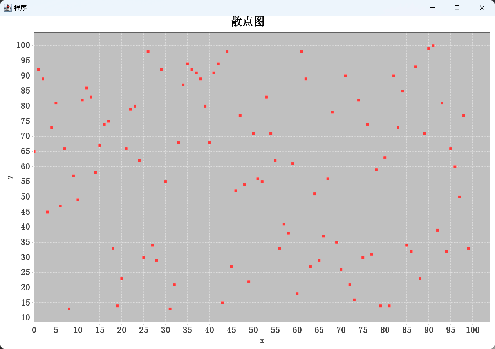


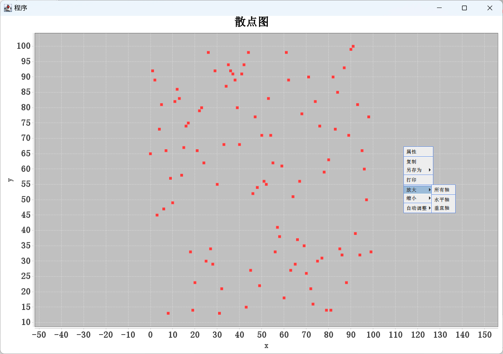


## 气泡图

```java
package mao;

import org.jfree.chart.*;
import org.jfree.chart.plot.PlotOrientation;
import org.jfree.data.xy.DefaultXYZDataset;
import org.jfree.data.xy.XYSeries;
import org.jfree.data.xy.XYSeriesCollection;

import javax.imageio.ImageIO;
import javax.swing.*;
import java.awt.*;
import java.awt.event.WindowAdapter;
import java.awt.event.WindowEvent;
import java.awt.image.BufferedImage;
import java.io.File;
import java.io.FileInputStream;
import java.io.IOException;

/**
 * Project name(项目名称)：数据可视化_JFreechart的使用
 * Package(包名): mao
 * Class(类名): Test7
 * Author(作者）: mao
 * Author QQ：1296193245
 * GitHub：https://github.com/maomao124/
 * Date(创建日期)： 2023/6/10
 * Time(创建时间)： 14:55
 * Version(版本): 1.0
 * Description(描述)： 气泡图
 */

public class Test7
{
    /**
     * 得到int随机
     *
     * @param min 最小值
     * @param max 最大值
     * @return int
     */
    public static int getIntRandom(int min, int max)
    {
        if (min > max)
        {
            min = max;
        }
        return min + (int) (Math.random() * (max - min + 1));
    }

    public static void main(String[] args) throws IOException
    {

        // 创建数据
        DefaultXYZDataset dataset = new DefaultXYZDataset();
        //控制y轴位置
        double[] x = {30, 40, getIntRandom(20, 100), getIntRandom(20, 100), getIntRandom(20, 100), getIntRandom(20, 100)};
        //控制y轴位置
        double[] y = {10, 20, getIntRandom(20, 100), getIntRandom(20, 100), getIntRandom(20, 100), getIntRandom(20, 100)};
        //控制大小
        double[] z = {3, 2, getIntRandom(1, 20), getIntRandom(1, 10), getIntRandom(1, 10), getIntRandom(1, 10)};
        double[][] xyz = {x, y, z};
        dataset.addSeries("Series", xyz);

        StandardChartTheme standardChartTheme = new StandardChartTheme("CN");
        //设置标题字体
        standardChartTheme.setExtraLargeFont(new Font("宋体", Font.BOLD, 28));
        //设置图例的字体
        standardChartTheme.setRegularFont(new Font("宋体", Font.BOLD, 22));
        //设置轴向的字体
        standardChartTheme.setLargeFont(new Font("宋体", Font.BOLD, 20));
        //应用主题样式
        ChartFactory.setChartTheme(standardChartTheme);
        //参数1 title 标题
        //参数2　dataset 数据集
        //参数3  是否开启图例
        //参数4  是否开启工具栏
        //参数5  是否开启url跳转
        JFreeChart chart = ChartFactory.createBubbleChart("气泡图",
                "x", "y", dataset);
        //生成一张图表的图片文件

        String path = "./chart7.png";


        ChartUtils.saveChartAsPNG(new File(path), chart, 1280, 720);

        // 利用awt进行显示
        ChartFrame chartFrame = new ChartFrame("程序", chart);
        chartFrame.pack();
        chartFrame.setVisible(true);
        chartFrame.setSize(1280, 900);
        int screenWidth = Toolkit.getDefaultToolkit().getScreenSize().width;       //获取屏幕宽度
        int screenHeight = Toolkit.getDefaultToolkit().getScreenSize().height;     //获取屏幕高度
        chartFrame.setLocation(screenWidth / 2 - chartFrame.getWidth() / 2, screenHeight / 2 - chartFrame.getHeight() / 2);  //位于屏幕中央

        BufferedImage bufferedImage = ImageIO.read(new FileInputStream(path));
        JLabel jLabel = new JLabel();
        jLabel.setIcon(new ImageIcon(bufferedImage));

        JFrame jFrame = new JFrame("图片");                                   //初始化顶层面板
        jFrame.setSize(1280, 900);
        screenWidth = Toolkit.getDefaultToolkit().getScreenSize().width;       //获取屏幕宽度
        screenHeight = Toolkit.getDefaultToolkit().getScreenSize().height;     //获取屏幕高度
        jFrame.setLocation(screenWidth / 2 - jFrame.getWidth() / 2, screenHeight / 2 - jFrame.getHeight() / 2);  //位于屏幕中央

        jFrame.add(jLabel);
        jFrame.setVisible(true);
        jFrame.addWindowListener(new WindowAdapter()
        {
            @Override
            public void windowClosing(WindowEvent e)
            {
                System.exit(1);
            }
        });
    }
}
```


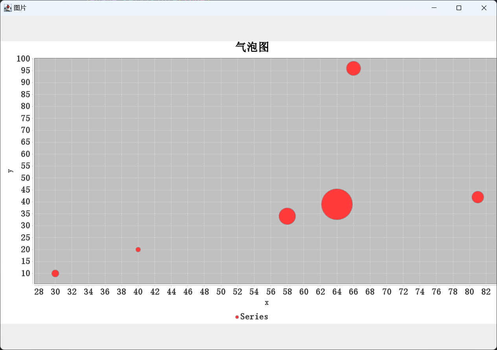


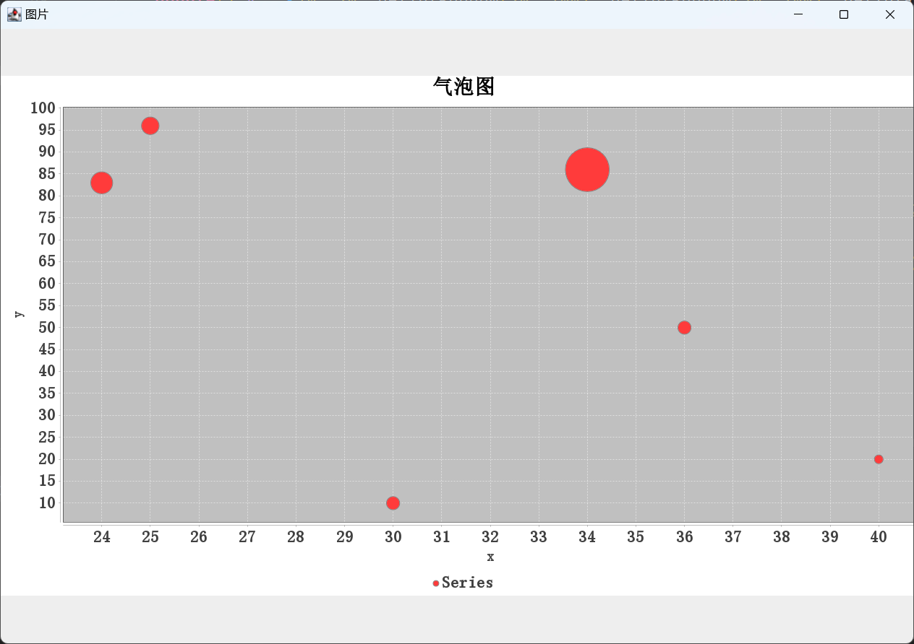


## 时序图

```java
package mao;

import org.jfree.chart.*;
import org.jfree.data.time.Second;
import org.jfree.data.time.TimeSeries;
import org.jfree.data.time.TimeSeriesCollection;
import org.jfree.data.xy.DefaultXYZDataset;
import org.jfree.data.xy.XYDataset;

import javax.imageio.ImageIO;
import javax.swing.*;
import java.awt.*;
import java.awt.event.WindowAdapter;
import java.awt.event.WindowEvent;
import java.awt.image.BufferedImage;
import java.io.File;
import java.io.FileInputStream;
import java.io.IOException;

/**
 * Project name(项目名称)：数据可视化_JFreechart的使用
 * Package(包名): mao
 * Class(类名): Test8
 * Author(作者）: mao
 * Author QQ：1296193245
 * GitHub：https://github.com/maomao124/
 * Date(创建日期)： 2023/6/10
 * Time(创建时间)： 15:05
 * Version(版本): 1.0
 * Description(描述)： 时序图
 */

public class Test8
{
    public static void main(String[] args) throws IOException
    {

        // 创建数据
        TimeSeries series = new TimeSeries("数据");
        Second current = new Second();
        double value = 100.0;
        for (int i = 0; i < 4000; i++)
        {
            value = value + Math.random() - 0.5;
            series.add(current, value);
            current = (Second) current.next();
        }
        XYDataset dataset = new TimeSeriesCollection(series);


        StandardChartTheme standardChartTheme = new StandardChartTheme("CN");
        //设置标题字体
        standardChartTheme.setExtraLargeFont(new Font("宋体", Font.BOLD, 28));
        //设置图例的字体
        standardChartTheme.setRegularFont(new Font("宋体", Font.BOLD, 22));
        //设置轴向的字体
        standardChartTheme.setLargeFont(new Font("宋体", Font.BOLD, 20));
        //应用主题样式
        ChartFactory.setChartTheme(standardChartTheme);
        //参数1 title 标题
        //参数2　dataset 数据集
        //参数3  是否开启图例
        //参数4  是否开启工具栏
        //参数5  是否开启url跳转
        JFreeChart chart = ChartFactory.createTimeSeriesChart("时序图",
                "x", "y", dataset);
        //生成一张图表的图片文件

        String path = "./chart8.png";


        ChartUtils.saveChartAsPNG(new File(path), chart, 1280, 720);

        // 利用awt进行显示
        ChartFrame chartFrame = new ChartFrame("程序", chart);
        chartFrame.pack();
        chartFrame.setVisible(true);
        chartFrame.setSize(1280, 900);
        int screenWidth = Toolkit.getDefaultToolkit().getScreenSize().width;       //获取屏幕宽度
        int screenHeight = Toolkit.getDefaultToolkit().getScreenSize().height;     //获取屏幕高度
        chartFrame.setLocation(screenWidth / 2 - chartFrame.getWidth() / 2, screenHeight / 2 - chartFrame.getHeight() / 2);  //位于屏幕中央

        BufferedImage bufferedImage = ImageIO.read(new FileInputStream(path));
        JLabel jLabel = new JLabel();
        jLabel.setIcon(new ImageIcon(bufferedImage));

        JFrame jFrame = new JFrame("图片");                                   //初始化顶层面板
        jFrame.setSize(1280, 900);
        screenWidth = Toolkit.getDefaultToolkit().getScreenSize().width;       //获取屏幕宽度
        screenHeight = Toolkit.getDefaultToolkit().getScreenSize().height;     //获取屏幕高度
        jFrame.setLocation(screenWidth / 2 - jFrame.getWidth() / 2, screenHeight / 2 - jFrame.getHeight() / 2);  //位于屏幕中央

        jFrame.add(jLabel);
        jFrame.setVisible(true);
        jFrame.addWindowListener(new WindowAdapter()
        {
            @Override
            public void windowClosing(WindowEvent e)
            {
                System.exit(1);
            }
        });
    }
}
```


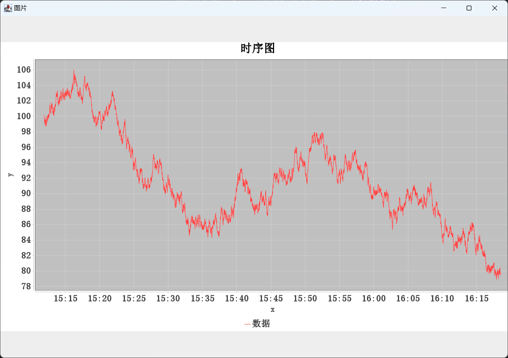


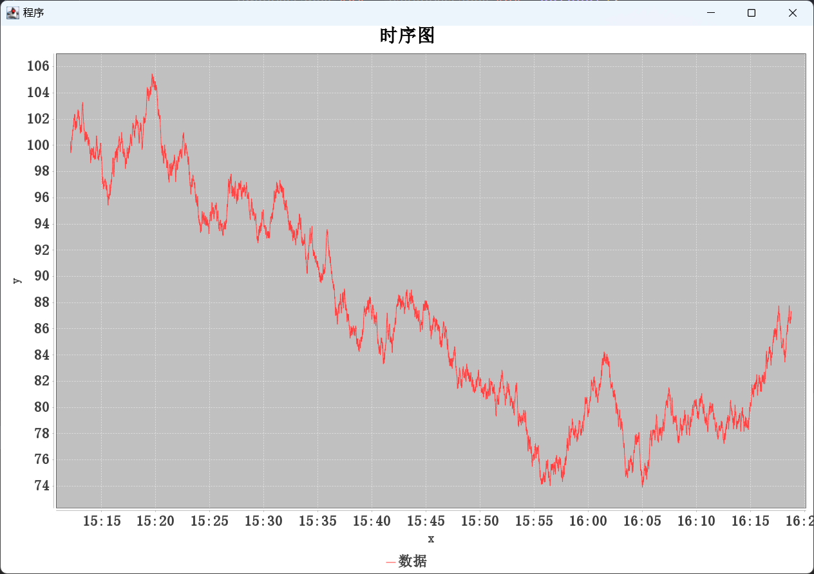


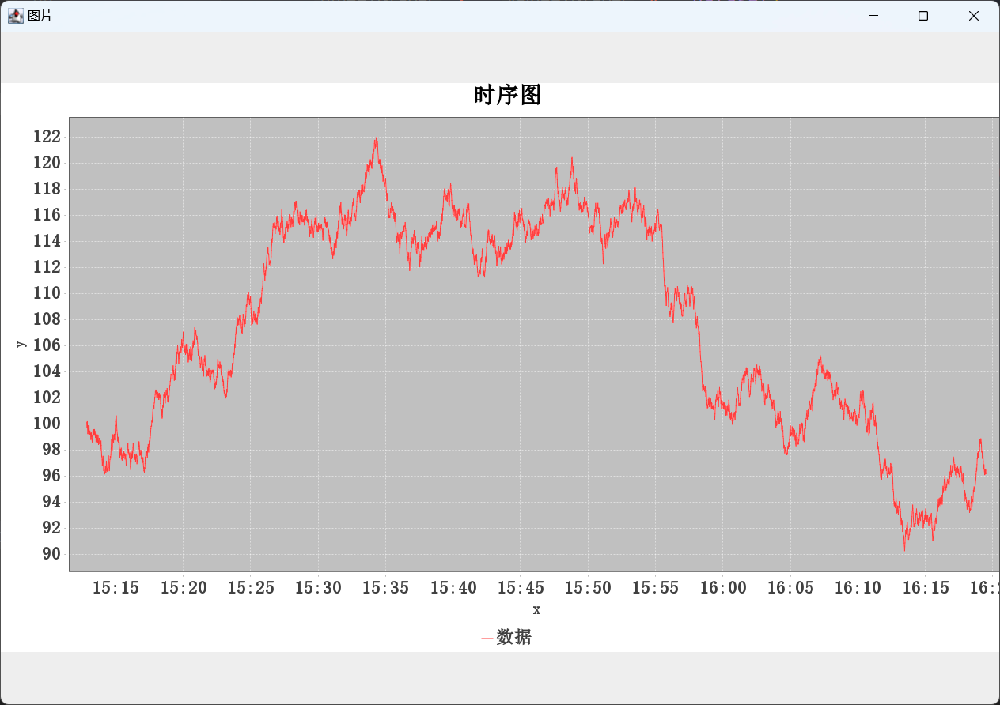


## 时间序列图

```java
package mao;

import org.jfree.chart.*;
import org.jfree.chart.axis.DateAxis;
import org.jfree.chart.axis.DateTickUnit;
import org.jfree.chart.labels.ItemLabelAnchor;
import org.jfree.chart.labels.ItemLabelPosition;
import org.jfree.chart.labels.StandardXYItemLabelGenerator;
import org.jfree.chart.plot.XYPlot;
import org.jfree.chart.renderer.xy.XYItemRenderer;
import org.jfree.chart.renderer.xy.XYLineAndShapeRenderer;
import org.jfree.chart.title.TextTitle;
import org.jfree.chart.ui.TextAnchor;
import org.jfree.data.time.Month;
import org.jfree.data.time.Second;
import org.jfree.data.time.TimeSeries;
import org.jfree.data.time.TimeSeriesCollection;
import org.jfree.data.xy.XYDataset;

import javax.imageio.ImageIO;
import javax.swing.*;
import java.awt.*;
import java.awt.event.WindowAdapter;
import java.awt.event.WindowEvent;
import java.awt.image.BufferedImage;
import java.io.File;
import java.io.FileInputStream;
import java.io.IOException;
import java.text.SimpleDateFormat;

/**
 * Project name(项目名称)：数据可视化_JFreechart的使用
 * Package(包名): mao
 * Class(类名): Test9
 * Author(作者）: mao
 * Author QQ：1296193245
 * GitHub：https://github.com/maomao124/
 * Date(创建日期)： 2023/6/10
 * Time(创建时间)： 15:29
 * Version(版本): 1.0
 * Description(描述)： 时间序列图
 */

public class Test9
{
    /**
     * 得到int随机
     *
     * @param min 最小值
     * @param max 最大值
     * @return int
     */
    public static int getIntRandom(int min, int max)
    {
        if (min > max)
        {
            min = max;
        }
        return min + (int) (Math.random() * (max - min + 1));
    }

    public static void main(String[] args) throws IOException
    {
        //A网站的访问量统计
        TimeSeries timeSeries1 = new TimeSeries("A-访问量");
        // 添加数据
        for (int i = 1; i <= 12; i++)
        {
            timeSeries1.add(new Month(i, 2022), getIntRandom(40000, 200000));
        }

        //A网站的UV统计
        TimeSeries timeSeries2 = new TimeSeries("A-UV");
        //添加数据
        for (int i = 1; i <= 12; i++)
        {
            timeSeries2.add(new Month(i, 2022), getIntRandom(5000, 80000));
        }

        //B网站的访问量统计
        TimeSeries timeSeries3 = new TimeSeries("B-访问量");
        // 添加数据
        for (int i = 1; i <= 12; i++)
        {
            timeSeries3.add(new Month(i, 2022), getIntRandom(40000, 200000));
        }

        //B网站的UV统计
        TimeSeries timeSeries4 = new TimeSeries("B-UV");
        //添加数据
        for (int i = 1; i <= 12; i++)
        {
            timeSeries4.add(new Month(i, 2022), getIntRandom(5000, 80000));
        }

        //定义时间序列的集合
        TimeSeriesCollection dataset = new TimeSeriesCollection();
        dataset.addSeries(timeSeries1);
        dataset.addSeries(timeSeries2);
        dataset.addSeries(timeSeries3);
        dataset.addSeries(timeSeries4);


        StandardChartTheme standardChartTheme = new StandardChartTheme("CN");
        //设置标题字体
        standardChartTheme.setExtraLargeFont(new Font("宋体", Font.BOLD, 28));
        //设置图例的字体
        standardChartTheme.setRegularFont(new Font("宋体", Font.BOLD, 22));
        //设置轴向的字体
        standardChartTheme.setLargeFont(new Font("宋体", Font.BOLD, 20));
        //应用主题样式
        ChartFactory.setChartTheme(standardChartTheme);
        //参数1 title 标题
        //参数2　dataset 数据集
        //参数3  是否开启图例
        //参数4  是否开启工具栏
        //参数5  是否开启url跳转
        JFreeChart chart = ChartFactory.createTimeSeriesChart("2022年度A,B网站访问统计",
                "时间", "访问量", dataset);

        XYPlot plot = (XYPlot) chart.getPlot();

        //设置曲线是否显示数据点
        XYLineAndShapeRenderer xylinerenderer = (XYLineAndShapeRenderer) plot.getRenderer();
        //xylinerenderer.setBaseShapesVisible(true);
        xylinerenderer.setDefaultShapesVisible(true);

        //设置曲线显示各数据点的值
        XYItemRenderer xyitem = plot.getRenderer();
        xyitem.setDefaultItemLabelsVisible(true);
        xyitem.setDefaultPositiveItemLabelPosition(new ItemLabelPosition(ItemLabelAnchor.OUTSIDE12,
                TextAnchor.BASELINE_CENTER));
        xyitem.setDefaultItemLabelGenerator(new StandardXYItemLabelGenerator());
        xyitem.setDefaultItemLabelFont(new Font("黑体", Font.BOLD, 15));
        plot.setRenderer(xyitem);

        //生成一张图表的图片文件
        String path = "./chart9.png";


        ChartUtils.saveChartAsPNG(new File(path), chart, 1280, 720);

        // 利用awt进行显示
        ChartFrame chartFrame = new ChartFrame("程序", chart);
        chartFrame.pack();
        chartFrame.setVisible(true);
        chartFrame.setSize(1280, 900);
        int screenWidth = Toolkit.getDefaultToolkit().getScreenSize().width;       //获取屏幕宽度
        int screenHeight = Toolkit.getDefaultToolkit().getScreenSize().height;     //获取屏幕高度
        chartFrame.setLocation(screenWidth / 2 - chartFrame.getWidth() / 2, screenHeight / 2 - chartFrame.getHeight() / 2);  //位于屏幕中央

        BufferedImage bufferedImage = ImageIO.read(new FileInputStream(path));
        JLabel jLabel = new JLabel();
        jLabel.setIcon(new ImageIcon(bufferedImage));

        JFrame jFrame = new JFrame("图片");                                   //初始化顶层面板
        jFrame.setSize(1280, 900);
        screenWidth = Toolkit.getDefaultToolkit().getScreenSize().width;       //获取屏幕宽度
        screenHeight = Toolkit.getDefaultToolkit().getScreenSize().height;     //获取屏幕高度
        jFrame.setLocation(screenWidth / 2 - jFrame.getWidth() / 2, screenHeight / 2 - jFrame.getHeight() / 2);  //位于屏幕中央

        jFrame.add(jLabel);
        jFrame.setVisible(true);
        jFrame.addWindowListener(new WindowAdapter()
        {
            @Override
            public void windowClosing(WindowEvent e)
            {
                System.exit(1);
            }
        });
    }
}
```


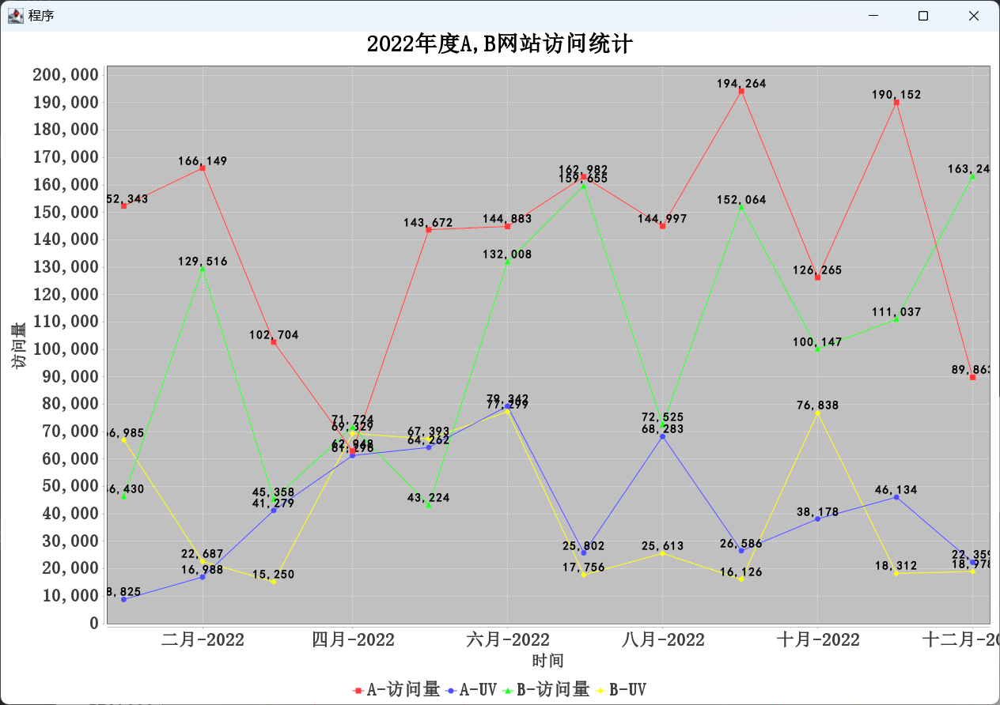


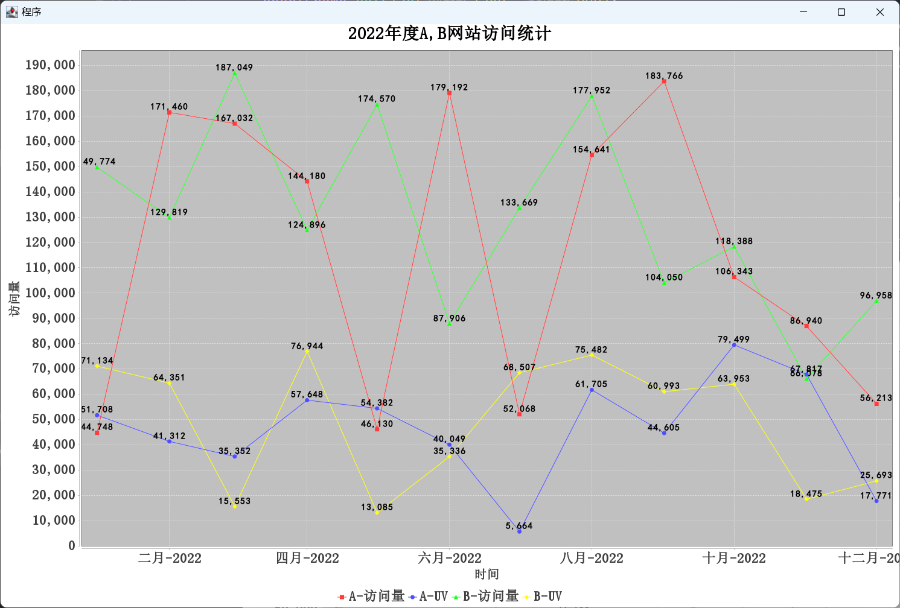


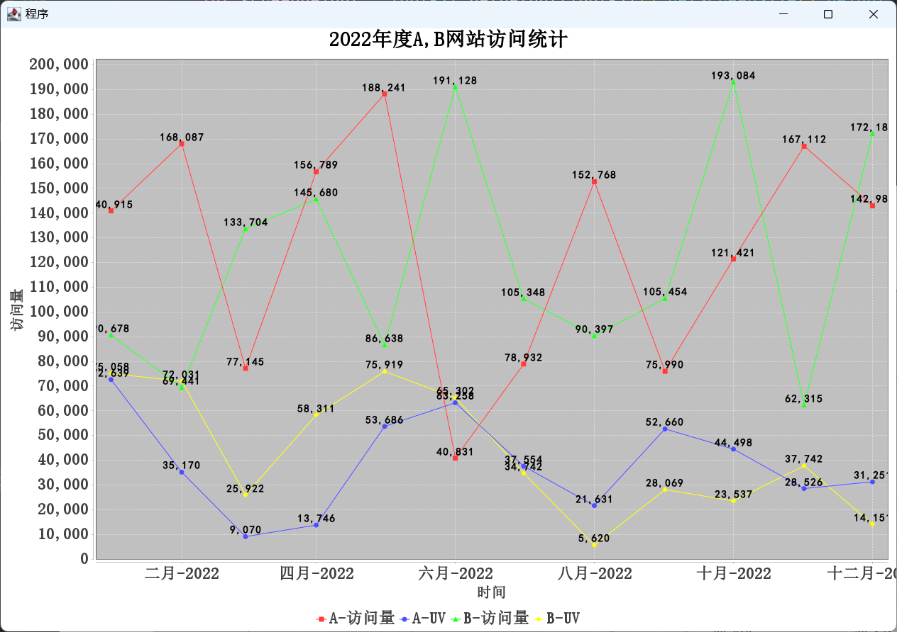


## XY阶梯面积图

```java
package mao;

import org.jfree.chart.*;
import org.jfree.chart.plot.PlotOrientation;
import org.jfree.chart.plot.XYPlot;
import org.jfree.data.xy.XYSeries;
import org.jfree.data.xy.XYSeriesCollection;

import javax.imageio.ImageIO;
import javax.swing.*;
import java.awt.*;
import java.awt.event.WindowAdapter;
import java.awt.event.WindowEvent;
import java.awt.image.BufferedImage;
import java.io.File;
import java.io.FileInputStream;
import java.io.IOException;

/**
 * Project name(项目名称)：数据可视化_JFreechart的使用
 * Package(包名): mao
 * Class(类名): Test10
 * Author(作者）: mao
 * Author QQ：1296193245
 * GitHub：https://github.com/maomao124/
 * Date(创建日期)： 2023/6/10
 * Time(创建时间)： 15:58
 * Version(版本): 1.0
 * Description(描述)： 无
 */

public class Test10
{
    /**
     * 得到int随机
     *
     * @param min 最小值
     * @param max 最大值
     * @return int
     */
    public static int getIntRandom(int min, int max)
    {
        if (min > max)
        {
            min = max;
        }
        return min + (int) (Math.random() * (max - min + 1));
    }

    public static void main(String[] args) throws IOException
    {

        // 创建XYSeriesCollection对象
        XYSeriesCollection dataset = new XYSeriesCollection();
        // 系列一数据
        XYSeries series1 = new XYSeries("Series1");
        series1.add(2, 4);
        series1.add(3, 6);
        series1.add(5, 2);
        series1.add(8, 5);
        series1.add(1, 8);

        // 系列二数据
        XYSeries series2 = new XYSeries("Series2");
        series2.add(4, 6);
        series2.add(9, 5);
        series2.add(10, 9);
        series2.add(18, 11);
        series2.add(15, 18);
        // 添加到数据集
        dataset.addSeries(series1);
        dataset.addSeries(series2);

        StandardChartTheme standardChartTheme = new StandardChartTheme("CN");
        //设置标题字体
        standardChartTheme.setExtraLargeFont(new Font("宋体", Font.BOLD, 28));
        //设置图例的字体
        standardChartTheme.setRegularFont(new Font("宋体", Font.BOLD, 22));
        //设置轴向的字体
        standardChartTheme.setLargeFont(new Font("宋体", Font.BOLD, 20));
        //应用主题样式
        ChartFactory.setChartTheme(standardChartTheme);
        //参数1 title 标题
        //参数2　dataset 数据集
        //参数3  是否开启图例
        //参数4  是否开启工具栏
        //参数5  是否开启url跳转
        JFreeChart chart = ChartFactory.createXYStepAreaChart("XY阶梯面积图",
                "x", "y", dataset);
        XYPlot plot = (XYPlot) chart.getPlot();
        plot.setBackgroundPaint(new Color(200, 150, 97, 100));

        //生成一张图表的图片文件
        String path = "./chart10.png";


        ChartUtils.saveChartAsPNG(new File(path), chart, 1280, 720);

        // 利用awt进行显示
        ChartFrame chartFrame = new ChartFrame("程序", chart);
        chartFrame.pack();
        chartFrame.setVisible(true);
        chartFrame.setSize(1280, 900);
        int screenWidth = Toolkit.getDefaultToolkit().getScreenSize().width;       //获取屏幕宽度
        int screenHeight = Toolkit.getDefaultToolkit().getScreenSize().height;     //获取屏幕高度
        chartFrame.setLocation(screenWidth / 2 - chartFrame.getWidth() / 2, screenHeight / 2 - chartFrame.getHeight() / 2);  //位于屏幕中央

        BufferedImage bufferedImage = ImageIO.read(new FileInputStream(path));
        JLabel jLabel = new JLabel();
        jLabel.setIcon(new ImageIcon(bufferedImage));

        JFrame jFrame = new JFrame("图片");                                   //初始化顶层面板
        jFrame.setSize(1280, 900);
        screenWidth = Toolkit.getDefaultToolkit().getScreenSize().width;       //获取屏幕宽度
        screenHeight = Toolkit.getDefaultToolkit().getScreenSize().height;     //获取屏幕高度
        jFrame.setLocation(screenWidth / 2 - jFrame.getWidth() / 2, screenHeight / 2 - jFrame.getHeight() / 2);  //位于屏幕中央

        jFrame.add(jLabel);
        jFrame.setVisible(true);
        jFrame.addWindowListener(new WindowAdapter()
        {
            @Override
            public void windowClosing(WindowEvent e)
            {
                System.exit(1);
            }
        });
    }
}
```


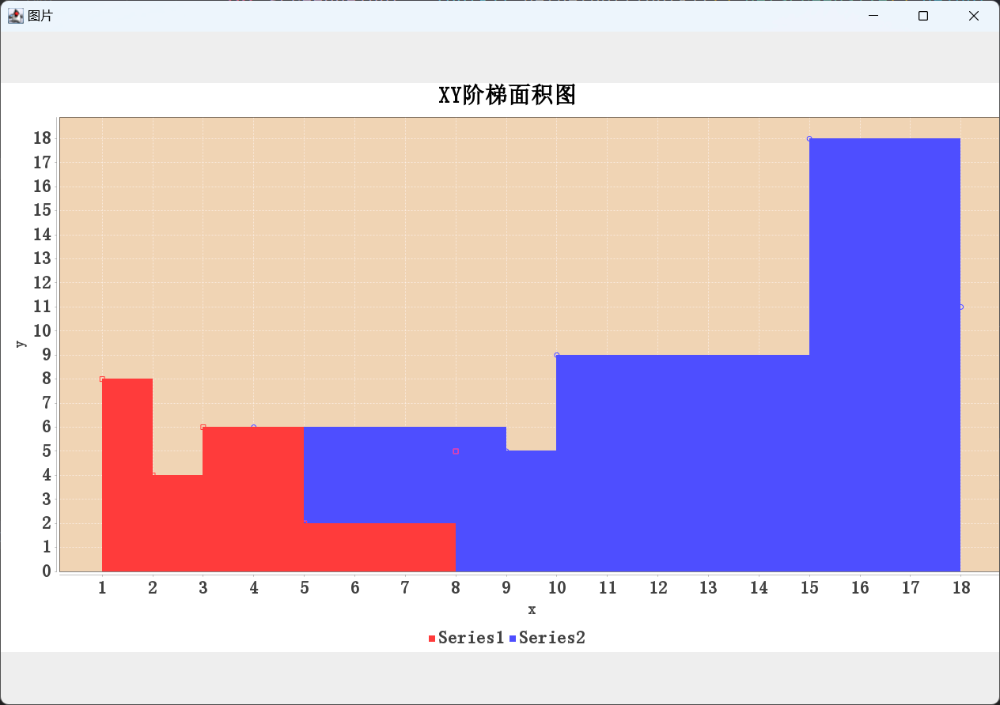


## 条形图与折线图结合

```java
package mao;

import org.jfree.chart.ChartFrame;
import org.jfree.chart.ChartUtils;
import org.jfree.chart.JFreeChart;
import org.jfree.chart.axis.CategoryAxis;
import org.jfree.chart.axis.NumberAxis;
import org.jfree.chart.plot.CategoryPlot;
import org.jfree.chart.renderer.category.BarRenderer;
import org.jfree.chart.renderer.category.CategoryItemRenderer;
import org.jfree.chart.renderer.category.LineAndShapeRenderer;
import org.jfree.data.category.DefaultCategoryDataset;

import javax.imageio.ImageIO;
import javax.swing.*;
import java.awt.*;
import java.awt.event.WindowAdapter;
import java.awt.event.WindowEvent;
import java.awt.image.BufferedImage;
import java.io.File;
import java.io.FileInputStream;
import java.io.IOException;

/**
 * Project name(项目名称)：数据可视化_JFreechart的使用
 * Package(包名): mao
 * Class(类名): Test11
 * Author(作者）: mao
 * Author QQ：1296193245
 * GitHub：https://github.com/maomao124/
 * Date(创建日期)： 2023/6/10
 * Time(创建时间)： 16:06
 * Version(版本): 1.0
 * Description(描述)： 无
 */

public class Test11
{
    /**
     * 得到int随机
     *
     * @param min 最小值
     * @param max 最大值
     * @return int
     */
    public static int getIntRandom(int min, int max)
    {
        if (min > max)
        {
            min = max;
        }
        return min + (int) (Math.random() * (max - min + 1));
    }

    public static void main(String[] args) throws IOException
    {
        // 创建数据
        DefaultCategoryDataset dataset = new DefaultCategoryDataset();
        dataset.addValue(getIntRandom(20, 100), "A", "Ⅰ");
        dataset.addValue(getIntRandom(20, 100), "A", "Ⅱ");
        dataset.addValue(getIntRandom(20, 100), "A", "Ⅲ");
        dataset.addValue(getIntRandom(20, 100), "A", "Ⅳ");
        dataset.addValue(getIntRandom(20, 100), "B", "Ⅰ");
        dataset.addValue(getIntRandom(20, 100), "B", "Ⅱ");
        dataset.addValue(getIntRandom(20, 100), "B", "Ⅲ");
        dataset.addValue(getIntRandom(20, 100), "B", "Ⅳ");
        
        // 创建CategoryPlot对象
        CategoryPlot plot = new CategoryPlot();

        // 添加第一个数据集并渲染为line
        CategoryItemRenderer lineRenderer = new LineAndShapeRenderer();
        plot.setDataset(0, dataset);
        plot.setRenderer(0, lineRenderer);

        // 添加第二个数据集并渲染为线条bar
        CategoryItemRenderer baRenderer = new BarRenderer();
        plot.setDataset(1, dataset);
        plot.setRenderer(1, baRenderer);

        // 设置坐标轴
        plot.setDomainAxis(new CategoryAxis("Time"));
        plot.setRangeAxis(new NumberAxis("Value"));

        // 创建JFreeChart对象
        JFreeChart chart = new JFreeChart(plot);


        //生成一张图表的图片文件
        String path = "./chart10.png";


        ChartUtils.saveChartAsPNG(new File(path), chart, 1280, 720);

        // 利用awt进行显示
        ChartFrame chartFrame = new ChartFrame("程序", chart);
        chartFrame.pack();
        chartFrame.setVisible(true);
        chartFrame.setSize(1280, 900);
        int screenWidth = Toolkit.getDefaultToolkit().getScreenSize().width;       //获取屏幕宽度
        int screenHeight = Toolkit.getDefaultToolkit().getScreenSize().height;     //获取屏幕高度
        chartFrame.setLocation(screenWidth / 2 - chartFrame.getWidth() / 2, screenHeight / 2 - chartFrame.getHeight() / 2);  //位于屏幕中央

        BufferedImage bufferedImage = ImageIO.read(new FileInputStream(path));
        JLabel jLabel = new JLabel();
        jLabel.setIcon(new ImageIcon(bufferedImage));

        JFrame jFrame = new JFrame("图片");                                   //初始化顶层面板
        jFrame.setSize(1280, 900);
        screenWidth = Toolkit.getDefaultToolkit().getScreenSize().width;       //获取屏幕宽度
        screenHeight = Toolkit.getDefaultToolkit().getScreenSize().height;     //获取屏幕高度
        jFrame.setLocation(screenWidth / 2 - jFrame.getWidth() / 2, screenHeight / 2 - jFrame.getHeight() / 2);  //位于屏幕中央

        jFrame.add(jLabel);
        jFrame.setVisible(true);
        jFrame.addWindowListener(new WindowAdapter()
        {
            @Override
            public void windowClosing(WindowEvent e)
            {
                System.exit(1);
            }
        });

    }
}
```


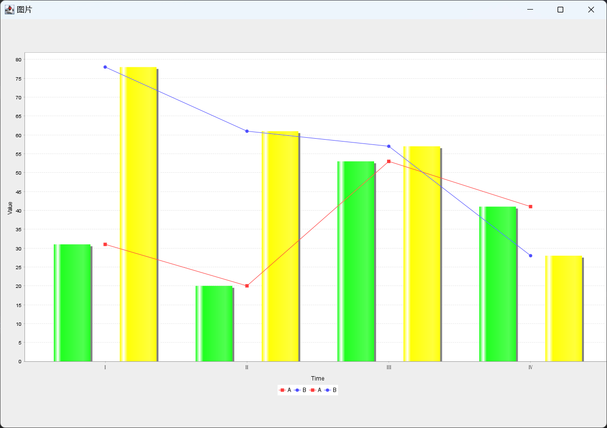


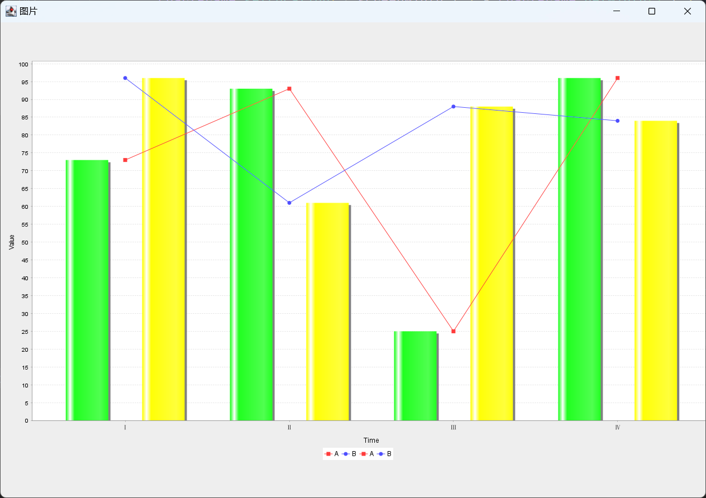


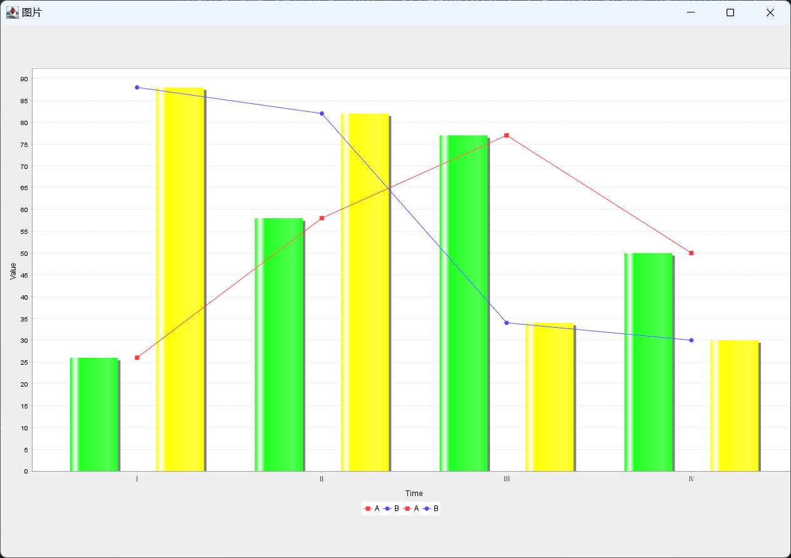


# Highcharts

## 概述

Highcharts 是一个用纯JavaScript编写的一个图表库， 能够很简单便捷的在web网站或是web应用程序添加有交互性的图表，并且免费提供给个人学习、个人网站和非商业用途使用。HighCharts支持的图表类型有曲线图、区域图、柱状图、饼状图、散状点图和综合图表。


官网地址：https://www.hcharts.cn/


## 特点

* 非商用免费：对于个人网站，学校网站和非盈利机构使用 Highcharts 系列软件，直接使用而不需要经过我们的授权；
* HTML 5：Highcharts 完全基于 HTML5 技术，不需要安装任何插件，也不需要配置 PHP、Java 等运行环境，只需要两个 JS 文件即可使用；
* 开源：源代码基于 Github 托管，任何人都可以下载和修改源码；
* 图表丰富：Highcharts 提供丰富的图表类型，线图、柱形图、饼图、散点图、仪表图、雷达图、热力图、混合图等多，Highstock 则提供股票走势图（K线、分时）、高级时间轴图，Highmaps 提供各种丰富多样的地图；
* 兼容性：兼容 IE6+，同时完美支持移动端触摸操作、手势缩放，并且能够保证在不同的浏览器上做到展现效果和使用体验一致性；
* 动态交互性：支持动态增加、修改、删除数据列、数据点、坐标轴操作，支持多种交互操作，丰富灵活的API可以精准控制图表的每一个细节！


## 下载和安装

直接下载：

https://code.hcharts.cn/highcharts/highcharts.js

https://code.hcharts.cn/highcharts/modules/exporting.js

https://code.hcharts.cn/highcharts/modules/series-label.js

https://code.hcharts.cn/highcharts/modules/oldie.js

https://code.hcharts.cn/plugins/zh_cn.js

或者：

https://www.hcharts.cn/download


下载完5个js文件后，在页面中引入js文件即可

也可以直接使用：

```html
<script src="https://code.hcharts.cn/highcharts/highcharts.js"></script>
<script src="https://code.hcharts.cn/highcharts/modules/exporting.js"></script>
<script src="https://code.hcharts.cn/highcharts/modules/series-label.js"></script>
<script src="https://code.hcharts.cn/highcharts/modules/oldie.js"></script>
<script src="https://code.hcharts.cn/plugins/zh_cn.js"></script>
```


npm安装：

```sh
npm install highcharts --save
```


## 官方文档和示例

文档：https://www.hcharts.cn/docs

示例：https://www.hcharts.cn/demo/highcharts/

API文档：https://api.hcharts.cn/highcharts/index.html


## 线图

### 基础折线图

```html
<!DOCTYPE html>

<!--
Project name(项目名称)：data_visualization_diagram
  File name(文件名): test1
  Authors(作者）: mao
  Author QQ：1296193245
  GitHub：https://github.com/maomao124/
  Date(创建日期)： 2023/6/10
  Time(创建时间)： 21:21
  Description(描述)： 无
-->

<html lang="en">
<head>
    <meta charset="UTF-8">
    <title>基础折线图</title>

    <script src="./js/highcharts.js"></script>
    <script src="./js/exporting.js"></script>
    <script src="./js/series-label.js"></script>
    <script src="./js/zh_cn.js"></script>

</head>

<style>
    #container {
        width: 70vw;
        height: 70vh;
        position: absolute;
        top: 50%;
        left: 50%;
        transform: translate(-50%, -50%);
    }
</style>
<body>
<div id="container"></div>
<script>
    var chart = Highcharts.chart('container', {
        title: {
            text: '2010 ~ 2016 年太阳能行业就业人员发展情况'
        },
        subtitle: {
            text: '数据来源：thesolarfoundation.com'
        },
        yAxis: {
            title: {
                text: '就业人数'
            }
        },
        legend: {
            layout: 'vertical',
            align: 'right',
            verticalAlign: 'middle'
        },
        plotOptions: {
            series: {
                label: {
                    connectorAllowed: false
                },
                pointStart: 2014
            }
        },
        series: [{
            name: '安装，实施人员',
            data: [43934, 52503, 57177, 69658, 97031, 119931, 137133, 154175]
        }, {
            name: '工人',
            data: [24916, 24064, 29742, 29851, 32490, 30282, 38121, 40434]
        }, {
            name: '销售',
            data: [11744, 17722, 16005, 19771, 20185, 24377, 32147, 39387]
        }, {
            name: '项目开发',
            data: [null, null, 7988, 12169, 15112, 22452, 34400, 34227]
        }, {
            name: '其他',
            data: [12908, 5948, 8105, 11248, 8989, 11816, 18274, 18111]
        }],
        responsive: {
            rules: [{
                condition: {
                    maxWidth: 500
                },
                chartOptions: {
                    legend: {
                        layout: 'horizontal',
                        align: 'center',
                        verticalAlign: 'bottom'
                    }
                }
            }]
        }
    });
</script>

</body>
</html>

```


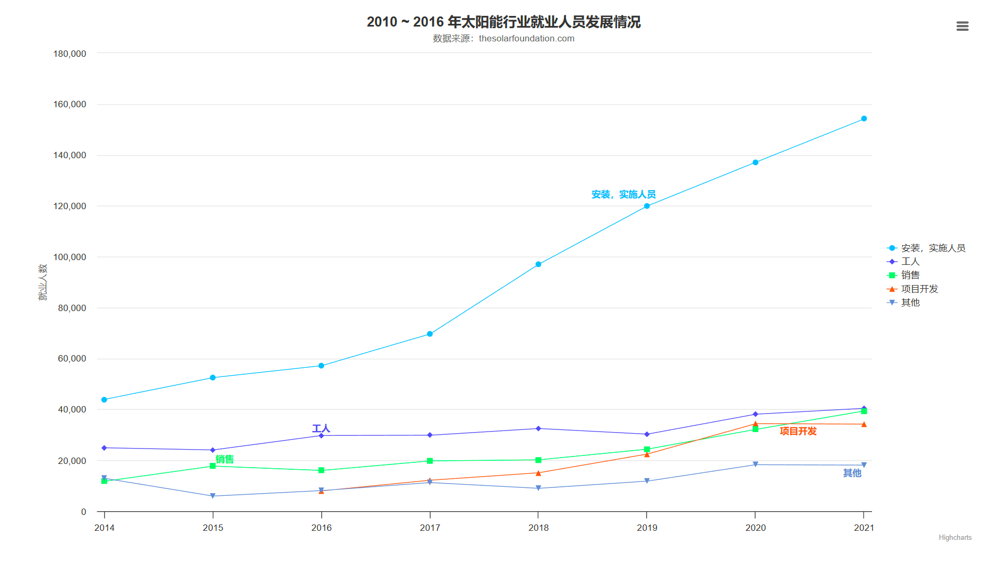


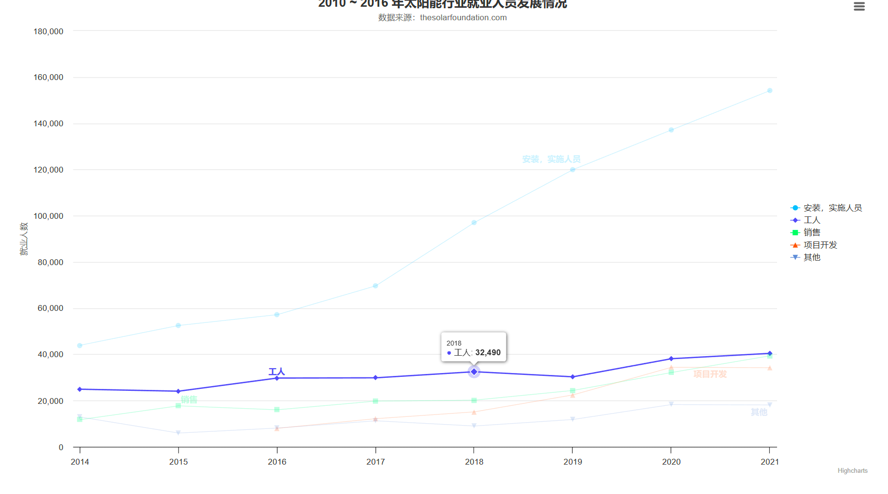


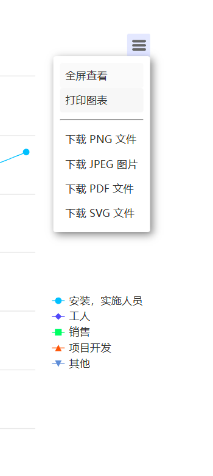


属性解释：

```sh

（1）chart ：图表基本属性
    a)	plotBackgroundColor  区域背景颜色
    b)	plotBorderWidth  区域边框宽度
    c)	plotShadow  区域阴影
    d)	type  图表类型
（2）title ：图表标题
    a)	text 标题文本
（3）tooltip ：工具提示
    a)	pointFormat  工具提示显示格式
（4）plotOptions：区域选项
    a)	allowPointSelect  点击区域后选择
    b)	cursor  光标类型
    c)	dataLabels  数据标签
    d)	showInLegend  是否显示图例
（5）series： 数据组
    a)	name  名称
    b)	colorByPoint  点的颜色
    c)	data  数据
```


### 显示点值的折线图

```html
<!DOCTYPE html>

<!--
Project name(项目名称)：data_visualization_diagram
  File name(文件名): test2
  Authors(作者）: mao
  Author QQ：1296193245
  GitHub：https://github.com/maomao124/
  Date(创建日期)： 2023/6/10
  Time(创建时间)： 21:45
  Description(描述)： 无
-->


<html lang="en">
<head>
    <meta charset="UTF-8">
    <title>显示点值的折线图</title>

    <script src="./js/highcharts.js"></script>
    <script src="./js/exporting.js"></script>
    <script src="./js/series-label.js"></script>
    <script src="./js/zh_cn.js"></script>

</head>

<style>
    #container {
        width: 70vw;
        height: 70vh;
        position: absolute;
        top: 50%;
        left: 50%;
        transform: translate(-50%, -50%);
    }
</style>
<body>
<div id="container"></div>
<script>
    var chart = Highcharts.chart('container', {
        chart: {
            type: 'line'
        },
        title: {
            text: '月平均气温'
        },
        subtitle: {
            text: '数据来源: WorldClimate.com'
        },
        xAxis: {
            categories: ['一月', '二月', '三月', '四月', '五月', '六月', '七月', '八月', '九月', '十月', '十一月', '十二月']
        },
        yAxis: {
            title: {
                text: '气温 (°C)'
            }
        },
        plotOptions: {
            line: {
                dataLabels: {
                    // 开启数据标签
                    enabled: true
                },
                // 关闭鼠标跟踪，对应的提示框、点击事件会失效
                enableMouseTracking: false
            }
        },
        series: [{
            name: '东京',
            data: [7.0, 6.9, 9.5, 14.5, 18.4, 21.5, 25.2, 26.5, 23.3, 18.3, 13.9, 9.6]
        }, {
            name: '伦敦',
            data: [3.9, 4.2, 5.7, 8.5, 11.9, 15.2, 17.0, 16.6, 14.2, 10.3, 6.6, 4.8]
        }]
    });
</script>
```


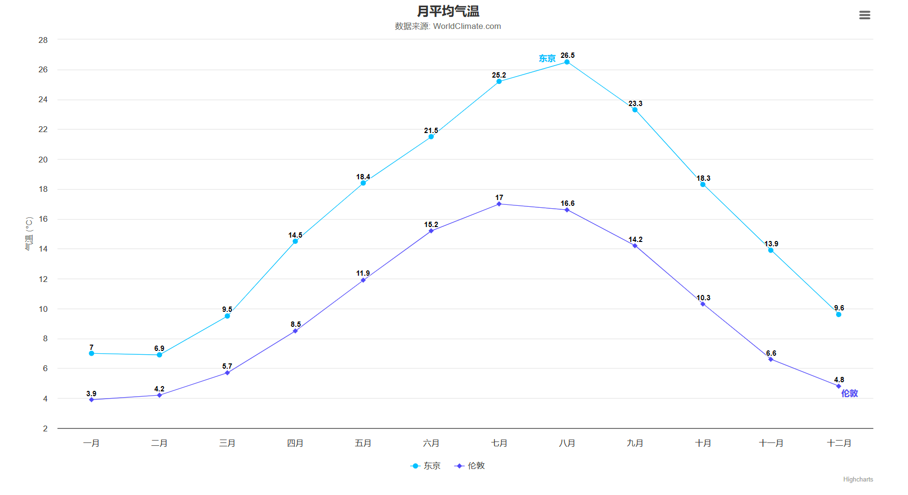


### 可缩放的时间轴

```html
<!DOCTYPE html>

<!--
Project name(项目名称)：data_visualization_diagram
  File name(文件名): test3
  Authors(作者）: mao
  Author QQ：1296193245
  GitHub：https://github.com/maomao124/
  Date(创建日期)： 2023/6/10
  Time(创建时间)： 21:53
  Description(描述)： 无
-->

<html lang="en">
<head>
    <meta charset="UTF-8">
    <title>可缩放的时间轴</title>
    <script src="./js/highcharts.js"></script>
    <script src="./js/exporting.js"></script>
    <script src="./js/series-label.js"></script>
    <script src="./js/zh_cn.js"></script>
    <script src="https://img.hcharts.cn/jquery/jquery-1.8.3.min.js"></script>
</head>

<style>
    #container {
        width: 70vw;
        height: 70vh;
        position: absolute;
        top: 50%;
        left: 50%;
        transform: translate(-50%, -50%);
    }
</style>
<body>
<div id="container"></div>
<script>
    var chart = null;
    $.getJSON('https://data.jianshukeji.com/jsonp?filename=json/usdeur.json&callback=?', function (data)
    {
        chart = Highcharts.chart('container', {
            chart: {
                zoomType: 'x'
            },
            title: {
                text: '美元兑欧元汇率走势图'
            },
            subtitle: {
                text: document.ontouchstart === undefined ?
                    '鼠标拖动可以进行缩放' : '手势操作进行缩放'
            },
            xAxis: {
                type: 'datetime',
                dateTimeLabelFormats: {
                    millisecond: '%H:%M:%S.%L',
                    second: '%H:%M:%S',
                    minute: '%H:%M',
                    hour: '%H:%M',
                    day: '%m-%d',
                    week: '%m-%d',
                    month: '%Y-%m',
                    year: '%Y'
                }
            },
            tooltip: {
                dateTimeLabelFormats: {
                    millisecond: '%H:%M:%S.%L',
                    second: '%H:%M:%S',
                    minute: '%H:%M',
                    hour: '%H:%M',
                    day: '%Y-%m-%d',
                    week: '%m-%d',
                    month: '%Y-%m',
                    year: '%Y'
                }
            },
            yAxis: {
                title: {
                    text: '汇率'
                }
            },
            legend: {
                enabled: false
            },
            plotOptions: {
                area: {
                    fillColor: {
                        linearGradient: {
                            x1: 0,
                            y1: 0,
                            x2: 0,
                            y2: 1
                        },
                        stops: [
                            [0, new Highcharts.getOptions().colors[0]],
                            [1, new Highcharts.Color(Highcharts.getOptions().colors[0]).setOpacity(0).get('rgba')]
                        ]
                    },
                    marker: {
                        radius: 2
                    },
                    lineWidth: 1,
                    states: {
                        hover: {
                            lineWidth: 1
                        }
                    },
                    threshold: null
                }
            },
            series: [{
                type: 'area',
                name: '美元兑欧元',
                data: data
            }]
        });
    });
</script>

</body>
</html>
```


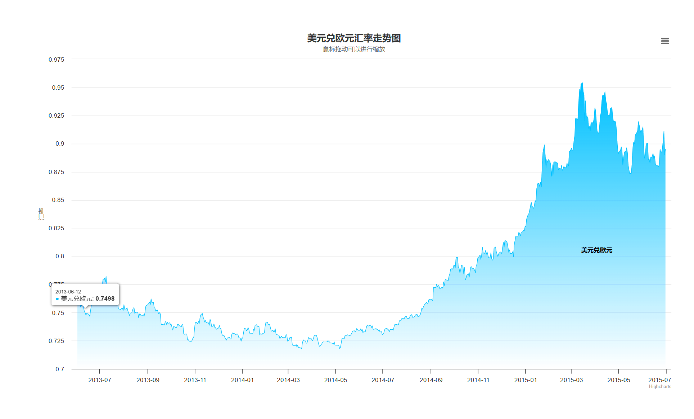


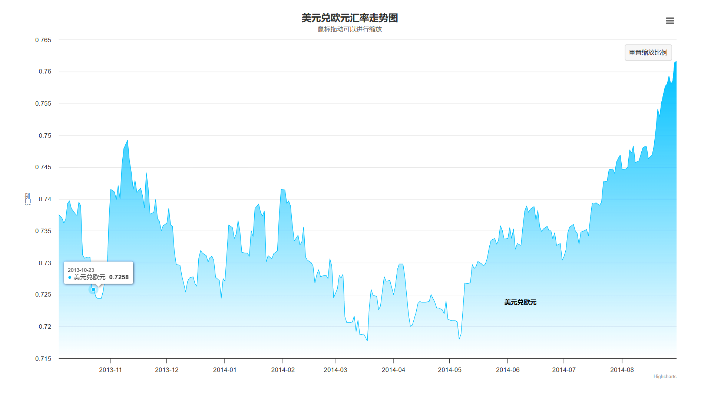


### 大数据量直线图

```html
<!DOCTYPE html>

<!--
Project name(项目名称)：data_visualization_diagram
  File name(文件名): test4
  Authors(作者）: mao
  Author QQ：1296193245
  GitHub：https://github.com/maomao124/
  Date(创建日期)： 2023/6/10
  Time(创建时间)： 22:03
  Description(描述)： 无
-->


<html lang="en">
<head>
    <meta charset="UTF-8">
    <title>可缩放的时间轴</title>
    <script src="./js/highcharts.js"></script>
    <script src="./js/exporting.js"></script>
    <script src="./js/series-label.js"></script>
    <script src="./js/zh_cn.js"></script>
</head>

<style>
    #container {
        width: 70vw;
        height: 70vh;
        position: absolute;
        top: 50%;
        left: 50%;
        transform: translate(-50%, -50%);
    }
</style>
<body>
<div id="container"></div>
<script>
    function getData(n)
    {
        var arr = [],
            i,
            a,
            b,
            c,
            spike;
        for (i = 0; i < n; i = i + 1)
        {
            if (i % 100 === 0)
            {
                a = 2 * Math.random();
            }
            if (i % 1000 === 0)
            {
                b = 2 * Math.random();
            }
            if (i % 10000 === 0)
            {
                c = 2 * Math.random();
            }
            if (i % 50000 === 0)
            {
                spike = 10;
            }
            else
            {
                spike = 0;
            }
            arr.push([
                i,
                2 * Math.sin(i / 100) + a + b + c + spike + Math.random()
            ]);
        }
        return arr;
    }

    var n = 500000,
        data = getData(n);
    console.time('line');
    Highcharts.chart('container', {
        chart: {
            zoomType: 'x'
        },
        boost: {
            useGPUTranslations: true
        },
        title: {
            text: 'Highcharts drawing ' + n + ' points'
        },
        subtitle: {
            text: 'Using the Boost module'
        },
        tooltip: {
            valueDecimals: 2
        },
        series: [{
            data: data,
            lineWidth: 0.5
        }]
    });
    console.timeEnd('line');
</script>

</body>
</html>
```


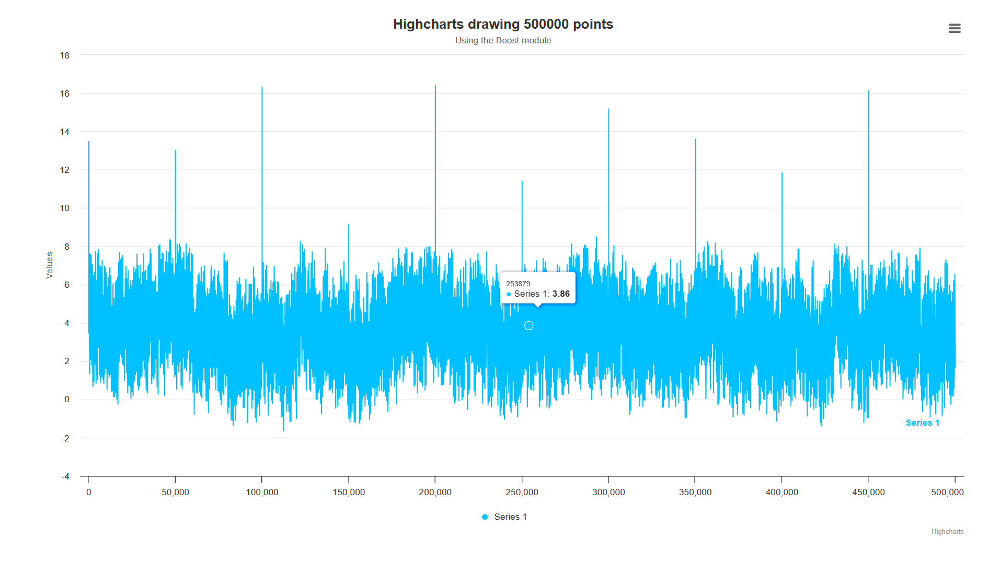


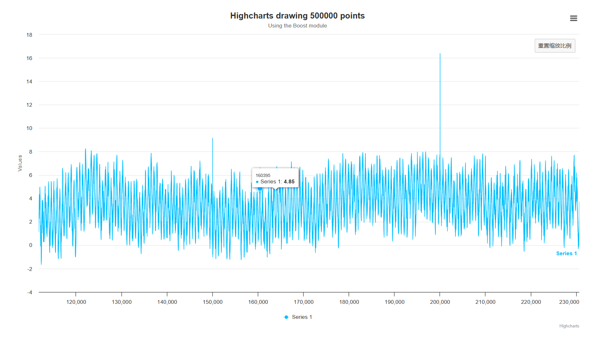


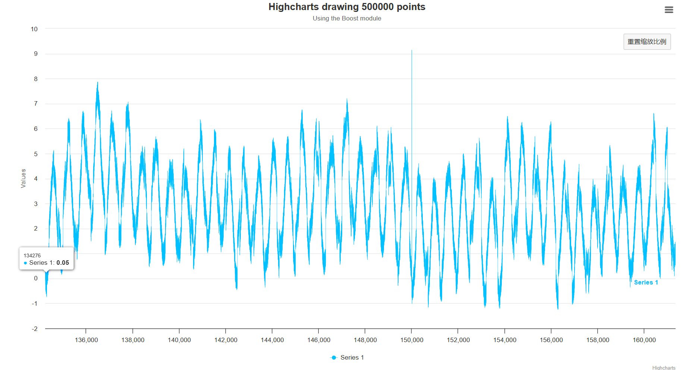


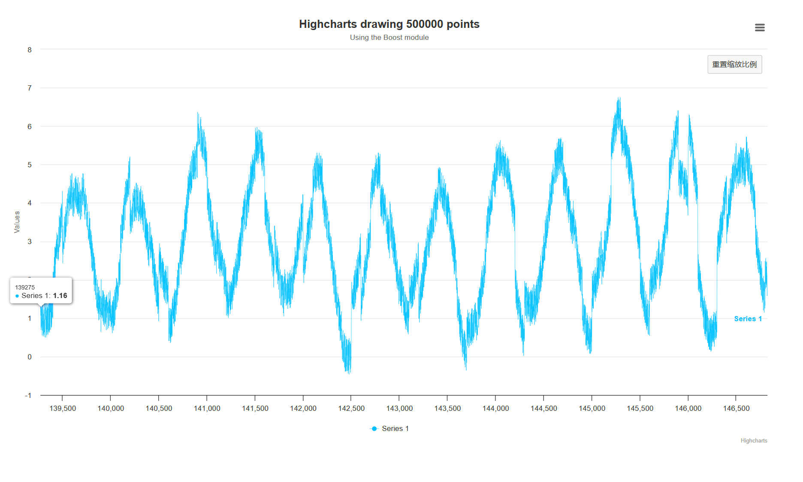


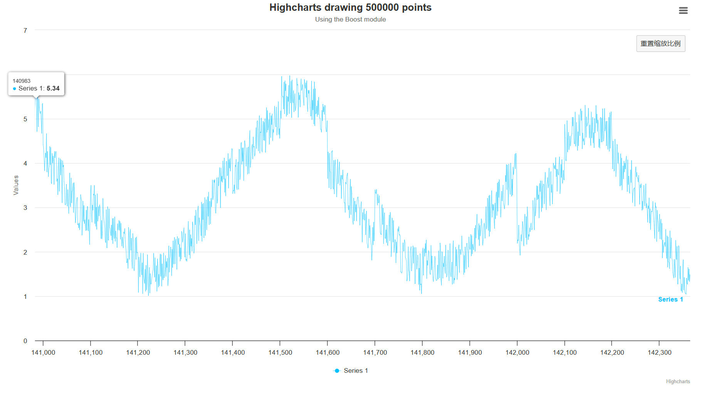

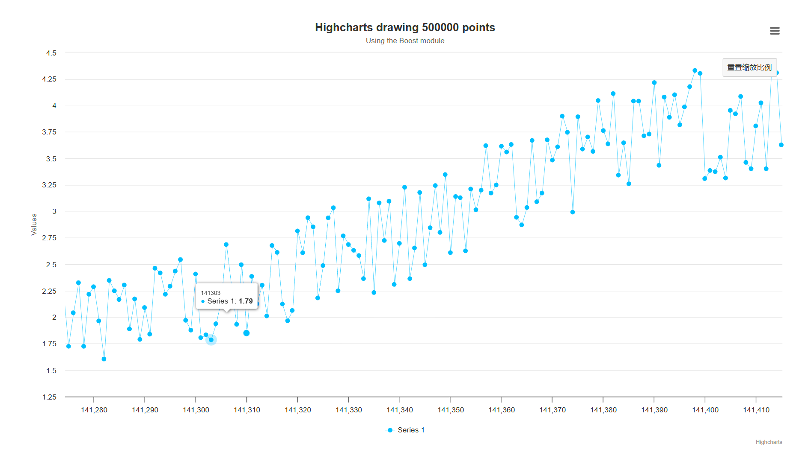


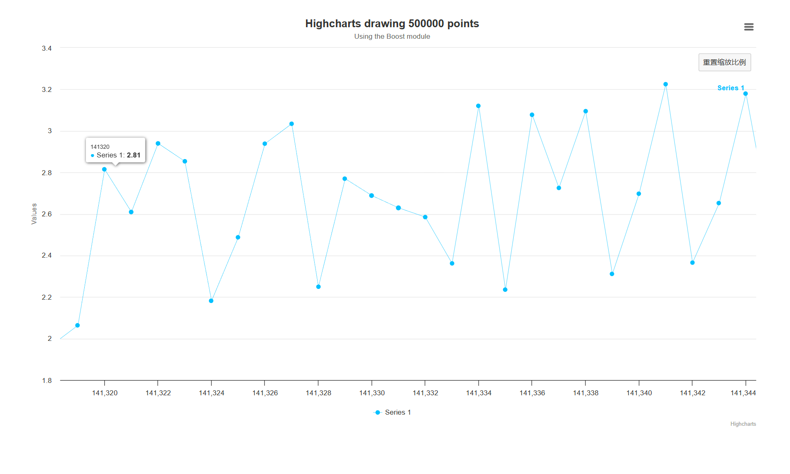


## 面积图

### 基础面积图

```html
<html lang="en">
<head>
    <meta charset="UTF-8">
    <title>基础面积图</title>

    <script src="./js/highcharts.js"></script>
    <script src="./js/exporting.js"></script>
    <script src="./js/series-label.js"></script>
    <script src="./js/zh_cn.js"></script>

</head>

<style>
    #container {
        width: 70vw;
        height: 70vh;
        position: absolute;
        top: 50%;
        left: 50%;
        transform: translate(-50%, -50%);
    }
</style>
<body>
<div id="container"></div>
<script>
    var chart = Highcharts.chart('container', {
        chart: {
            type: 'area'
        },
        title: {
            text: '美苏核武器库存量'
        },
        subtitle: {
            text: '数据来源: <a href="https://thebulletin.metapress.com/content/c4120650912x74k7/fulltext.pdf">' +
                'thebulletin.metapress.com</a>'
        },
        xAxis: {
            allowDecimals: false
        },
        yAxis: {
            title: {
                text: '核武库国家'
            },
            labels: {
                formatter: function ()
                {
                    return this.value / 1000 + 'k';
                }
            }
        },
        tooltip: {
            pointFormat: '{series.name} 制造 <b>{point.y:,.0f}</b>枚弹头'
        },
        plotOptions: {
            area: {
                pointStart: 1940,
                marker: {
                    enabled: false,
                    symbol: 'circle',
                    radius: 2,
                    states: {
                        hover: {
                            enabled: true
                        }
                    }
                }
            }
        },
        series: [{
            name: '美国',
            data: [null, null, null, null, null, 6, 11, 32, 110, 235, 369, 640,
                1005, 1436, 2063, 3057, 4618, 6444, 9822, 15468, 20434, 24126,
                27387, 29459, 31056, 31982, 32040, 31233, 29224, 27342, 26662,
                26956, 27912, 28999, 28965, 27826, 25579, 25722, 24826, 24605,
                24304, 23464, 23708, 24099, 24357, 24237, 24401, 24344, 23586,
                22380, 21004, 17287, 14747, 13076, 12555, 12144, 11009, 10950,
                10871, 10824, 10577, 10527, 10475, 10421, 10358, 10295, 10104]
        }, {
            name: '苏联/俄罗斯',
            data: [null, null, null, null, null, null, null, null, null, null,
                5, 25, 50, 120, 150, 200, 426, 660, 869, 1060, 1605, 2471, 3322,
                4238, 5221, 6129, 7089, 8339, 9399, 10538, 11643, 13092, 14478,
                15915, 17385, 19055, 21205, 23044, 25393, 27935, 30062, 32049,
                33952, 35804, 37431, 39197, 45000, 43000, 41000, 39000, 37000,
                35000, 33000, 31000, 29000, 27000, 25000, 24000, 23000, 22000,
                21000, 20000, 19000, 18000, 18000, 17000, 16000]
        }]
    });
</script>

</body>
</html>
```


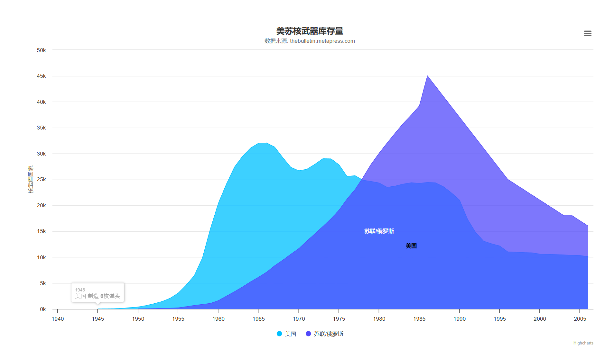


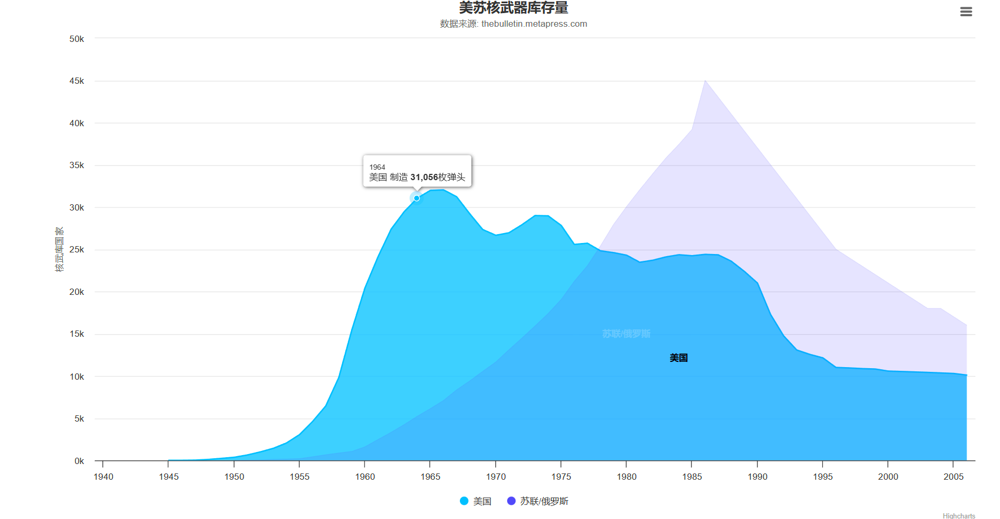


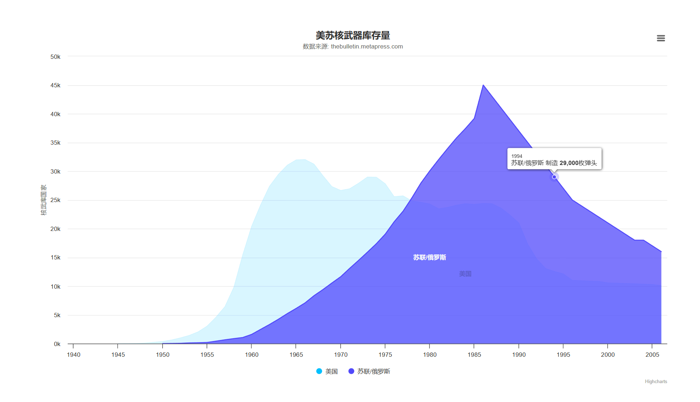


### 堆叠面积图

```html
<html lang="en">
<head>
    <meta charset="UTF-8">
    <title>堆叠面积图</title>

    <script src="./js/highcharts.js"></script>
    <script src="./js/exporting.js"></script>
    <script src="./js/series-label.js"></script>
    <script src="./js/zh_cn.js"></script>

</head>

<style>
    #container {
        width: 70vw;
        height: 70vh;
        position: absolute;
        top: 50%;
        left: 50%;
        transform: translate(-50%, -50%);
    }
</style>
<body>
<div id="container"></div>
<script>
    var chart = Highcharts.chart('container', {
        chart: {
            type: 'area'
        },
        title: {
            text: '全球各大洲人口增长历史及预测'
        },
        subtitle: {
            text: '数据来源: Wikipedia.org'
        },
        xAxis: {
            categories: ['1750', '1800', '1850', '1900', '1950', '1999', '2050'],
            tickmarkPlacement: 'on',
            title: {
                enabled: false
            }
        },
        yAxis: {
            title: {
                text: '十亿'
            },
            labels: {
                formatter: function ()
                {
                    return this.value / 1000;
                }
            }
        },
        tooltip: {
            split: true,
            valueSuffix: ' 百万'
        },
        plotOptions: {
            area: {
                stacking: 'normal',
                lineColor: '#666666',
                lineWidth: 1,
                marker: {
                    lineWidth: 1,
                    lineColor: '#666666'
                }
            }
        },
        series: [{
            name: '亚洲',
            data: [502, 635, 809, 947, 1402, 3634, 5268]
        }, {
            name: '非洲',
            data: [106, 107, 111, 133, 221, 767, 1766]
        }, {
            name: '欧洲',
            data: [163, 203, 276, 408, 547, 729, 628]
        }, {
            name: '美洲',
            data: [18, 31, 54, 156, 339, 818, 1201]
        }, {
            name: '大洋洲',
            data: [2, 2, 2, 6, 13, 30, 46]
        }]
    });
</script>

</body>
</html>
```


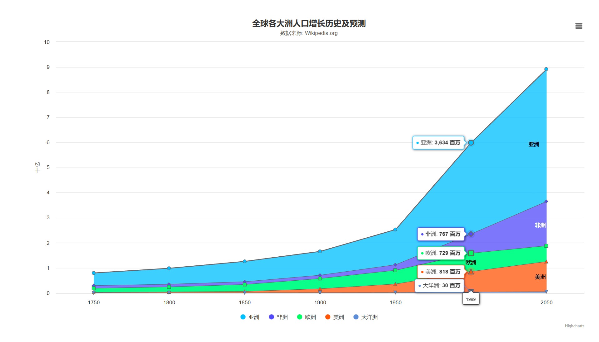


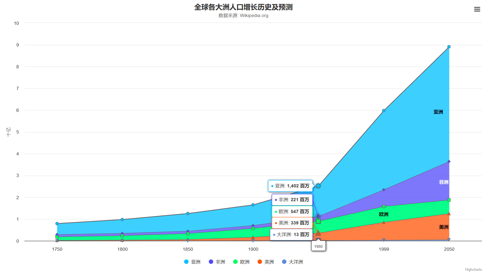


### 百分比堆叠面积图

```html
<html lang="en">
<head>
    <meta charset="UTF-8">
    <title>百分比堆叠面积图</title>

    <script src="./js/highcharts.js"></script>
    <script src="./js/exporting.js"></script>
    <script src="./js/series-label.js"></script>
    <script src="./js/zh_cn.js"></script>

</head>

<style>
    #container {
        width: 70vw;
        height: 70vh;
        position: absolute;
        top: 50%;
        left: 50%;
        transform: translate(-50%, -50%);
    }
</style>
<body>
<div id="container"></div>
<script>
    var chart = Highcharts.chart('container', {
        chart: {
            type: 'area'
        },
        title: {
            text: '全球各大洲人口占比'
        },
        subtitle: {
            text: '数据来源: Wikipedia.org'
        },
        xAxis: {
            categories: ['1750', '1800', '1850', '1900', '1950', '1999', '2050'],
            tickmarkPlacement: 'on',
            title: {
                enabled: false
            }
        },
        yAxis: {
            title: {
                text: '百分比'
            }
        },
        tooltip: {
            pointFormat: '<span style="color:{series.color}">{series.name}</span>: <b>{point.percentage:.1f}%</b> ({point.y:,.0f} 百万)<br/>',
            shared: true
        },
        plotOptions: {
            area: {
                stacking: 'percent',
                lineColor: '#ffffff',
                lineWidth: 1,
                marker: {
                    lineWidth: 1,
                    lineColor: '#ffffff'
                }
            }
        },
        series: [{
            name: '亚洲',
            data: [502, 635, 809, 947, 1402, 3634, 5268]
        }, {
            name: '非洲',
            data: [106, 107, 111, 133, 221, 767, 1766]
        }, {
            name: '欧洲',
            data: [163, 203, 276, 408, 547, 729, 628]
        }, {
            name: '美洲',
            data: [18, 31, 54, 156, 339, 818, 1201]
        }, {
            name: '大洋洲',
            data: [2, 2, 2, 6, 13, 30, 46]
        }]
    });
</script>

</body>
</html>
```


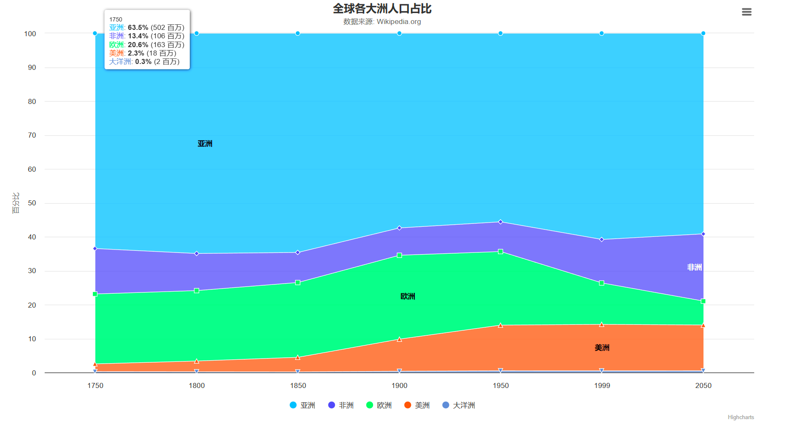


## 柱状图和条形图

### 基础条形图

```html
<html lang="en">
<head>
    <meta charset="UTF-8">
    <title>基础条形图</title>

    <script src="./js/highcharts.js"></script>
    <script src="./js/exporting.js"></script>
    <script src="./js/series-label.js"></script>
    <script src="./js/zh_cn.js"></script>

</head>

<style>
    #container {
        width: 70vw;
        height: 70vh;
        position: absolute;
        top: 50%;
        left: 50%;
        transform: translate(-50%, -50%);
    }
</style>
<body>
<div id="container"></div>
<script>
    var chart = Highcharts.chart('container', {
        chart: {
            type: 'bar'
        },
        title: {
            text: '各洲不同时间的人口条形图'
        },
        subtitle: {
            text: '数据来源: Wikipedia.org'
        },
        xAxis: {
            categories: ['非洲', '美洲', '亚洲', '欧洲', '大洋洲'],
            title: {
                text: null
            }
        },
        yAxis: {
            min: 0,
            title: {
                text: '人口总量 (百万)',
                align: 'high'
            },
            labels: {
                overflow: 'justify'
            }
        },
        tooltip: {
            valueSuffix: ' 百万'
        },
        plotOptions: {
            bar: {
                dataLabels: {
                    enabled: true,
                    allowOverlap: true // 允许数据标签重叠
                }
            }
        },
        legend: {
            layout: 'vertical',
            align: 'right',
            verticalAlign: 'top',
            x: -40,
            y: 100,
            floating: true,
            borderWidth: 1,
            backgroundColor: ((Highcharts.theme && Highcharts.theme.legendBackgroundColor) || '#FFFFFF'),
            shadow: true
        },
        series: [{
            name: '1800 年',
            data: [107, 31, 635, 203, 2]
        }, {
            name: '1900 年',
            data: [133, 156, 947, 408, 6]
        }, {
            name: '2008 年',
            data: [973, 914, 4054, 732, 34]
        }]
    });
</script>

</body>
</html>
```


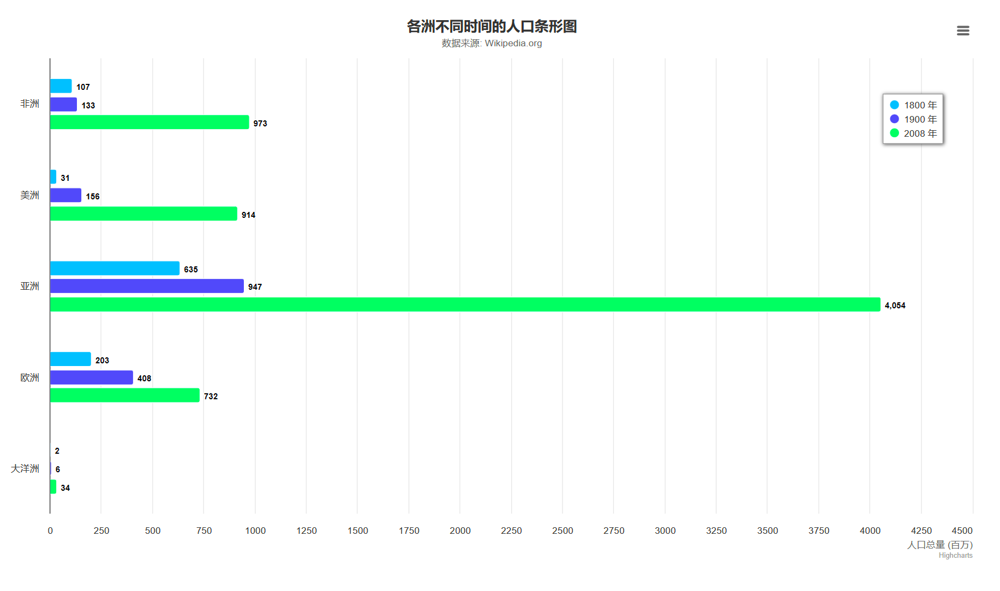


### 堆叠条形图

```html
<html lang="en">
<head>
    <meta charset="UTF-8">
    <title>堆叠条形图</title>

    <script src="./js/highcharts.js"></script>
    <script src="./js/exporting.js"></script>
    <script src="./js/series-label.js"></script>
    <script src="./js/zh_cn.js"></script>

</head>

<style>
    #container {
        width: 70vw;
        height: 70vh;
        position: absolute;
        top: 50%;
        left: 50%;
        transform: translate(-50%, -50%);
    }
</style>
<body>
<div id="container"></div>
<script>
    var chart = Highcharts.chart('container', {
        chart: {
            type: 'bar'
        },
        title: {
            text: '堆叠条形图'
        },
        xAxis: {
            categories: ['苹果', '橘子', '梨', '葡萄', '香蕉']
        },
        yAxis: {
            min: 0,
            title: {
                text: '水果消费总量'
            }
        },
        legend: {
            /* 图例显示顺序反转
             * 这是因为堆叠的顺序默认是反转的，可以设置
             * yAxis.reversedStacks = false 来达到类似的效果
             */
            reversed: true
        },
        plotOptions: {
            series: {
                stacking: 'normal'
            }
        },
        series: [{
            name: '小张',
            data: [5, 3, 4, 7, 2]
        }, {
            name: '小彭',
            data: [2, 2, 3, 2, 1]
        }, {
            name: '小潘',
            data: [3, 4, 4, 2, 5]
        }]
    });
</script>

</body>
</html>
```


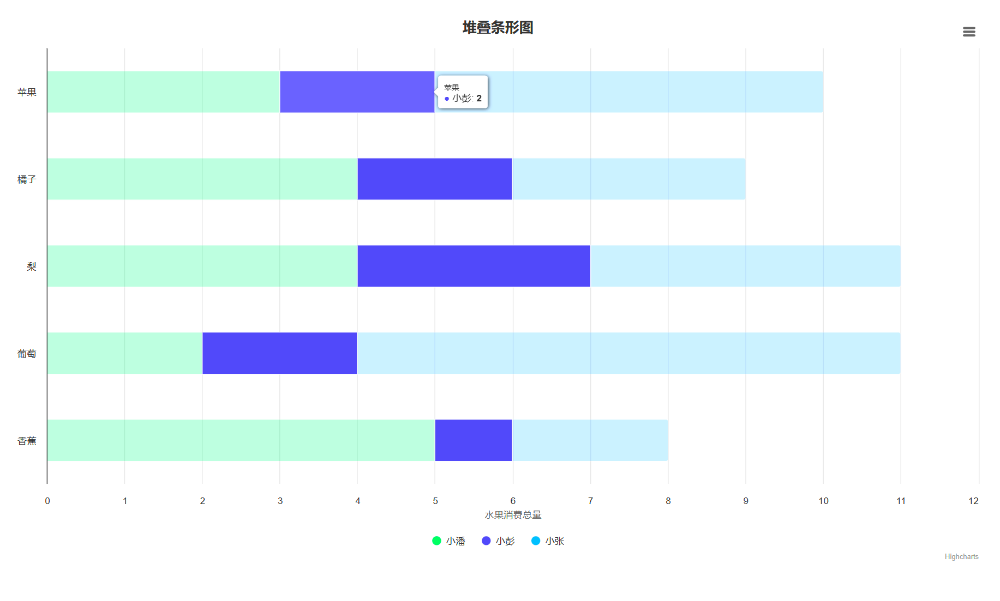


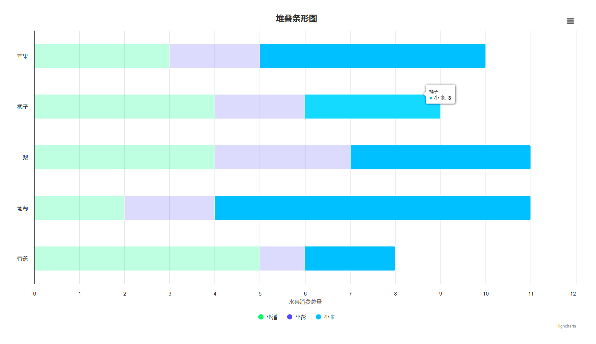


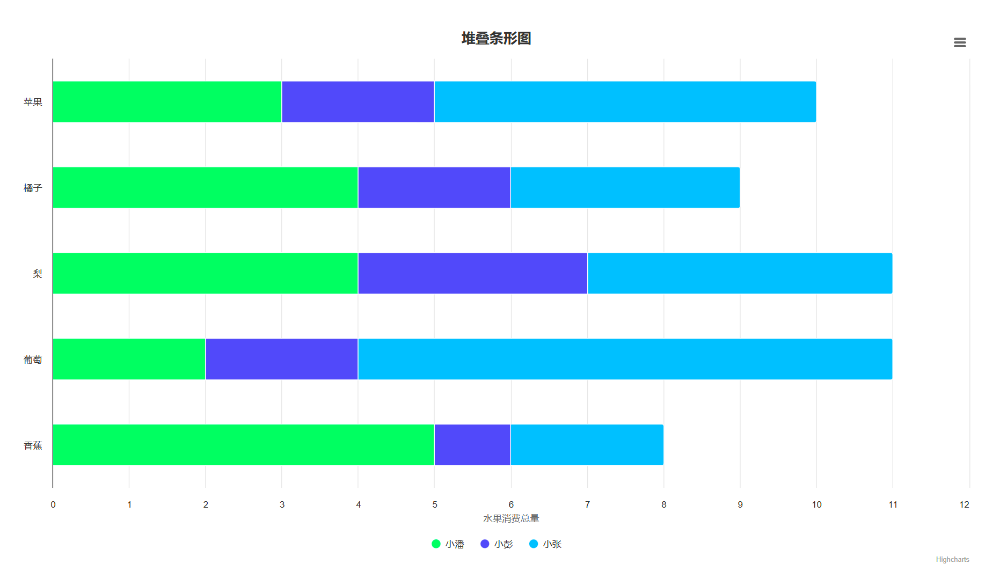


### 基础柱状图

```html
<html lang="en">
<head>
    <meta charset="UTF-8">
    <title>基础柱状图</title>

    <script src="./js/highcharts.js"></script>
    <script src="./js/exporting.js"></script>
    <script src="./js/series-label.js"></script>
    <script src="./js/zh_cn.js"></script>

</head>

<style>
    #container {
        width: 70vw;
        height: 70vh;
        position: absolute;
        top: 50%;
        left: 50%;
        transform: translate(-50%, -50%);
    }
</style>
<body>
<div id="container"></div>
<script>
    var chart = Highcharts.chart('container', {
        chart: {
            type: 'column'
        },
        title: {
            text: '月平均降雨量'
        },
        subtitle: {
            text: '数据来源: WorldClimate.com'
        },
        xAxis: {
            categories: [
                '一月', '二月', '三月', '四月', '五月', '六月', '七月', '八月', '九月', '十月', '十一月', '十二月'
            ],
            crosshair: true
        },
        yAxis: {
            min: 0,
            title: {
                text: '降雨量 (mm)'
            }
        },
        tooltip: {
            // head + 每个 point + footer 拼接成完整的 table
            headerFormat: '<span style="font-size:10px">{point.key}</span><table>',
            pointFormat: '<tr><td style="color:{series.color};padding:0">{series.name}: </td>' +
                '<td style="padding:0"><b>{point.y:.1f} mm</b></td></tr>',
            footerFormat: '</table>',
            shared: true,
            useHTML: true
        },
        plotOptions: {
            column: {
                borderWidth: 0
            }
        },
        series: [{
            name: '东京',
            data: [49.9, 71.5, 106.4, 129.2, 144.0, 176.0, 135.6, 148.5, 216.4, 194.1, 95.6, 54.4]
        }, {
            name: '纽约',
            data: [83.6, 78.8, 98.5, 93.4, 106.0, 84.5, 105.0, 104.3, 91.2, 83.5, 106.6, 92.3]
        }, {
            name: '伦敦',
            data: [48.9, 38.8, 39.3, 41.4, 47.0, 48.3, 59.0, 59.6, 52.4, 65.2, 59.3, 51.2]
        }, {
            name: '柏林',
            data: [42.4, 33.2, 34.5, 39.7, 52.6, 75.5, 57.4, 60.4, 47.6, 39.1, 46.8, 51.1]
        }]
    });
</script>

</body>
</html>
```


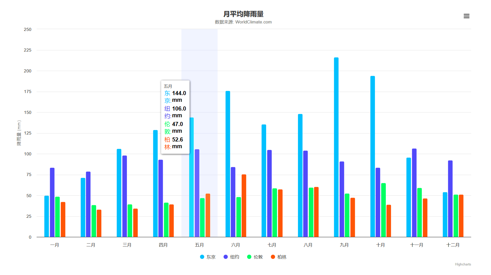


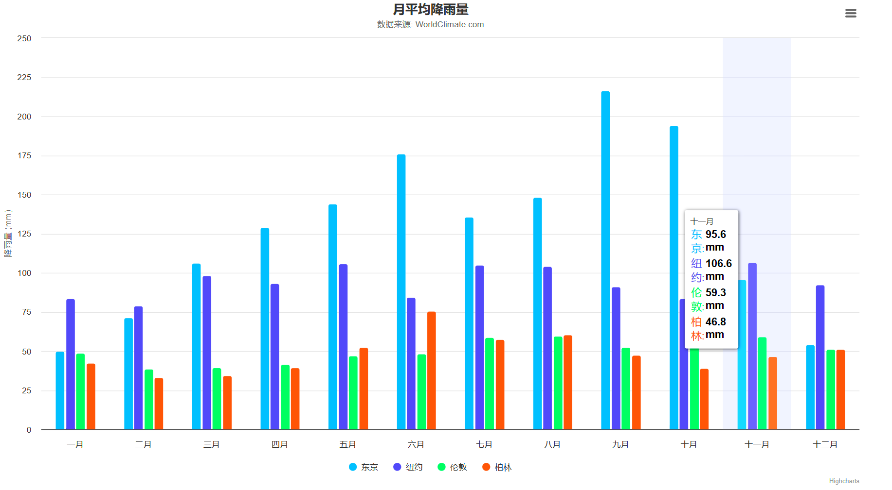


### 堆叠柱状图

```html
<html lang="en">
<head>
    <meta charset="UTF-8">
    <title>堆叠柱状图</title>

    <script src="./js/highcharts.js"></script>
    <script src="./js/exporting.js"></script>
    <script src="./js/series-label.js"></script>
    <script src="./js/zh_cn.js"></script>

</head>

<style>
    #container {
        width: 70vw;
        height: 70vh;
        position: absolute;
        top: 50%;
        left: 50%;
        transform: translate(-50%, -50%);
    }
</style>
<body>
<div id="container"></div>
<script>
    var chart = Highcharts.chart('container', {
        chart: {
            type: 'column'
        },
        title: {
            text: '堆叠柱状图'
        },
        xAxis: {
            categories: ['苹果', '橘子', '梨', '葡萄', '香蕉']
        },
        yAxis: {
            min: 0,
            title: {
                text: '水果消费总量'
            }
        },
        legend: {
            /* 图例显示顺序反转
             * 这是因为堆叠的顺序默认是反转的，可以设置
             * yAxis.reversedStacks = false 来达到类似的效果
             */
            reversed: true
        },
        plotOptions: {
            series: {
                stacking: 'normal'
            }
        },
        series: [{
            name: '小张',
            data: [5, 3, 4, 7, 2]
        }, {
            name: '小彭',
            data: [2, 2, 3, 2, 1]
        }, {
            name: '小潘',
            data: [3, 4, 4, 2, 5]
        }]
    });
</script>

</body>
</html>
```


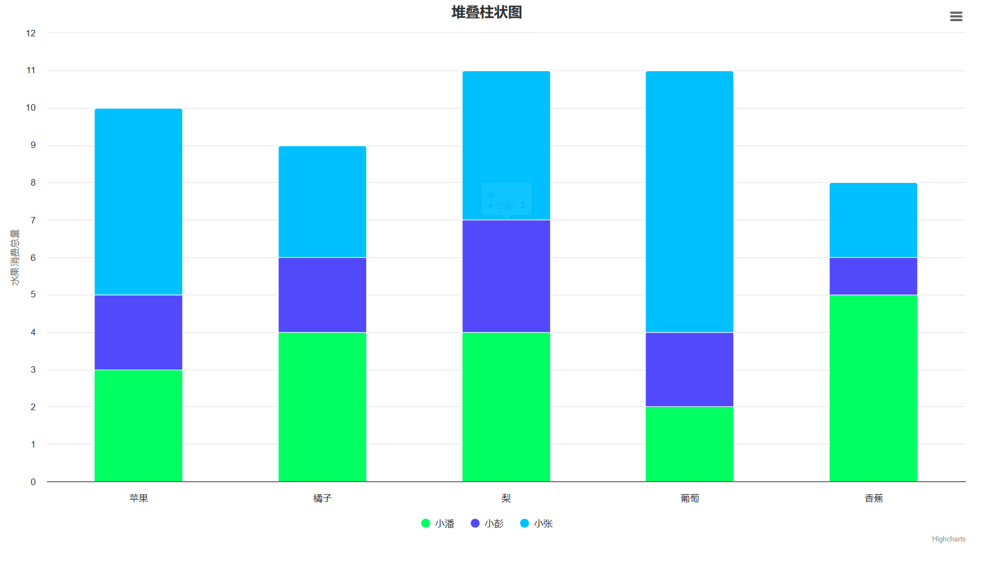


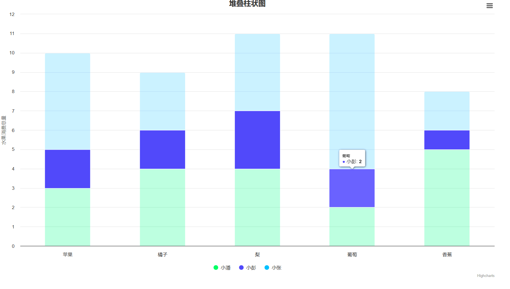


```html
<html lang="en">
<head>
    <meta charset="UTF-8">
    <title>堆叠柱状图</title>

    <script src="./js/highcharts.js"></script>
    <script src="./js/exporting.js"></script>
    <script src="./js/series-label.js"></script>
    <script src="./js/zh_cn.js"></script>

</head>

<style>
    #container {
        width: 70vw;
        height: 70vh;
        position: absolute;
        top: 50%;
        left: 50%;
        transform: translate(-50%, -50%);
    }
</style>
<body>
<div id="container"></div>
<script>
    var chart = Highcharts.chart('container', {
        chart: {
            type: 'column'
        },
        title: {
            text: '堆叠柱形图'
        },
        xAxis: {
            categories: ['苹果', '橘子', '梨', '葡萄', '香蕉']
        },
        yAxis: {
            min: 0,
            title: {
                text: '水果消费总量'
            },
            stackLabels: {  // 堆叠数据标签
                enabled: true,
                style: {
                    fontWeight: 'bold',
                    color: (Highcharts.theme && Highcharts.theme.textColor) || 'gray'
                }
            }
        },
        legend: {
            align: 'right',
            x: -30,
            verticalAlign: 'top',
            y: 25,
            floating: true,
            backgroundColor: (Highcharts.theme && Highcharts.theme.background2) || 'white',
            borderColor: '#CCC',
            borderWidth: 1,
            shadow: false
        },
        tooltip: {
            formatter: function () {
                return '<b>' + this.x + '</b><br/>' +
                    this.series.name + ': ' + this.y + '<br/>' +
                    '总量: ' + this.point.stackTotal;
            }
        },
        plotOptions: {
            column: {
                stacking: 'normal',
                dataLabels: {
                    enabled: true,
                    color: (Highcharts.theme && Highcharts.theme.dataLabelsColor) || 'white',
                    style: {
                        // 如果不需要数据标签阴影，可以将 textOutline 设置为 'none'
                        textOutline: '1px 1px black'
                    }
                }
            }
        },
        series: [{
            name: '小张',
            data: [5, 3, 4, 7, 2]
        }, {
            name: '小彭',
            data: [2, 2, 3, 2, 1]
        }, {
            name: '小潘',
            data: [3, 4, 4, 2, 5]
        }]
    });
</script>

</body>
</html>
```


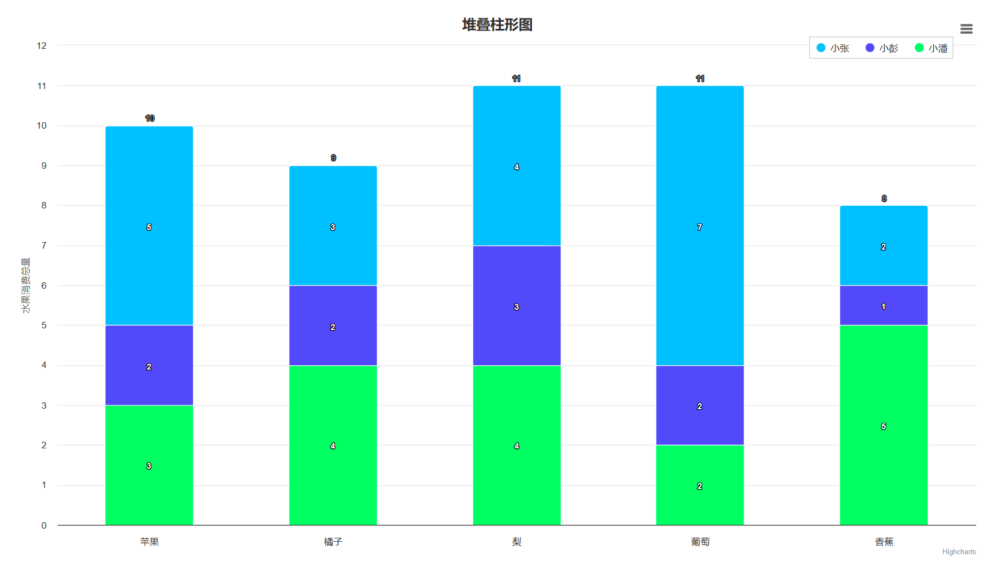


### 动态更新数据

```html
<html lang="en">
<head>
    <meta charSet="UTF-8">
    <title>动态更新数据</title>

    <script src="./js/highcharts.js"></script>
    <script src="./js/exporting.js"></script>
    <script src="./js/series-label.js"></script>
    <script src="./js/zh_cn.js"></script>

</head>

<style>
    #container {
        width: 70vw;
        height: 70vh;
        position: absolute;
        top: 50%;
        left: 50%;
        transform: translate(-50%, -50%);
    }
</style>
<body>
<div id="container"></div>
<script>
    var chart = Highcharts.chart('container', {
        chart: {
            type: 'column'
        },
        title: {
            text: '堆叠柱形图'
        },
        xAxis: {
            categories: ['苹果', '橘子', '梨', '葡萄', '香蕉']
        },
        yAxis: {
            min: 0,
            title: {
                text: '水果消费总量'
            },
            stackLabels: {  // 堆叠数据标签
                enabled: true,
                style: {
                    fontWeight: 'bold',
                    color: (Highcharts.theme && Highcharts.theme.textColor) || 'gray'
                }
            }
        },
        legend: {
            align: 'right',
            x: -30,
            verticalAlign: 'top',
            y: 25,
            floating: true,
            backgroundColor: (Highcharts.theme && Highcharts.theme.background2) || 'white',
            borderColor: '#CCC',
            borderWidth: 1,
            shadow: false
        },
        tooltip: {
            formatter: function ()
            {
                return '<b>' + this.x + '</b><br/>' +
                    this.series.name + ': ' + this.y + '<br/>' +
                    '总量: ' + this.point.stackTotal;
            }
        },
        plotOptions: {
            column: {
                stacking: 'normal',
                dataLabels: {
                    enabled: true,
                    color: (Highcharts.theme && Highcharts.theme.dataLabelsColor) || 'white',
                    style: {
                        // 如果不需要数据标签阴影，可以将 textOutline 设置为 'none'
                        textOutline: '1px 1px black'
                    }
                }
            }
        },
        series: [{
            name: '小张',
            data: [5, 3, 4, 7, 2]
        }, {
            name: '小彭',
            data: [2, 2, 3, 2, 1]
        }, {
            name: '小潘',
            data: [3, 4, 4, 2, 5]
        }]
    });

    var a = 4;
    var b = 1;

    window.setInterval(() =>
    {
        const series = chart.series

        series[0].updateData([5, 3, a++, 7, 2])
        series[1].updateData([2, 2, 3, 2, b++])

        chart.redraw();
    }, 3000)

</script>

</body>
</html>
```


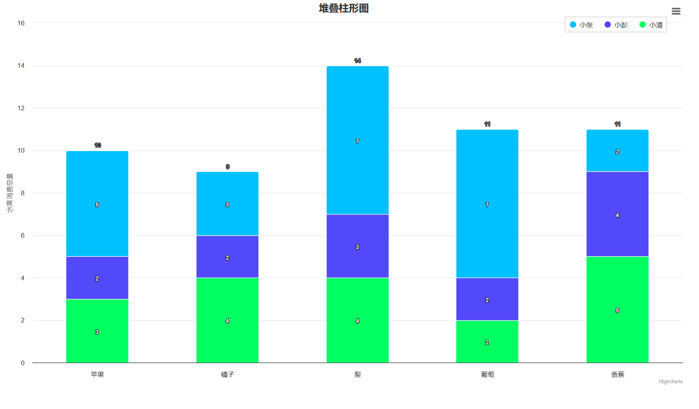


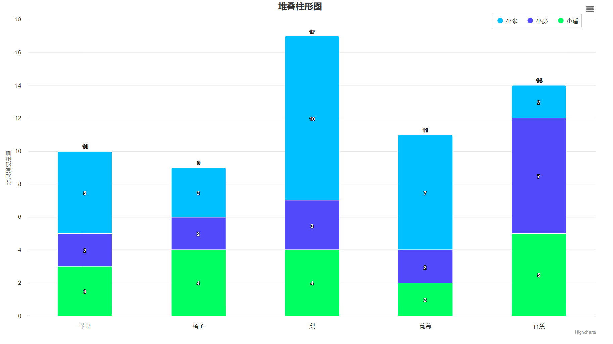


### 百分比堆叠柱状图

```html
<html lang="en">
<head>
    <meta charSet="UTF-8">
    <title>百分比堆叠柱状图</title>

    <script src="./js/highcharts.js"></script>
    <script src="./js/exporting.js"></script>
    <script src="./js/series-label.js"></script>
    <script src="./js/zh_cn.js"></script>

</head>

<style>
    #container {
        width: 70vw;
        height: 70vh;
        position: absolute;
        top: 50%;
        left: 50%;
        transform: translate(-50%, -50%);
    }
</style>
<body>
<div id="container"></div>
<script>
    var chart = Highcharts.chart('container', {
        chart: {
            type: 'column'
        },
        title: {
            text: '百分比堆叠柱形图'
        },
        xAxis: {
            categories: ['苹果', '橘子', '梨', '葡萄', '香蕉']
        },
        yAxis: {
            min: 0,
            title: {
                text: '水果消费总量'
            }
        },
        tooltip: {
            pointFormat: '<span style="color:{series.color}">{series.name}</span>: <b>{point.y}</b>' +
                '({point.percentage:.0f}%)<br/>',
            //:.0f 表示保留 0 位小数，详见教程：https://www.hcharts.cn/docs/basic-labels-string-formatting
            shared: true
        },
        plotOptions: {
            column: {
                stacking: 'percent'
            }
        },
        series: [{
            name: '小张',
            data: [5, 3, 4, 7, 2]
        }, {
            name: '小彭',
            data: [2, 2, 3, 2, 1]
        }, {
            name: '小潘',
            data: [3, 4, 4, 2, 5]
        }]
    });

</script>

</body>
</html>
```


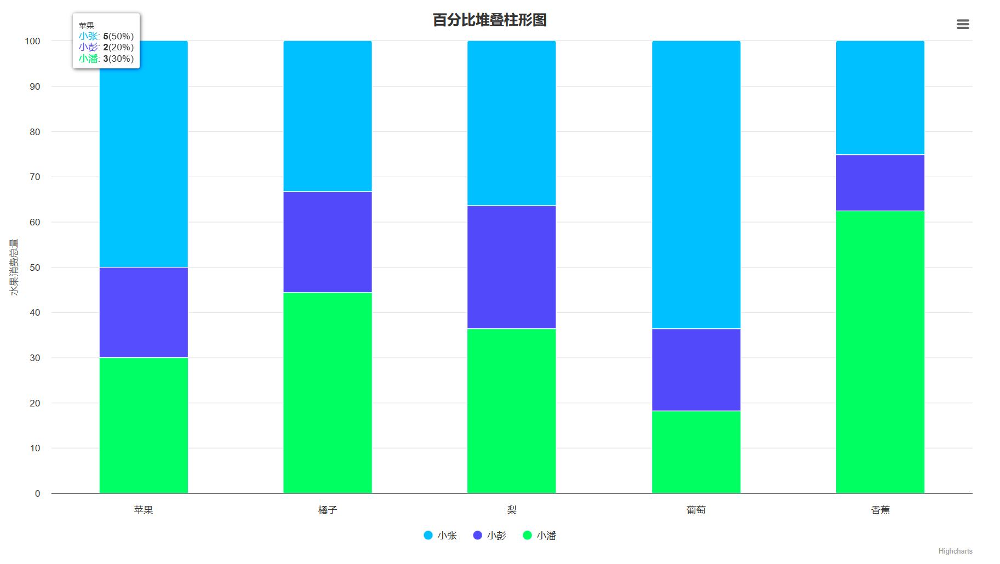


## 饼图

### 基础饼图

```html
<html lang="en">
<head>
    <meta charset="UTF-8">
    <title>基础条形图</title>

    <script src="./js/highcharts.js"></script>
    <script src="./js/exporting.js"></script>
    <script src="./js/series-label.js"></script>
    <script src="./js/zh_cn.js"></script>

</head>

<style>
    #container {
        width: 70vw;
        height: 70vh;
        position: absolute;
        top: 50%;
        left: 50%;
        transform: translate(-50%, -50%);
    }
</style>
<body>
<div id="container"></div>
<script>
    var chart = Highcharts.chart('container', {
        chart: {
            plotBackgroundColor: null,
            plotBorderWidth: null,
            plotShadow: false,
            type: 'pie'
        },
        title: {
            text: '2018年1月浏览器市场份额'
        },
        tooltip: {
            pointFormat: '{series.name}: <b>{point.percentage:.1f}%</b>'
        },
        plotOptions: {
            pie: {
                allowPointSelect: true,
                cursor: 'pointer',
                dataLabels: {
                    enabled: true,
                    format: '<b>{point.name}</b>: {point.percentage:.1f} %',
                    style: {
                        color: (Highcharts.theme && Highcharts.theme.contrastTextColor) || 'black'
                    }
                }
            }
        },
        series: [{
            name: 'Brands',
            colorByPoint: true,
            data: [{
                name: 'Chrome',
                y: 61.41,
                sliced: true,
                selected: true
            }, {
                name: 'Internet Explorer',
                y: 11.84
            }, {
                name: 'Firefox',
                y: 10.85
            }, {
                name: 'Edge',
                y: 4.67
            }, {
                name: 'Safari',
                y: 4.18
            }, {
                name: 'Sogou Explorer',
                y: 1.64
            }, {
                name: 'Opera',
                y: 1.6
            }, {
                name: 'QQ',
                y: 1.2
            }, {
                name: 'Other',
                y: 2.61
            }]
        }]
    })

    var a = 10;
    window.setInterval(() =>
    {
        chart.series[0].updateData([{
            name: 'Chrome',
            y: 61.41,
            sliced: true,
            selected: true
        }, {
            name: 'Internet Explorer',
            y: 11.84
        }, {
            name: 'Firefox',
            y: 10.85
        }, {
            name: 'Edge',
            y: 4.67
        }, {
            name: 'Safari',
            y: 4.18
        }, {
            name: 'Sogou Explorer',
            y: 1.64
        }, {
            name: 'Opera',
            y: 1.6
        }, {
            name: 'QQ',
            y: a += 3
        }, {
            name: 'Other',
            y: 2.61
        }])

        chart.redraw()
    }, 3000)

</script>

</body>
</html>
```


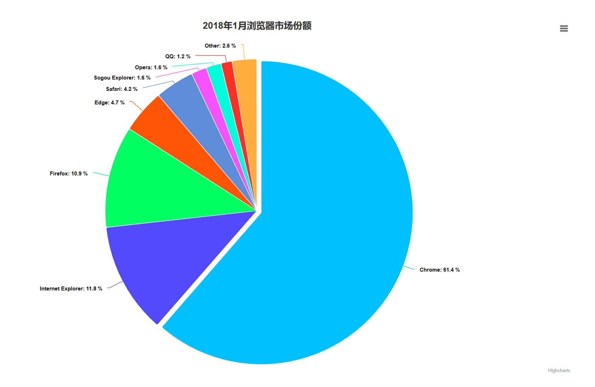


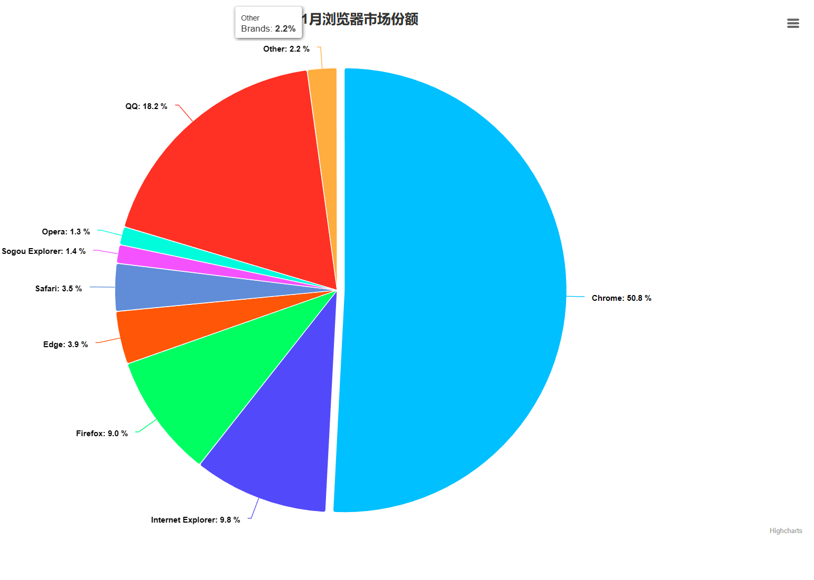


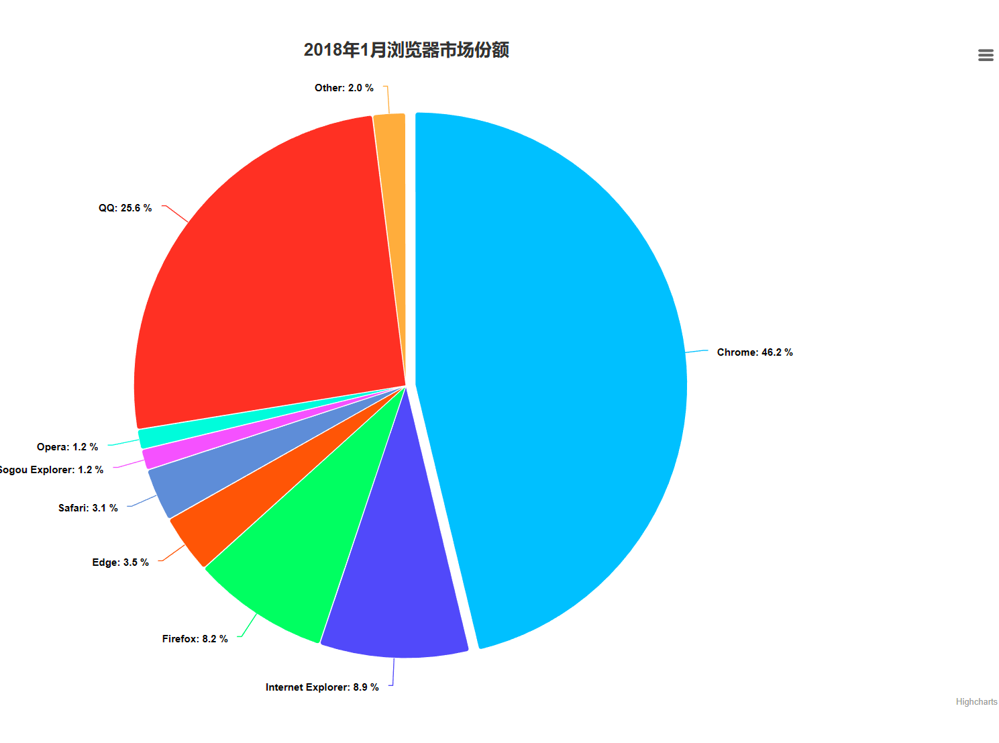


### 包含图例的饼图

```html
<html lang="en">
<head>
    <meta charset="UTF-8">
    <title>基础条形图</title>

    <script src="./js/highcharts.js"></script>
    <script src="./js/exporting.js"></script>
    <script src="./js/series-label.js"></script>
    <script src="./js/zh_cn.js"></script>

</head>

<style>
    #container {
        width: 70vw;
        height: 70vh;
        position: absolute;
        top: 50%;
        left: 50%;
        transform: translate(-50%, -50%);
    }
</style>
<body>
<div id="container"></div>
<script>
    var chart = Highcharts.chart('container', {
        chart: {
            plotBackgroundColor: null,
            plotBorderWidth: null,
            plotShadow: false,
            type: 'pie'
        },
        title: {
            text: '2018 年浏览器市场份额'
        },
        tooltip: {
            pointFormat: '{series.name}: <b>{point.percentage:.1f}%</b>'
        },
        plotOptions: {
            pie: {
                allowPointSelect: true,
                cursor: 'pointer',
                dataLabels: {
                    enabled: true
                },
                showInLegend: true
            }
        },
        series: [{
            name: 'Brands',
            colorByPoint: true,
            data: [{
                name: 'Chrome',
                y: 61.41,
                sliced: true,
                selected: true
            }, {
                name: 'Internet Explorer',
                y: 11.84
            }, {
                name: 'Firefox',
                y: 10.85
            }, {
                name: 'Edge',
                y: 4.67
            }, {
                name: 'Safari',
                y: 4.18
            }, {
                name: 'Other',
                y: 7.05
            }]
        }]
    })

</script>

</body>
</html>
```


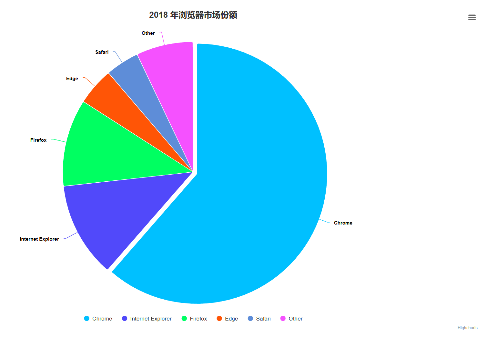


### 扇形图

```html
<html lang="en">
<head>
    <meta charset="UTF-8">
    <title>扇形图</title>

    <script src="./js/highcharts.js"></script>
    <script src="./js/exporting.js"></script>
    <script src="./js/series-label.js"></script>
    <script src="./js/zh_cn.js"></script>

</head>

<style>
    #container {
        width: 70vw;
        height: 70vh;
        position: absolute;
        top: 50%;
        left: 50%;
        transform: translate(-50%, -50%);
    }
</style>
<body>
<div id="container"></div>
<script>
    var chart = Highcharts.chart('container', {
        title: {
            text: '浏览器<br>占比',
            align: 'center',
            verticalAlign: 'middle',
            y: 50
        },
        tooltip: {
            headerFormat: '{series.name}<br>',
            pointFormat: '{point.name}: <b>{point.percentage:.1f}%</b>'
        },
        plotOptions: {
            pie: {
                dataLabels: {
                    enabled: true,
                    distance: -50,
                    style: {
                        fontWeight: 'bold',
                        color: 'white',
                        textShadow: '0px 1px 2px black'
                    }
                },
                startAngle: -90, // 圆环的开始角度
                endAngle: 90,    // 圆环的结束角度
                center: ['50%', '75%']
            }
        },
        series: [{
            type: 'pie',
            name: '浏览器占比',
            innerSize: '50%',
            data: [
                ['Firefox', 45.0],
                ['IE', 26.8],
                ['Chrome', 12.8],
                ['Safari', 8.5],
                ['Opera', 6.2],
                {
                    name: '其他',
                    y: 0.7,
                    dataLabels: {
                        // 数据比较少，没有空间显示数据标签，所以将其关闭
                        enabled: false
                    }
                }
            ]
        }]
    });


</script>

</body>
</html>
```


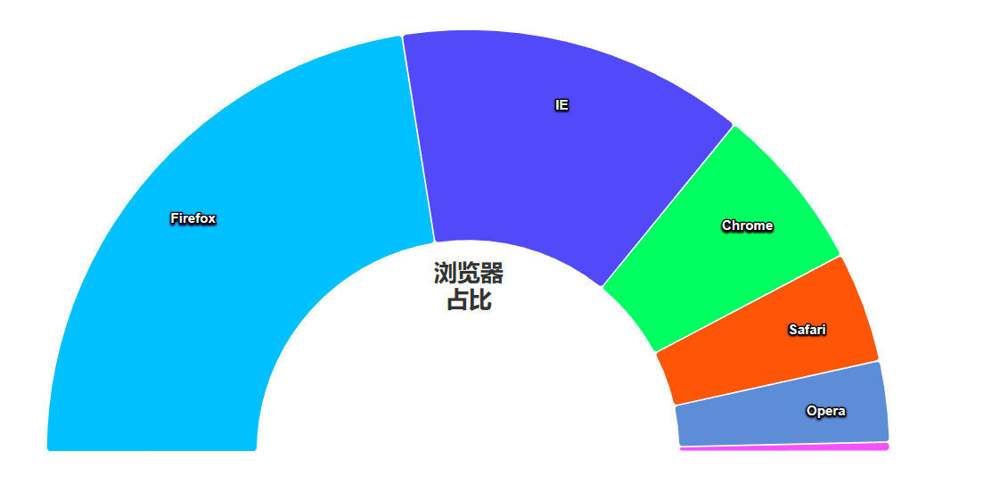


### 可变宽度的环形图

```html
<html lang="en">
<head>
    <meta charset="UTF-8">
    <title>可变宽度的环形图</title>

    <script src="./js/highcharts.js"></script>
    <script src="./js/exporting.js"></script>
    <script src="./js/series-label.js"></script>
    <script src="./js/zh_cn.js"></script>
    <script src="https://code.hcharts.cn/highcharts/modules/variable-pie.js"></script>

</head>

<style>
    #container {
        width: 70vw;
        height: 70vh;
        position: absolute;
        top: 50%;
        left: 50%;
        transform: translate(-50%, -50%);
    }
</style>
<body>
<div id="container"></div>
<script>
    var chart = Highcharts.chart('container', {
        chart: {
            type: 'variablepie'
        },
        title: {
            text: '不同国家人口密度及面积对比'
        },
        subtitle: {
            text: '扇区长度（圆周方法）表示面积，宽度（纵向）表示人口密度'
        },
        tooltip: {
            headerFormat: '',
            pointFormat: '<span style="color:{point.color}">\u25CF</span> <b> {point.name}</b><br/>' +
                '面积 (平方千米): <b>{point.y}</b><br/>' +
                '人口密度 (每平方千米人数): <b>{point.z}</b><br/>'
        },
        series: [{
            minPointSize: 10,
            innerSize: '20%',
            zMin: 0,
            name: 'countries',
            data: [{
                name: '西班牙',
                y: 505370,
                z: 92.9
            }, {
                name: '法国',
                y: 551500,
                z: 118.7
            }, {
                name: '波兰',
                y: 312685,
                z: 124.6
            }, {
                name: '捷克共和国',
                y: 78867,
                z: 137.5
            }, {
                name: '意大利',
                y: 301340,
                z: 201.8
            }, {
                name: '瑞士',
                y: 41277,
                z: 214.5
            }, {
                name: '德国',
                y: 357022,
                z: 235.6
            }]
        }]
    })

    window.setInterval(() =>
    {
        var z1 = 92.9 + (Math.random() > 0.3 ? 26 : -12)
        var z2 = 118.7 + (Math.random() > 0.3 ? 28 : -13)
        var z3 = 124.6 + (Math.random() > 0.3 ? 19 : -12)
        var z4 = 137.5 + (Math.random() > 0.3 ? 28 : -12)
        var z5 = 201.8 + (Math.random() > 0.3 ? 39 : -16)
        var z6 = 214.5 + (Math.random() > 0.3 ? 32 : -14)
        var z7 = 235.6 + (Math.random() > 0.3 ? 20 : -10)

        var data = [{
            name: '西班牙',
            y: 505370,
            z: z1
        }, {
            name: '法国',
            y: 551500,
            z: z2
        }, {
            name: '波兰',
            y: 312685,
            z: z3
        }, {
            name: '捷克共和国',
            y: 78867,
            z: z4
        }, {
            name: '意大利',
            y: 301340,
            z: z5
        }, {
            name: '瑞士',
            y: 41277,
            z: z6
        }, {
            name: '德国',
            y: 357022,
            z: z7
        }]
        chart.series[0].updateData(data)
        chart.redraw();
    }, 2000)

</script>

</body>
</html>
```


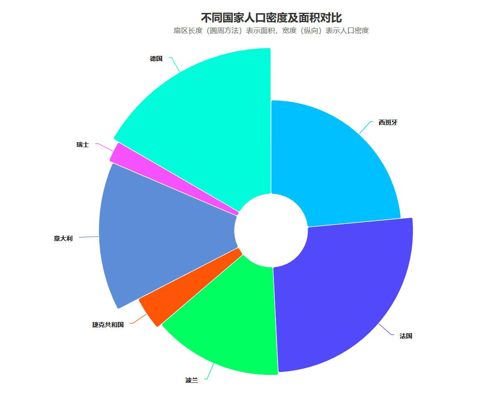


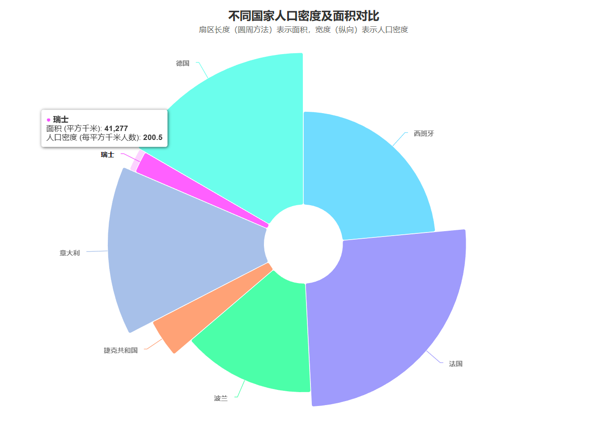


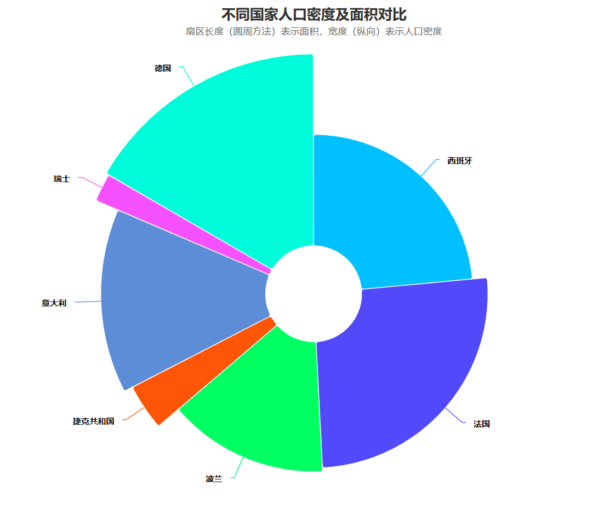


## 散点图和气泡图

### 散点图

```html
<html lang="en">
<head>
    <meta charset="UTF-8">
    <title>散点图</title>

    <script src="./js/highcharts.js"></script>
    <script src="./js/exporting.js"></script>
    <script src="./js/series-label.js"></script>
    <script src="./js/zh_cn.js"></script>

</head>

<style>
    #container {
        width: 70vw;
        height: 70vh;
        position: absolute;
        top: 50%;
        left: 50%;
        transform: translate(-50%, -50%);
    }
</style>
<body>
<div id="container"></div>
<script>
    var chart = Highcharts.chart('container', {
        chart: {
            type: 'scatter',
            zoomType: 'xy'
        },
        title: {
            text: '507 人按性别划分的身高和体重分布图'
        },
        subtitle: {
            text: '数据来源: Heinz  2003'
        },
        xAxis: {
            title: {
                enabled: true,
                text: '身高 (cm)'
            },
            startOnTick: true,
            endOnTick: true,
            showLastLabel: true
        },
        yAxis: {
            title: {
                text: '体重 (kg)'
            }
        },
        legend: {
            layout: 'vertical',
            align: 'left',
            verticalAlign: 'top',
            x: 100,
            y: 70,
            floating: true,
            backgroundColor: (Highcharts.theme && Highcharts.theme.legendBackgroundColor) || '#FFFFFF',
            borderWidth: 1
        },
        plotOptions: {
            scatter: {
                marker: {
                    radius: 5,
                    states: {
                        hover: {
                            enabled: true,
                            lineColor: 'rgb(100,100,100)'
                        }
                    }
                },
                states: {
                    hover: {
                        marker: {
                            enabled: false
                        }
                    }
                },
                tooltip: {
                    headerFormat: '<b>{series.name}</b><br>',
                    pointFormat: '{point.x} cm, {point.y} kg'
                }
            }
        },
        series: [{
            name: '女',
            color: 'rgba(223, 83, 83, .5)',
            data: [[161.2, 51.6], [167.5, 59.0], [159.5, 49.2], [157.0, 63.0], [155.8, 53.6],
                [170.0, 59.0], [159.1, 47.6], [166.0, 69.8], [176.2, 66.8], [160.2, 75.2],
                [172.5, 55.2], [170.9, 54.2], [172.9, 62.5], [153.4, 42.0], [160.0, 50.0],
                [147.2, 49.8], [168.2, 49.2], [175.0, 73.2], [157.0, 47.8], [167.6, 68.8],
                [159.5, 50.6], [175.0, 82.5], [166.8, 57.2], [176.5, 87.8], [170.2, 72.8],
                [174.0, 54.5], [173.0, 59.8], [179.9, 67.3], [170.5, 67.8], [160.0, 47.0],
                [154.4, 46.2], [162.0, 55.0], [176.5, 83.0], [160.0, 54.4], [152.0, 45.8],
                [162.1, 53.6], [170.0, 73.2], [160.2, 52.1], [161.3, 67.9], [166.4, 56.6],
                [168.9, 62.3], [163.8, 58.5], [167.6, 54.5], [160.0, 50.2], [161.3, 60.3],
                [167.6, 58.3], [165.1, 56.2], [160.0, 50.2], [170.0, 72.9], [157.5, 59.8],
                [167.6, 61.0], [160.7, 69.1], [163.2, 55.9], [152.4, 46.5], [157.5, 54.3],
                [168.3, 54.8], [180.3, 60.7], [165.5, 60.0], [165.0, 62.0], [164.5, 60.3],
                [156.0, 52.7], [160.0, 74.3], [163.0, 62.0], [165.7, 73.1], [161.0, 80.0],
                [162.0, 54.7], [166.0, 53.2], [174.0, 75.7], [172.7, 61.1], [167.6, 55.7],
                [151.1, 48.7], [164.5, 52.3], [163.5, 50.0], [152.0, 59.3], [169.0, 62.5],
                [164.0, 55.7], [161.2, 54.8], [155.0, 45.9], [170.0, 70.6], [176.2, 67.2],
                [170.0, 69.4], [162.5, 58.2], [170.3, 64.8], [164.1, 71.6], [169.5, 52.8],
                [163.2, 59.8], [154.5, 49.0], [159.8, 50.0], [173.2, 69.2], [170.0, 55.9],
                [161.4, 63.4], [169.0, 58.2], [166.2, 58.6], [159.4, 45.7], [162.5, 52.2],
                [159.0, 48.6], [162.8, 57.8], [159.0, 55.6], [179.8, 66.8], [162.9, 59.4],
                [161.0, 53.6], [151.1, 73.2], [168.2, 53.4], [168.9, 69.0], [173.2, 58.4],
                [171.8, 56.2], [178.0, 70.6], [164.3, 59.8], [163.0, 72.0], [168.5, 65.2],
                [166.8, 56.6], [172.7, 105.2], [163.5, 51.8], [169.4, 63.4], [167.8, 59.0],
                [159.5, 47.6], [167.6, 63.0], [161.2, 55.2], [160.0, 45.0], [163.2, 54.0],
                [162.2, 50.2], [161.3, 60.2], [149.5, 44.8], [157.5, 58.8], [163.2, 56.4],
                [172.7, 62.0], [155.0, 49.2], [156.5, 67.2], [164.0, 53.8], [160.9, 54.4],
                [162.8, 58.0], [167.0, 59.8], [160.0, 54.8], [160.0, 43.2], [168.9, 60.5],
                [158.2, 46.4], [156.0, 64.4], [160.0, 48.8], [167.1, 62.2], [158.0, 55.5],
                [167.6, 57.8], [156.0, 54.6], [162.1, 59.2], [173.4, 52.7], [159.8, 53.2],
                [170.5, 64.5], [159.2, 51.8], [157.5, 56.0], [161.3, 63.6], [162.6, 63.2],
                [160.0, 59.5], [168.9, 56.8], [165.1, 64.1], [162.6, 50.0], [165.1, 72.3],
                [166.4, 55.0], [160.0, 55.9], [152.4, 60.4], [170.2, 69.1], [162.6, 84.5],
                [170.2, 55.9], [158.8, 55.5], [172.7, 69.5], [167.6, 76.4], [162.6, 61.4],
                [167.6, 65.9], [156.2, 58.6], [175.2, 66.8], [172.1, 56.6], [162.6, 58.6],
                [160.0, 55.9], [165.1, 59.1], [182.9, 81.8], [166.4, 70.7], [165.1, 56.8],
                [177.8, 60.0], [165.1, 58.2], [175.3, 72.7], [154.9, 54.1], [158.8, 49.1],
                [172.7, 75.9], [168.9, 55.0], [161.3, 57.3], [167.6, 55.0], [165.1, 65.5],
                [175.3, 65.5], [157.5, 48.6], [163.8, 58.6], [167.6, 63.6], [165.1, 55.2],
                [165.1, 62.7], [168.9, 56.6], [162.6, 53.9], [164.5, 63.2], [176.5, 73.6],
                [168.9, 62.0], [175.3, 63.6], [159.4, 53.2], [160.0, 53.4], [170.2, 55.0],
                [162.6, 70.5], [167.6, 54.5], [162.6, 54.5], [160.7, 55.9], [160.0, 59.0],
                [157.5, 63.6], [162.6, 54.5], [152.4, 47.3], [170.2, 67.7], [165.1, 80.9],
                [172.7, 70.5], [165.1, 60.9], [170.2, 63.6], [170.2, 54.5], [170.2, 59.1],
                [161.3, 70.5], [167.6, 52.7], [167.6, 62.7], [165.1, 86.3], [162.6, 66.4],
                [152.4, 67.3], [168.9, 63.0], [170.2, 73.6], [175.2, 62.3], [175.2, 57.7],
                [160.0, 55.4], [165.1, 104.1], [174.0, 55.5], [170.2, 77.3], [160.0, 80.5],
                [167.6, 64.5], [167.6, 72.3], [167.6, 61.4], [154.9, 58.2], [162.6, 81.8],
                [175.3, 63.6], [171.4, 53.4], [157.5, 54.5], [165.1, 53.6], [160.0, 60.0],
                [174.0, 73.6], [162.6, 61.4], [174.0, 55.5], [162.6, 63.6], [161.3, 60.9],
                [156.2, 60.0], [149.9, 46.8], [169.5, 57.3], [160.0, 64.1], [175.3, 63.6],
                [169.5, 67.3], [160.0, 75.5], [172.7, 68.2], [162.6, 61.4], [157.5, 76.8],
                [176.5, 71.8], [164.4, 55.5], [160.7, 48.6], [174.0, 66.4], [163.8, 67.3]]
        }, {
            name: '男',
            color: 'rgba(119, 152, 191, .5)',
            data: [[174.0, 65.6], [175.3, 71.8], [193.5, 80.7], [186.5, 72.6], [187.2, 78.8],
                [181.5, 74.8], [184.0, 86.4], [184.5, 78.4], [175.0, 62.0], [184.0, 81.6],
                [180.0, 76.6], [177.8, 83.6], [192.0, 90.0], [176.0, 74.6], [174.0, 71.0],
                [184.0, 79.6], [192.7, 93.8], [171.5, 70.0], [173.0, 72.4], [176.0, 85.9],
                [176.0, 78.8], [180.5, 77.8], [172.7, 66.2], [176.0, 86.4], [173.5, 81.8],
                [178.0, 89.6], [180.3, 82.8], [180.3, 76.4], [164.5, 63.2], [173.0, 60.9],
                [183.5, 74.8], [175.5, 70.0], [188.0, 72.4], [189.2, 84.1], [172.8, 69.1],
                [170.0, 59.5], [182.0, 67.2], [170.0, 61.3], [177.8, 68.6], [184.2, 80.1],
                [186.7, 87.8], [171.4, 84.7], [172.7, 73.4], [175.3, 72.1], [180.3, 82.6],
                [182.9, 88.7], [188.0, 84.1], [177.2, 94.1], [172.1, 74.9], [167.0, 59.1],
                [169.5, 75.6], [174.0, 86.2], [172.7, 75.3], [182.2, 87.1], [164.1, 55.2],
                [163.0, 57.0], [171.5, 61.4], [184.2, 76.8], [174.0, 86.8], [174.0, 72.2],
                [177.0, 71.6], [186.0, 84.8], [167.0, 68.2], [171.8, 66.1], [182.0, 72.0],
                [167.0, 64.6], [177.8, 74.8], [164.5, 70.0], [192.0, 101.6], [175.5, 63.2],
                [171.2, 79.1], [181.6, 78.9], [167.4, 67.7], [181.1, 66.0], [177.0, 68.2],
                [174.5, 63.9], [177.5, 72.0], [170.5, 56.8], [182.4, 74.5], [197.1, 90.9],
                [180.1, 93.0], [175.5, 80.9], [180.6, 72.7], [184.4, 68.0], [175.5, 70.9],
                [180.6, 72.5], [177.0, 72.5], [177.1, 83.4], [181.6, 75.5], [176.5, 73.0],
                [175.0, 70.2], [174.0, 73.4], [165.1, 70.5], [177.0, 68.9], [192.0, 102.3],
                [176.5, 68.4], [169.4, 65.9], [182.1, 75.7], [179.8, 84.5], [175.3, 87.7],
                [184.9, 86.4], [177.3, 73.2], [167.4, 53.9], [178.1, 72.0], [168.9, 55.5],
                [157.2, 58.4], [180.3, 83.2], [170.2, 72.7], [177.8, 64.1], [172.7, 72.3],
                [165.1, 65.0], [186.7, 86.4], [165.1, 65.0], [174.0, 88.6], [175.3, 84.1],
                [185.4, 66.8], [177.8, 75.5], [180.3, 93.2], [180.3, 82.7], [177.8, 58.0],
                [177.8, 79.5], [177.8, 78.6], [177.8, 71.8], [177.8, 116.4], [163.8, 72.2],
                [188.0, 83.6], [198.1, 85.5], [175.3, 90.9], [166.4, 85.9], [190.5, 89.1],
                [166.4, 75.0], [177.8, 77.7], [179.7, 86.4], [172.7, 90.9], [190.5, 73.6],
                [185.4, 76.4], [168.9, 69.1], [167.6, 84.5], [175.3, 64.5], [170.2, 69.1],
                [190.5, 108.6], [177.8, 86.4], [190.5, 80.9], [177.8, 87.7], [184.2, 94.5],
                [176.5, 80.2], [177.8, 72.0], [180.3, 71.4], [171.4, 72.7], [172.7, 84.1],
                [172.7, 76.8], [177.8, 63.6], [177.8, 80.9], [182.9, 80.9], [170.2, 85.5],
                [167.6, 68.6], [175.3, 67.7], [165.1, 66.4], [185.4, 102.3], [181.6, 70.5],
                [172.7, 95.9], [190.5, 84.1], [179.1, 87.3], [175.3, 71.8], [170.2, 65.9],
                [193.0, 95.9], [171.4, 91.4], [177.8, 81.8], [177.8, 96.8], [167.6, 69.1],
                [167.6, 82.7], [180.3, 75.5], [182.9, 79.5], [176.5, 73.6], [186.7, 91.8],
                [188.0, 84.1], [188.0, 85.9], [177.8, 81.8], [174.0, 82.5], [177.8, 80.5],
                [171.4, 70.0], [185.4, 81.8], [185.4, 84.1], [188.0, 90.5], [188.0, 91.4],
                [182.9, 89.1], [176.5, 85.0], [175.3, 69.1], [175.3, 73.6], [188.0, 80.5],
                [188.0, 82.7], [175.3, 86.4], [170.5, 67.7], [179.1, 92.7], [177.8, 93.6],
                [175.3, 70.9], [182.9, 75.0], [170.8, 93.2], [188.0, 93.2], [180.3, 77.7],
                [177.8, 61.4], [185.4, 94.1], [168.9, 75.0], [185.4, 83.6], [180.3, 85.5],
                [174.0, 73.9], [167.6, 66.8], [182.9, 87.3], [160.0, 72.3], [180.3, 88.6],
                [167.6, 75.5], [186.7, 101.4], [175.3, 91.1], [175.3, 67.3], [175.9, 77.7],
                [175.3, 81.8], [179.1, 75.5], [181.6, 84.5], [177.8, 76.6], [182.9, 85.0],
                [177.8, 102.5], [184.2, 77.3], [179.1, 71.8], [176.5, 87.9], [188.0, 94.3],
                [174.0, 70.9], [167.6, 64.5], [170.2, 77.3], [167.6, 72.3], [188.0, 87.3],
                [174.0, 80.0], [176.5, 82.3], [180.3, 73.6], [167.6, 74.1], [188.0, 85.9],
                [180.3, 73.2], [167.6, 76.3], [183.0, 65.9], [183.0, 90.9], [179.1, 89.1],
                [170.2, 62.3], [177.8, 82.7], [179.1, 79.1], [190.5, 98.2], [177.8, 84.1],
                [180.3, 83.2], [180.3, 83.2]]
        }]
    });

</script>

</body>
</html>
```


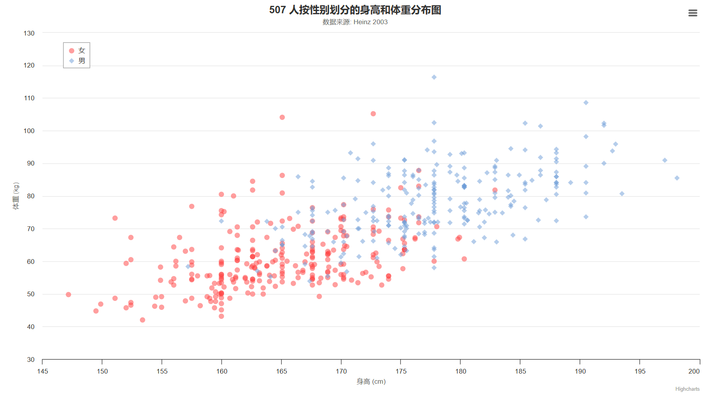


### 气泡图

```html
<html lang="en">
<head>
    <meta charset="UTF-8">
    <title>气泡图</title>

    <script src="./js/highcharts.js"></script>
    <script src="./js/exporting.js"></script>
    <script src="./js/series-label.js"></script>
    <script src="./js/zh_cn.js"></script>
    <script src="https://code.hcharts.cn/highcharts/highcharts-more.js"></script>

</head>

<style>
    #container {
        width: 70vw;
        height: 70vh;
        position: absolute;
        top: 50%;
        left: 50%;
        transform: translate(-50%, -50%);
    }
</style>
<body>
<div id="container"></div>
<script>
    var chart = Highcharts.chart('container', {
        chart: {
            type: 'bubble',
            zoomType: 'xy'
        },
        title: {
            text: 'Highcharts 气泡图'
        },
        series: [{
            name: '数据列 1',
            // 每个气泡包含三个值，x，y，z；其中 x，y用于定位，z 用于计算气泡大小
            data: [[97, 36, 79], [94, 74, 60], [68, 76, 58], [64, 87, 56], [68, 27, 73], [74, 99, 42], [7, 93, 87], [51, 69, 40], [38, 23, 33], [57, 86, 31]]
        }, {
            name: '数据列 2',
            data: [[25, 10, 87], [2, 75, 59], [11, 54, 8], [86, 55, 93], [5, 3, 58], [90, 63, 44], [91, 33, 17], [97, 3, 56], [15, 67, 48], [54, 25, 81]]
        }, {
            name: '数据列 3',
            data: [[47, 47, 21], [20, 12, 4], [6, 76, 91], [38, 30, 60], [57, 98, 64], [61, 17, 80], [83, 60, 13], [67, 78, 75], [64, 12, 10], [30, 77, 82]]
        }]
    });

</script>

</body>
</html>
```


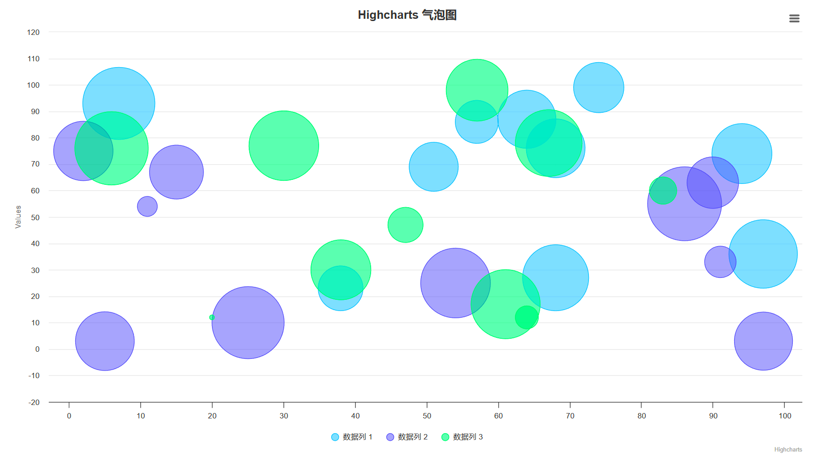


## 实战

### 需求

使用highcharts统计与可视化网站服务器当前实例的QPS信息、当前实例所在的机器的CPU占用率、当前实例内存占用（包含已分配、已使用和内存总大小）、最近30天网站访问量（PV），最近30天用户访问量（UV）、近7日注册和登录用户（UV）数、当日ip所属地区访问统计


### 分析

* QPS信息：动态折线图
* 当前实例所在的机器的CPU占用率：速度仪表图
* 当前实例内存占用：基础面积图
* 最近30天网站访问量：柱状图
* 最近30天用户访问量：柱状图
* 近7日注册和登录用户（UV）数：柱状图
* 当日ip所属地区访问统计：饼图


### 实现

#### pom文件

```xml
<dependencies>

    <dependency>
        <groupId>org.springframework.boot</groupId>
        <artifactId>spring-boot-starter-web</artifactId>
    </dependency>

    <dependency>
        <groupId>org.springframework.boot</groupId>
        <artifactId>spring-boot-starter-test</artifactId>
        <scope>test</scope>
    </dependency>

    <!--spring-boot lombok-->
    <dependency>
        <groupId>org.projectlombok</groupId>
        <artifactId>lombok</artifactId>
        <optional>true</optional>
    </dependency>

</dependencies>
```


#### 全局异常处理ExceptionHandler

```java
package mao.data_visualization_highcharts_website_statistics.config;

import lombok.extern.slf4j.Slf4j;
import mao.data_visualization_highcharts_website_statistics.entity.R;
import org.springframework.context.annotation.Configuration;
import org.springframework.web.bind.annotation.RestControllerAdvice;

/**
 * Project name(项目名称)：data_visualization_highcharts_website_statistics
 * Package(包名): mao.data_visualization_highcharts_website_statistics.config
 * Class(类名): ExceptionHandler
 * Author(作者）: mao
 * Author QQ：1296193245
 * GitHub：https://github.com/maomao124/
 * Date(创建日期)： 2023/6/12
 * Time(创建时间)： 19:10
 * Version(版本): 1.0
 * Description(描述)： 无
 */

@Slf4j
@Configuration
@RestControllerAdvice
public class ExceptionHandler
{
    @org.springframework.web.bind.annotation.ExceptionHandler(Exception.class)
    public R<Object> exception(Exception e)
    {
        log.error("错误：", e);
        return R.fail("系统繁忙，请稍后再试");
    }
}
```


#### 实体类IpCount

```java
package mao.data_visualization_highcharts_website_statistics.entity;

import lombok.*;
import lombok.experimental.Accessors;

/**
 * Project name(项目名称)：data_visualization_highcharts_website_statistics
 * Package(包名): mao.data_visualization_highcharts_website_statistics.entity
 * Class(类名): IpCount
 * Author(作者）: mao
 * Author QQ：1296193245
 * GitHub：https://github.com/maomao124/
 * Date(创建日期)： 2023/6/12
 * Time(创建时间)： 19:51
 * Version(版本): 1.0
 * Description(描述)： 无
 */

@Data
@AllArgsConstructor
@NoArgsConstructor
@Builder
@ToString
@EqualsAndHashCode
@Accessors(chain = true)
public class IpCount
{
    /**
     * 区域
     */
    private String area;

    /**
     * 统计
     */
    private int count;
}
```


#### 实体类LoginAndRegistrationCount

```java
package mao.data_visualization_highcharts_website_statistics.entity;

import lombok.*;
import lombok.experimental.Accessors;

/**
 * Project name(项目名称)：data_visualization_highcharts_website_statistics
 * Package(包名): mao.data_visualization_highcharts_website_statistics.entity
 * Class(类名): LoginAndRegistrationCount
 * Author(作者）: mao
 * Author QQ：1296193245
 * GitHub：https://github.com/maomao124/
 * Date(创建日期)： 2023/6/12
 * Time(创建时间)： 15:08
 * Version(版本): 1.0
 * Description(描述)： 无
 */

@Data
@AllArgsConstructor
@NoArgsConstructor
@Builder
@ToString
@EqualsAndHashCode
@Accessors(chain = true)
public class LoginAndRegistrationCount
{
    /**
     * 格式化的日期
     */
    private String date;

    /**
     * 当日数据
     */
    private int count;
}
```


#### 实体类Memory

```java
package mao.data_visualization_highcharts_website_statistics.entity;

import lombok.*;
import lombok.experimental.Accessors;

/**
 * Project name(项目名称)：data_visualization_highcharts_website_statistics
 * Package(包名): mao.data_visualization_highcharts_website_statistics.entity
 * Class(类名): Memory
 * Author(作者）: mao
 * Author QQ：1296193245
 * GitHub：https://github.com/maomao124/
 * Date(创建日期)： 2023/6/11
 * Time(创建时间)： 23:04
 * Version(版本): 1.0
 * Description(描述)： 无
 */

@Data
@AllArgsConstructor
@NoArgsConstructor
@Builder
@ToString
@EqualsAndHashCode
@Accessors(chain = true)
public class Memory
{
    /**
     * 当前已使用的内存，单位为M
     */
    private Double use;

    /**
     * jvm分配到的内存，单位为M
     */
    private Double max;

    /**
     * 当前机器最大内存
     */
    private Double total;
}
```


#### 实体类PVCount

```java
package mao.data_visualization_highcharts_website_statistics.entity;

import lombok.*;
import lombok.experimental.Accessors;

/**
 * Project name(项目名称)：data_visualization_highcharts_website_statistics
 * Package(包名): mao.data_visualization_highcharts_website_statistics.entity
 * Class(类名): PVCount
 * Author(作者）: mao
 * Author QQ：1296193245
 * GitHub：https://github.com/maomao124/
 * Date(创建日期)： 2023/6/11
 * Time(创建时间)： 23:40
 * Version(版本): 1.0
 * Description(描述)： 无
 */

@Data
@AllArgsConstructor
@NoArgsConstructor
@Builder
@ToString
@EqualsAndHashCode
@Accessors(chain = true)
public class PVCount
{
    /**
     * 格式化的日期
     */
    private String date;

    /**
     * 当日数据
     */
    private int count;
}
```


#### 实体类UVCount

```java
package mao.data_visualization_highcharts_website_statistics.entity;

import lombok.*;
import lombok.experimental.Accessors;

/**
 * Project name(项目名称)：data_visualization_highcharts_website_statistics
 * Package(包名): mao.data_visualization_highcharts_website_statistics.entity
 * Class(类名): UVCount
 * Author(作者）: mao
 * Author QQ：1296193245
 * GitHub：https://github.com/maomao124/
 * Date(创建日期)： 2023/6/11
 * Time(创建时间)： 23:41
 * Version(版本): 1.0
 * Description(描述)： 无
 */

@Data
@AllArgsConstructor
@NoArgsConstructor
@Builder
@ToString
@EqualsAndHashCode
@Accessors(chain = true)
public class UVCount
{
    /**
     * 格式化的日期
     */
    private String date;

    /**
     * 当日数据
     */
    private int count;
}
```


#### 实体类R

```java
package mao.data_visualization_highcharts_website_statistics.entity;

import lombok.*;
import lombok.experimental.Accessors;

import java.util.Date;
import java.util.Map;

/**
 * Project name(项目名称)：data_visualization_highcharts_website_statistics
 * Package(包名): mao.data_visualization_highcharts_website_statistics.entity
 * Class(类名): R
 * Author(作者）: mao
 * Author QQ：1296193245
 * GitHub：https://github.com/maomao124/
 * Date(创建日期)： 2023/6/11
 * Time(创建时间)： 21:35
 * Version(版本): 1.0
 * Description(描述)： 无
 */

@Data
@AllArgsConstructor
@NoArgsConstructor
@Builder
@ToString
@EqualsAndHashCode
@Accessors(chain = true)
public class R<T>
{
    /**
     * 状态
     */
    private boolean status;

    /**
     * 时间戳
     */
    private long time;

    /**
     * 错误消息
     */
    private String msg;

    /**
     * 数据
     */
    private T data;

    /**
     * 额外数据
     */
    private Map<String, Object> extraData;


    /**
     * 成功
     *
     * @return {@link R}<{@link Object}>
     */
    public static R<Object> success()
    {
        return new R<>().setStatus(true).setTime(new Date().getTime());
    }

    /**
     * 成功
     *
     * @param data 数据
     * @return {@link R}<{@link D}>
     */
    public static <D> R<D> success(D data)
    {
        return new R<D>().setStatus(true).setTime(new Date().getTime()).setData(data);
    }

    /**
     * 成功
     *
     * @param data      数据
     * @param extraData 额外数据
     * @return {@link R}<{@link D}>
     */
    public static <D> R<D> success(D data, Map<String, Object> extraData)
    {
        return new R<D>().setStatus(true).setTime(new Date().getTime()).setData(data).setExtraData(extraData);
    }

    /**
     * 失败
     *
     * @return {@link R}<{@link Object}>
     */
    public static R<Object> fail()
    {
        return new R<>().setStatus(false).setTime(new Date().getTime());
    }

    /**
     * 失败
     *
     * @param msg 消息
     * @return {@link R}<{@link Object}>
     */
    public static R<Object> fail(String msg)
    {
        return new R<>().setStatus(false).setTime(new Date().getTime()).setMsg(msg);
    }
}
```


