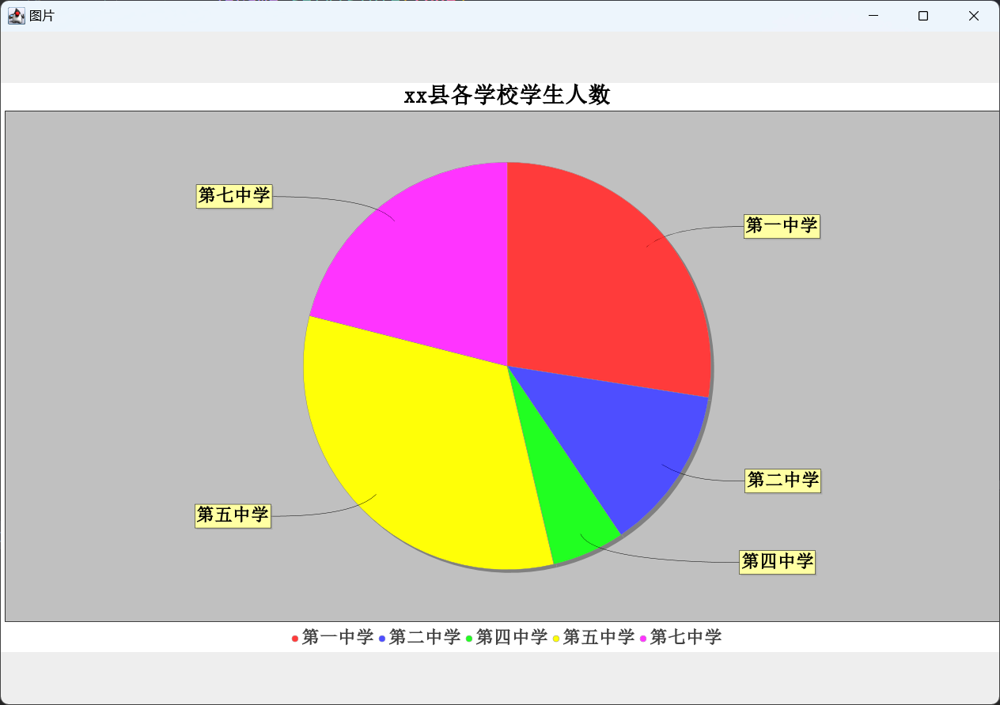
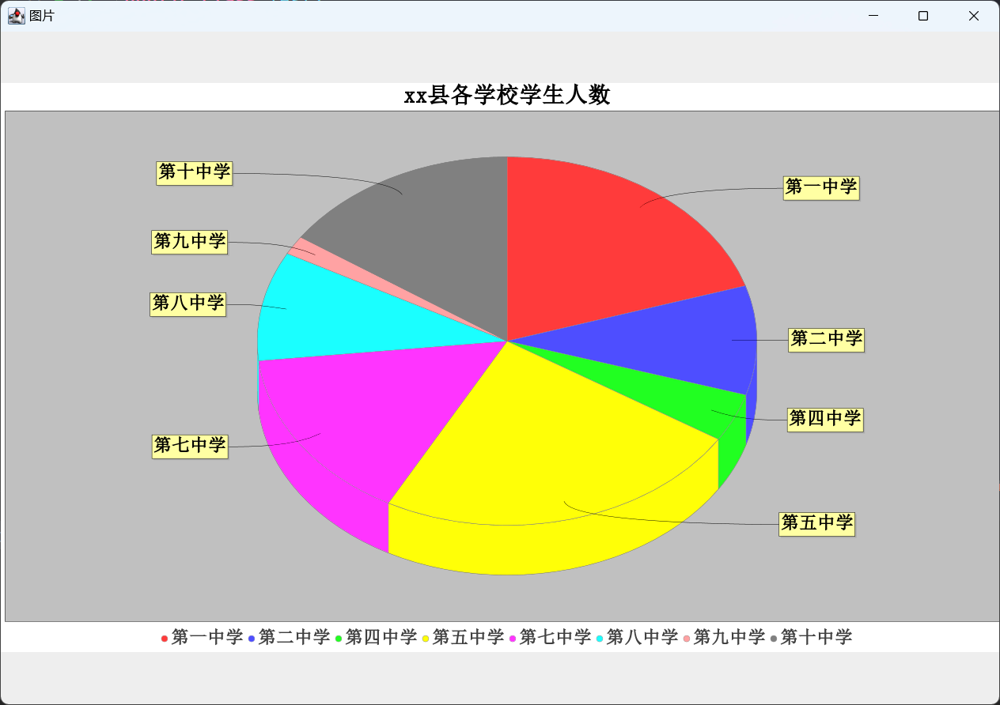
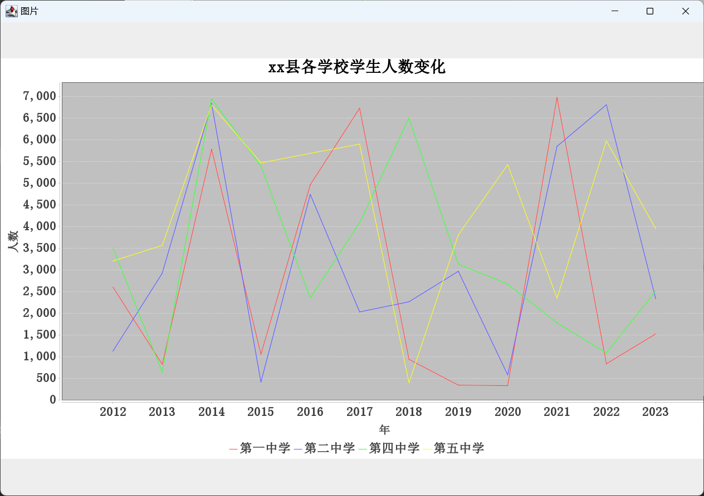
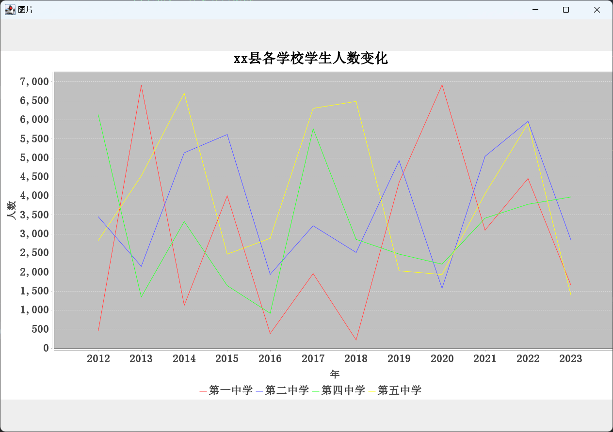
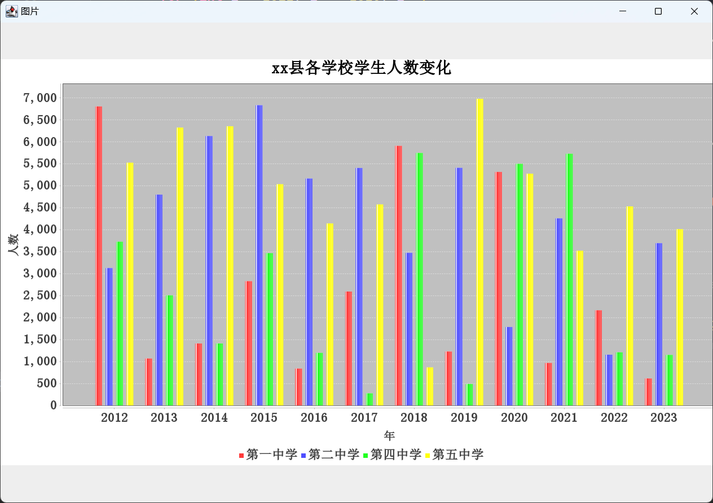
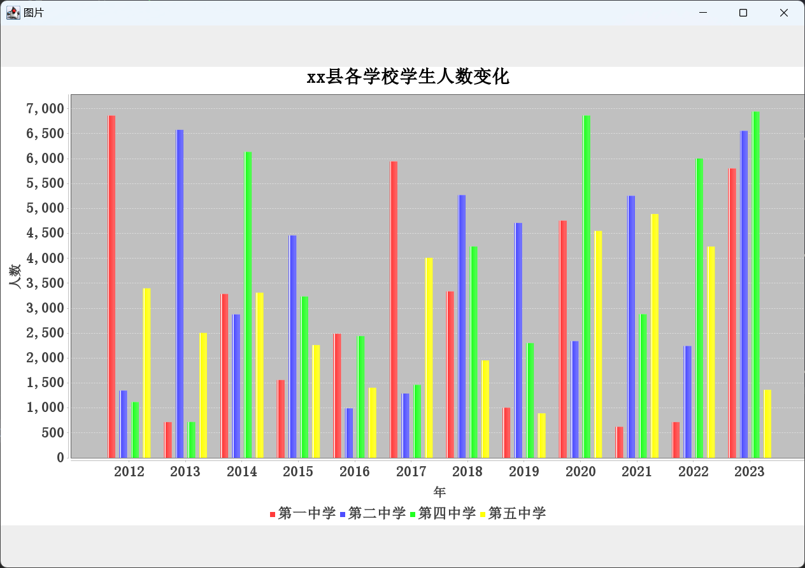
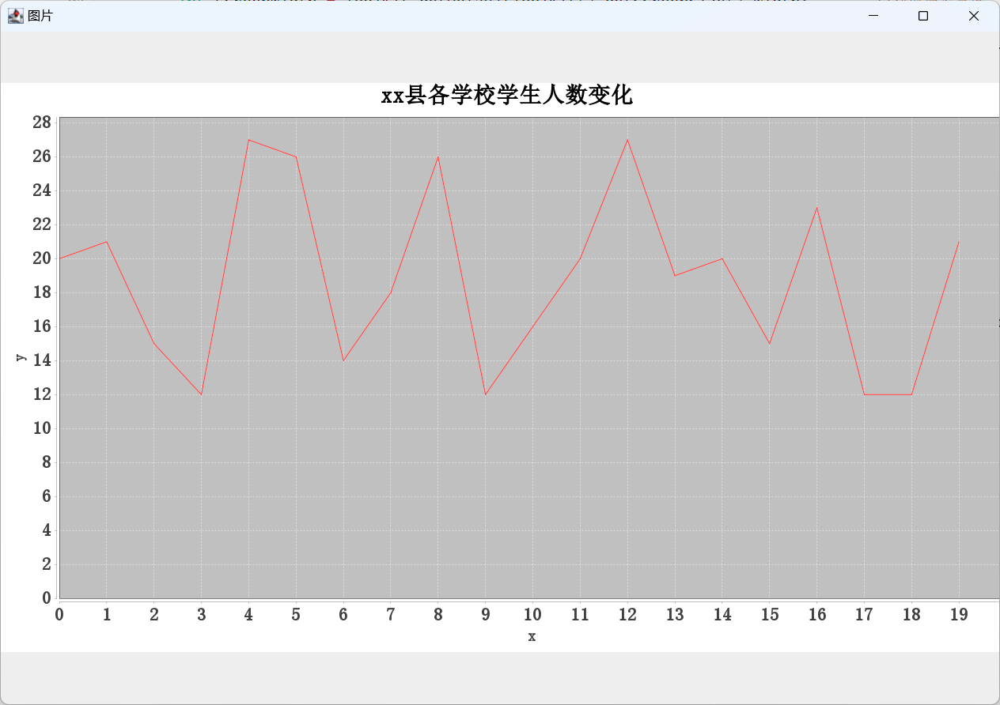
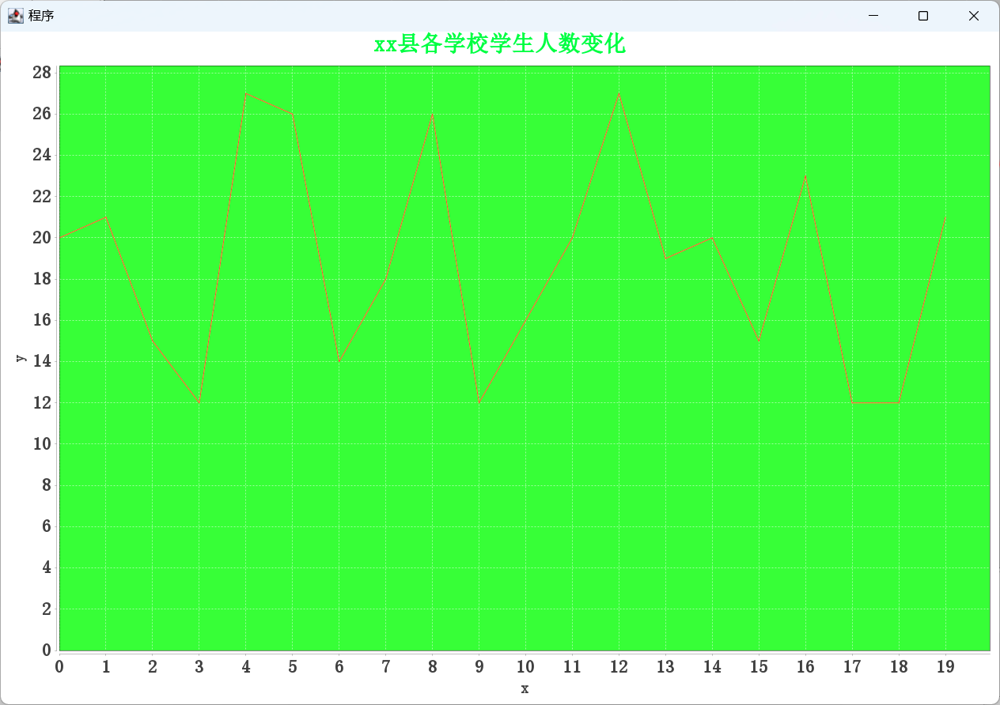
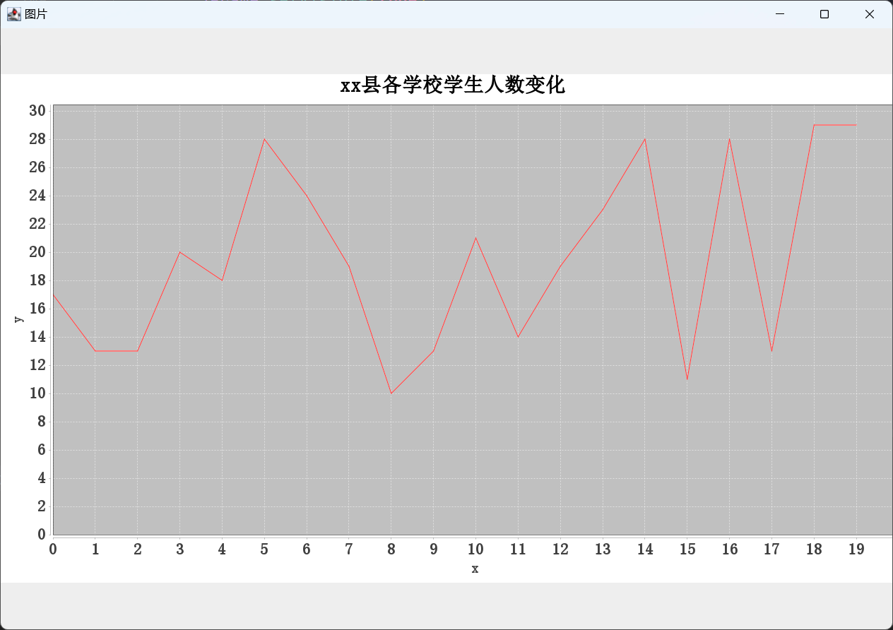

<h1 style="color:skyblue;text-align:center">数据可视化学习笔记</h1>


[TOC]

---


# 概述

在大数据时代，人们需要对大量的数据进行分析，帮助用户或公司领导更直观的察觉差异，做出判断，减少时间成本，而在web项目中除了表格显示数据外，还可以通过图表来表现数据，这种图表形式表现数据使人看的清楚明白且更加直观。对于web项目展示图形报表使用最多的技术就是基于js的前端报表框架，目前前端市场使用最多的图形报表框架有：JfreeChart、ECharts、Highcharts、FusionCharts、amCharts等。


# JFreechart

## 概述

JFreeChart是JAVA平台上的一个开放的图表绘制类库。它完全使用JAVA语言编写，可生成饼图（pie charts）、柱状图（bar charts）、散点图（scatter plots）、时序图（time series）、甘特图（Gantt charts）等等多种图表，并且可以产生PNG和JPEG格式的输出，还可以与PDF或EXCEL关联。


## 依赖

```xml
<dependency>
    <groupId>org.jfree</groupId>
    <artifactId>jfreechart</artifactId>
    <version>1.5.0</version>
</dependency>
```


## 饼图和3D饼图

```java
package mao;

import org.jfree.chart.ChartFactory;
import org.jfree.chart.ChartUtils;
import org.jfree.chart.JFreeChart;
import org.jfree.chart.StandardChartTheme;
import org.jfree.data.general.DefaultPieDataset;

import javax.imageio.ImageIO;
import javax.swing.*;
import java.awt.*;
import java.awt.event.WindowAdapter;
import java.awt.event.WindowEvent;
import java.awt.image.BufferedImage;
import java.io.File;
import java.io.FileInputStream;
import java.io.IOException;

/**
 * Project name(项目名称)：数据可视化_JFreechart的使用
 * Package(包名): mao
 * Class(类名): Test1
 * Author(作者）: mao
 * Author QQ：1296193245
 * GitHub：https://github.com/maomao124/
 * Date(创建日期)： 2023/6/8
 * Time(创建时间)： 22:22
 * Version(版本): 1.0
 * Description(描述)： 无
 */

public class Test1
{
    public static void main(String[] args) throws IOException
    {
        //构建饼图的数据集
        DefaultPieDataset<String> dataset = new DefaultPieDataset<String>();

        dataset.setValue("第一中学", 4572);
        dataset.setValue("第二中学", 2177);
        dataset.setValue("第四中学", 958);
        dataset.setValue("第五中学", 5433);
        dataset.setValue("第七中学", 3498);


        StandardChartTheme standardChartTheme = new StandardChartTheme("CN");
        //设置标题字体
        standardChartTheme.setExtraLargeFont(new Font("宋体", Font.BOLD, 28));
        //设置图例的字体
        standardChartTheme.setRegularFont(new Font("宋体", Font.BOLD, 22));
        //设置轴向的字体
        standardChartTheme.setLargeFont(new Font("宋体", Font.BOLD, 20));
        //应用主题样式
        ChartFactory.setChartTheme(standardChartTheme);
        //参数1 title 标题
        //参数2　dataset 数据集
        //参数3  是否开启图例
        //参数4  是否开启工具栏
        //参数5  是否开启url跳转
        JFreeChart chart = ChartFactory.createPieChart("xx县各学校学生人数", dataset, true, false, false);
        //生成一张图表的图片文件

        String path = "./chart1.png";

        ChartUtils.saveChartAsPNG(new File(path), chart, 1280, 720);

        BufferedImage bufferedImage = ImageIO.read(new FileInputStream(path));
        JLabel jLabel = new JLabel();
        jLabel.setIcon(new ImageIcon(bufferedImage));

        JFrame jFrame = new JFrame("图片");                                   //初始化顶层面板
        jFrame.setSize(1280, 900);
        int screenWidth = Toolkit.getDefaultToolkit().getScreenSize().width;       //获取屏幕宽度
        int screenHeight = Toolkit.getDefaultToolkit().getScreenSize().height;     //获取屏幕高度
        jFrame.setLocation(screenWidth / 2 - jFrame.getWidth() / 2, screenHeight / 2 - jFrame.getHeight() / 2);  //位于屏幕中央

        jFrame.add(jLabel);
        jFrame.setVisible(true);
        jFrame.addWindowListener(new WindowAdapter()
        {
            @Override
            public void windowClosing(WindowEvent e)
            {
                System.exit(1);
            }
        });
    }
}
```





```java
package mao;

import org.jfree.chart.ChartFactory;
import org.jfree.chart.ChartUtils;
import org.jfree.chart.JFreeChart;
import org.jfree.chart.StandardChartTheme;
import org.jfree.data.general.DefaultPieDataset;

import javax.imageio.ImageIO;
import javax.swing.*;
import java.awt.*;
import java.awt.event.WindowAdapter;
import java.awt.event.WindowEvent;
import java.awt.image.BufferedImage;
import java.io.File;
import java.io.FileInputStream;
import java.io.IOException;

/**
 * Project name(项目名称)：数据可视化_JFreechart的使用
 * Package(包名): mao
 * Class(类名): Test2
 * Author(作者）: mao
 * Author QQ：1296193245
 * GitHub：https://github.com/maomao124/
 * Date(创建日期)： 2023/6/9
 * Time(创建时间)： 20:56
 * Version(版本): 1.0
 * Description(描述)： 无
 */

public class Test2
{
    public static void main(String[] args) throws IOException
    {
        //构建饼图的数据集
        DefaultPieDataset<String> dataset = new DefaultPieDataset<String>();

        dataset.setValue("第一中学", 4572);
        dataset.setValue("第二中学", 2177);
        dataset.setValue("第四中学", 958);
        dataset.setValue("第五中学", 5433);
        dataset.setValue("第七中学", 3498);


        StandardChartTheme standardChartTheme = new StandardChartTheme("CN");
        //设置标题字体
        standardChartTheme.setExtraLargeFont(new Font("宋体", Font.BOLD, 28));
        //设置图例的字体
        standardChartTheme.setRegularFont(new Font("宋体", Font.BOLD, 22));
        //设置轴向的字体
        standardChartTheme.setLargeFont(new Font("宋体", Font.BOLD, 20));
        //应用主题样式
        ChartFactory.setChartTheme(standardChartTheme);
        //参数1 title 标题
        //参数2　dataset 数据集
        //参数3  是否开启图例
        //参数4  是否开启工具栏
        //参数5  是否开启url跳转
        JFreeChart chart = ChartFactory.createPieChart3D("xx县各学校学生人数", dataset, true, false, false);
        //生成一张图表的图片文件

        String path = "./chart2.png";

        ChartUtils.saveChartAsPNG(new File(path), chart, 1280, 720);

        BufferedImage bufferedImage = ImageIO.read(new FileInputStream(path));
        JLabel jLabel = new JLabel();
        jLabel.setIcon(new ImageIcon(bufferedImage));

        JFrame jFrame = new JFrame("图片");                                   //初始化顶层面板
        jFrame.setSize(1280, 900);
        int screenWidth = Toolkit.getDefaultToolkit().getScreenSize().width;       //获取屏幕宽度
        int screenHeight = Toolkit.getDefaultToolkit().getScreenSize().height;     //获取屏幕高度
        jFrame.setLocation(screenWidth / 2 - jFrame.getWidth() / 2, screenHeight / 2 - jFrame.getHeight() / 2);  //位于屏幕中央

        jFrame.add(jLabel);
        jFrame.setVisible(true);
        jFrame.addWindowListener(new WindowAdapter()
        {
            @Override
            public void windowClosing(WindowEvent e)
            {
                System.exit(1);
            }
        });
    }
}
```


```java
package mao;

import org.jfree.chart.ChartFactory;
import org.jfree.chart.ChartUtils;
import org.jfree.chart.JFreeChart;
import org.jfree.chart.StandardChartTheme;
import org.jfree.data.general.DefaultPieDataset;

import javax.imageio.ImageIO;
import javax.swing.*;
import java.awt.*;
import java.awt.event.WindowAdapter;
import java.awt.event.WindowEvent;
import java.awt.image.BufferedImage;
import java.io.File;
import java.io.FileInputStream;
import java.io.IOException;

/**
 * Project name(项目名称)：数据可视化_JFreechart的使用
 * Package(包名): mao
 * Class(类名): Test2
 * Author(作者）: mao
 * Author QQ：1296193245
 * GitHub：https://github.com/maomao124/
 * Date(创建日期)： 2023/6/9
 * Time(创建时间)： 20:56
 * Version(版本): 1.0
 * Description(描述)： 无
 */

public class Test2
{
    public static void main(String[] args) throws IOException
    {
        //构建饼图的数据集
        DefaultPieDataset<String> dataset = new DefaultPieDataset<String>();

        dataset.setValue("第一中学", 4572);
        dataset.setValue("第二中学", 2177);
        dataset.setValue("第四中学", 958);
        dataset.setValue("第五中学", 5433);
        dataset.setValue("第七中学", 3498);
        dataset.setValue("第八中学", 2177);
        dataset.setValue("第九中学", 374);
        dataset.setValue("第十中学", 3511);


        StandardChartTheme standardChartTheme = new StandardChartTheme("CN");
        //设置标题字体
        standardChartTheme.setExtraLargeFont(new Font("宋体", Font.BOLD, 28));
        //设置图例的字体
        standardChartTheme.setRegularFont(new Font("宋体", Font.BOLD, 22));
        //设置轴向的字体
        standardChartTheme.setLargeFont(new Font("宋体", Font.BOLD, 20));
        //应用主题样式
        ChartFactory.setChartTheme(standardChartTheme);
        //参数1 title 标题
        //参数2　dataset 数据集
        //参数3  是否开启图例
        //参数4  是否开启工具栏
        //参数5  是否开启url跳转
        JFreeChart chart = ChartFactory.createPieChart3D("xx县各学校学生人数", dataset, true, false, false);
        //生成一张图表的图片文件

        String path = "./chart2.png";

        ChartUtils.saveChartAsPNG(new File(path), chart, 1280, 720);

        BufferedImage bufferedImage = ImageIO.read(new FileInputStream(path));
        JLabel jLabel = new JLabel();
        jLabel.setIcon(new ImageIcon(bufferedImage));

        JFrame jFrame = new JFrame("图片");                                   //初始化顶层面板
        jFrame.setSize(1280, 900);
        int screenWidth = Toolkit.getDefaultToolkit().getScreenSize().width;       //获取屏幕宽度
        int screenHeight = Toolkit.getDefaultToolkit().getScreenSize().height;     //获取屏幕高度
        jFrame.setLocation(screenWidth / 2 - jFrame.getWidth() / 2, screenHeight / 2 - jFrame.getHeight() / 2);  //位于屏幕中央

        jFrame.add(jLabel);
        jFrame.setVisible(true);
        jFrame.addWindowListener(new WindowAdapter()
        {
            @Override
            public void windowClosing(WindowEvent e)
            {
                System.exit(1);
            }
        });
    }
}
```





## 折线图

```java
package mao;

import org.jfree.chart.ChartFactory;
import org.jfree.chart.ChartUtils;
import org.jfree.chart.JFreeChart;
import org.jfree.chart.StandardChartTheme;
import org.jfree.data.category.DefaultCategoryDataset;
import org.jfree.data.general.DefaultPieDataset;

import javax.imageio.ImageIO;
import javax.swing.*;
import java.awt.*;
import java.awt.event.WindowAdapter;
import java.awt.event.WindowEvent;
import java.awt.image.BufferedImage;
import java.io.File;
import java.io.FileInputStream;
import java.io.IOException;

/**
 * Project name(项目名称)：数据可视化_JFreechart的使用
 * Package(包名): mao
 * Class(类名): Test3
 * Author(作者）: mao
 * Author QQ：1296193245
 * GitHub：https://github.com/maomao124/
 * Date(创建日期)： 2023/6/9
 * Time(创建时间)： 21:05
 * Version(版本): 1.0
 * Description(描述)： 无
 */

public class Test3
{
    /**
     * 得到int随机
     *
     * @param min 最小值
     * @param max 最大值
     * @return int
     */
    public static int getIntRandom(int min, int max)
    {
        if (min > max)
        {
            min = max;
        }
        return min + (int) (Math.random() * (max - min + 1));
    }

    public static void main(String[] args) throws IOException
    {
        //构建饼图的数据集
        DefaultCategoryDataset dataset = new DefaultCategoryDataset();

        for (int i = 2012; i <= 2023; i++)
        {
            dataset.setValue(getIntRandom(200, 7000), "第一中学", String.valueOf(i));
        }

        for (int i = 2012; i <= 2023; i++)
        {
            dataset.setValue(getIntRandom(200, 7000), "第二中学", String.valueOf(i));
        }

        for (int i = 2012; i <= 2023; i++)
        {
            dataset.setValue(getIntRandom(200, 7000), "第四中学", String.valueOf(i));
        }

        for (int i = 2012; i <= 2023; i++)
        {
            dataset.setValue(getIntRandom(200, 7000), "第五中学", String.valueOf(i));
        }

        StandardChartTheme standardChartTheme = new StandardChartTheme("CN");
        //设置标题字体
        standardChartTheme.setExtraLargeFont(new Font("宋体", Font.BOLD, 28));
        //设置图例的字体
        standardChartTheme.setRegularFont(new Font("宋体", Font.BOLD, 22));
        //设置轴向的字体
        standardChartTheme.setLargeFont(new Font("宋体", Font.BOLD, 20));
        //应用主题样式
        ChartFactory.setChartTheme(standardChartTheme);
        //参数1 title 标题
        //参数2　dataset 数据集
        //参数3  是否开启图例
        //参数4  是否开启工具栏
        //参数5  是否开启url跳转
        JFreeChart chart = ChartFactory.createLineChart("xx县各学校学生人数变化", "年", "人数", dataset);
        //生成一张图表的图片文件

        String path = "./chart3.png";

        ChartUtils.saveChartAsPNG(new File(path), chart, 1280, 720);

        BufferedImage bufferedImage = ImageIO.read(new FileInputStream(path));
        JLabel jLabel = new JLabel();
        jLabel.setIcon(new ImageIcon(bufferedImage));

        JFrame jFrame = new JFrame("图片");                                   //初始化顶层面板
        jFrame.setSize(1280, 900);
        int screenWidth = Toolkit.getDefaultToolkit().getScreenSize().width;       //获取屏幕宽度
        int screenHeight = Toolkit.getDefaultToolkit().getScreenSize().height;     //获取屏幕高度
        jFrame.setLocation(screenWidth / 2 - jFrame.getWidth() / 2, screenHeight / 2 - jFrame.getHeight() / 2);  //位于屏幕中央

        jFrame.add(jLabel);
        jFrame.setVisible(true);
        jFrame.addWindowListener(new WindowAdapter()
        {
            @Override
            public void windowClosing(WindowEvent e)
            {
                System.exit(1);
            }
        });
    }
}
```








## 柱状图

```java
package mao;

import org.jfree.chart.ChartFactory;
import org.jfree.chart.ChartUtils;
import org.jfree.chart.JFreeChart;
import org.jfree.chart.StandardChartTheme;
import org.jfree.data.category.DefaultCategoryDataset;

import javax.imageio.ImageIO;
import javax.swing.*;
import java.awt.*;
import java.awt.event.WindowAdapter;
import java.awt.event.WindowEvent;
import java.awt.image.BufferedImage;
import java.io.File;
import java.io.FileInputStream;
import java.io.IOException;

/**
 * Project name(项目名称)：数据可视化_JFreechart的使用
 * Package(包名): mao
 * Class(类名): Test4
 * Author(作者）: mao
 * Author QQ：1296193245
 * GitHub：https://github.com/maomao124/
 * Date(创建日期)： 2023/6/10
 * Time(创建时间)： 0:24
 * Version(版本): 1.0
 * Description(描述)： 无
 */

public class Test4
{
    /**
     * 得到int随机
     *
     * @param min 最小值
     * @param max 最大值
     * @return int
     */
    public static int getIntRandom(int min, int max)
    {
        if (min > max)
        {
            min = max;
        }
        return min + (int) (Math.random() * (max - min + 1));
    }

    public static void main(String[] args) throws IOException
    {
        //构建饼图的数据集
        DefaultCategoryDataset dataset = new DefaultCategoryDataset();

        for (int i = 2012; i <= 2023; i++)
        {
            dataset.setValue(getIntRandom(200, 7000), "第一中学", String.valueOf(i));
        }

        for (int i = 2012; i <= 2023; i++)
        {
            dataset.setValue(getIntRandom(200, 7000), "第二中学", String.valueOf(i));
        }

        for (int i = 2012; i <= 2023; i++)
        {
            dataset.setValue(getIntRandom(200, 7000), "第四中学", String.valueOf(i));
        }

        for (int i = 2012; i <= 2023; i++)
        {
            dataset.setValue(getIntRandom(200, 7000), "第五中学", String.valueOf(i));
        }

        StandardChartTheme standardChartTheme = new StandardChartTheme("CN");
        //设置标题字体
        standardChartTheme.setExtraLargeFont(new Font("宋体", Font.BOLD, 28));
        //设置图例的字体
        standardChartTheme.setRegularFont(new Font("宋体", Font.BOLD, 22));
        //设置轴向的字体
        standardChartTheme.setLargeFont(new Font("宋体", Font.BOLD, 20));
        //应用主题样式
        ChartFactory.setChartTheme(standardChartTheme);
        //参数1 title 标题
        //参数2　dataset 数据集
        //参数3  是否开启图例
        //参数4  是否开启工具栏
        //参数5  是否开启url跳转
        JFreeChart chart = ChartFactory.createBarChart("xx县各学校学生人数变化", "年", "人数", dataset);
        //生成一张图表的图片文件

        String path = "./chart4.png";

        ChartUtils.saveChartAsPNG(new File(path), chart, 1280, 720);

        BufferedImage bufferedImage = ImageIO.read(new FileInputStream(path));
        JLabel jLabel = new JLabel();
        jLabel.setIcon(new ImageIcon(bufferedImage));

        JFrame jFrame = new JFrame("图片");                                   //初始化顶层面板
        jFrame.setSize(1280, 900);
        int screenWidth = Toolkit.getDefaultToolkit().getScreenSize().width;       //获取屏幕宽度
        int screenHeight = Toolkit.getDefaultToolkit().getScreenSize().height;     //获取屏幕高度
        jFrame.setLocation(screenWidth / 2 - jFrame.getWidth() / 2, screenHeight / 2 - jFrame.getHeight() / 2);  //位于屏幕中央

        jFrame.add(jLabel);
        jFrame.setVisible(true);
        jFrame.addWindowListener(new WindowAdapter()
        {
            @Override
            public void windowClosing(WindowEvent e)
            {
                System.exit(1);
            }
        });
    }
}
```








## XY图

```java
package mao;

import org.jfree.chart.*;
import org.jfree.chart.plot.PlotOrientation;
import org.jfree.data.category.DefaultCategoryDataset;
import org.jfree.data.xy.XYDataset;
import org.jfree.data.xy.XYSeries;
import org.jfree.data.xy.XYSeriesCollection;

import javax.imageio.ImageIO;
import javax.swing.*;
import java.awt.*;
import java.awt.event.WindowAdapter;
import java.awt.event.WindowEvent;
import java.awt.image.BufferedImage;
import java.io.File;
import java.io.FileInputStream;
import java.io.IOException;

/**
 * Project name(项目名称)：数据可视化_JFreechart的使用
 * Package(包名): mao
 * Class(类名): Test5
 * Author(作者）: mao
 * Author QQ：1296193245
 * GitHub：https://github.com/maomao124/
 * Date(创建日期)： 2023/6/10
 * Time(创建时间)： 14:19
 * Version(版本): 1.0
 * Description(描述)： XY图
 */

public class Test5
{
    /**
     * 得到int随机
     *
     * @param min 最小值
     * @param max 最大值
     * @return int
     */
    public static int getIntRandom(int min, int max)
    {
        if (min > max)
        {
            min = max;
        }
        return min + (int) (Math.random() * (max - min + 1));
    }

    public static void main(String[] args) throws IOException
    {

        XYSeries data = new XYSeries("InternetExplorer");

        for (int i = 0; i < 20; i++)
        {
            data.add(i, getIntRandom(10, 30));
        }

        XYSeriesCollection dataset = new XYSeriesCollection();
        dataset.addSeries(data);

        StandardChartTheme standardChartTheme = new StandardChartTheme("CN");
        //设置标题字体
        standardChartTheme.setExtraLargeFont(new Font("宋体", Font.BOLD, 28));
        //设置图例的字体
        standardChartTheme.setRegularFont(new Font("宋体", Font.BOLD, 22));
        //设置轴向的字体
        standardChartTheme.setLargeFont(new Font("宋体", Font.BOLD, 20));
        //应用主题样式
        ChartFactory.setChartTheme(standardChartTheme);
        //参数1 title 标题
        //参数2　dataset 数据集
        //参数3  是否开启图例
        //参数4  是否开启工具栏
        //参数5  是否开启url跳转
        JFreeChart chart = ChartFactory.createXYLineChart("xx县各学校学生人数变化",
                "x", "y", dataset
                , PlotOrientation.VERTICAL,
                false, true, false);
        //生成一张图表的图片文件

        String path = "./chart5.png";


        ChartUtils.saveChartAsPNG(new File(path), chart, 1280, 720);

        // 利用awt进行显示
        ChartFrame chartFrame = new ChartFrame("程序", chart);
        chartFrame.pack();
        chartFrame.setVisible(true);
        chartFrame.setSize(1280, 900);
        int screenWidth = Toolkit.getDefaultToolkit().getScreenSize().width;       //获取屏幕宽度
        int screenHeight = Toolkit.getDefaultToolkit().getScreenSize().height;     //获取屏幕高度
        chartFrame.setLocation(screenWidth / 2 - chartFrame.getWidth() / 2, screenHeight / 2 - chartFrame.getHeight() / 2);  //位于屏幕中央

        BufferedImage bufferedImage = ImageIO.read(new FileInputStream(path));
        JLabel jLabel = new JLabel();
        jLabel.setIcon(new ImageIcon(bufferedImage));

        JFrame jFrame = new JFrame("图片");                                   //初始化顶层面板
        jFrame.setSize(1280, 900);
        screenWidth = Toolkit.getDefaultToolkit().getScreenSize().width;       //获取屏幕宽度
        screenHeight = Toolkit.getDefaultToolkit().getScreenSize().height;     //获取屏幕高度
        jFrame.setLocation(screenWidth / 2 - jFrame.getWidth() / 2, screenHeight / 2 - jFrame.getHeight() / 2);  //位于屏幕中央

        jFrame.add(jLabel);
        jFrame.setVisible(true);
        jFrame.addWindowListener(new WindowAdapter()
        {
            @Override
            public void windowClosing(WindowEvent e)
            {
                System.exit(1);
            }
        });
    }
}

```











## 散点图

